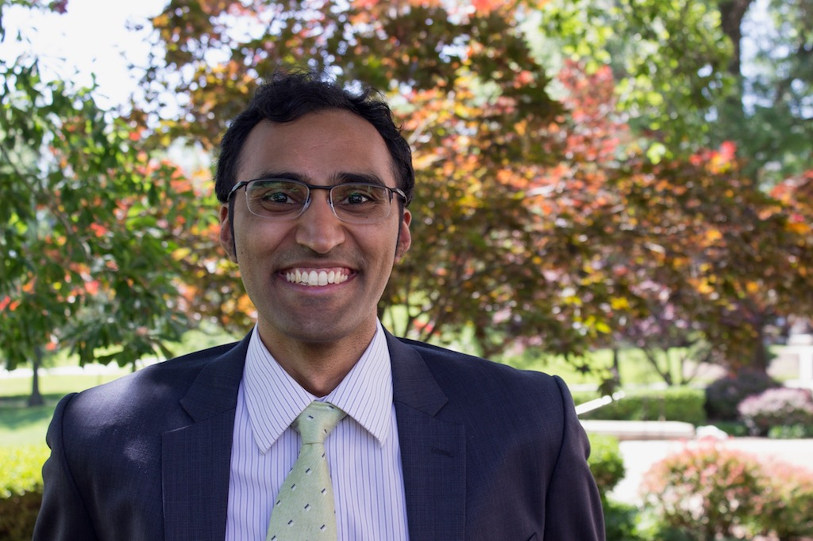
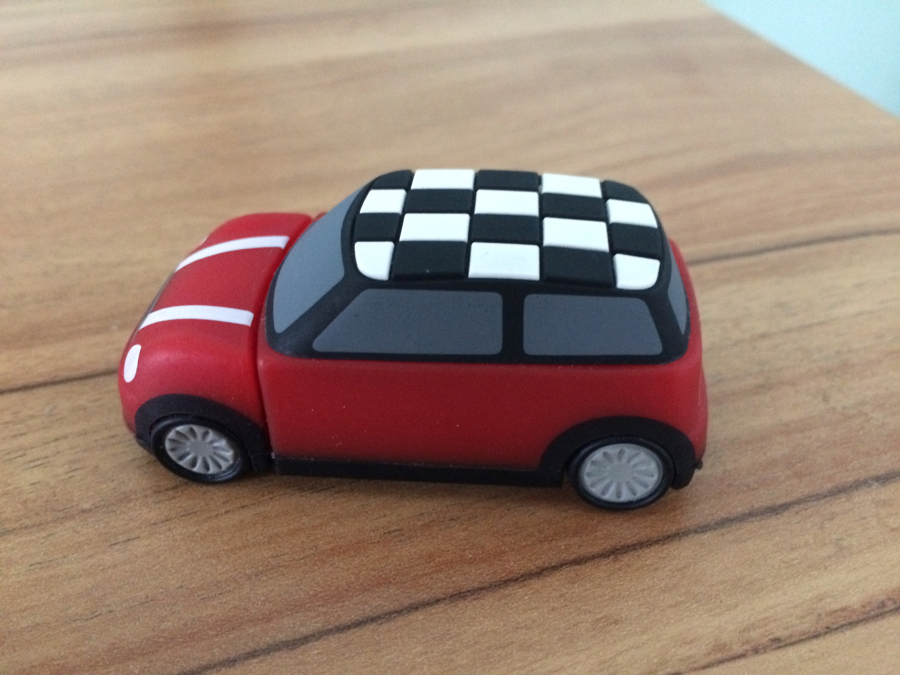

Thanks for stopping by!

I love creating, learning, and trying new things. I studied physics and music in university. 📚🎼

I'm a software developer by day, and that lets me care deeply about the projects I take up. I learned how to film and edit my friends' recitals during school which was a lot of fun. I listened to a lot of great music that way too.

My freshman year of undergrad I bought my first MacBook. Never looked back. 🧑‍💻

My ideal day involves being outside, fixing things, and helping others.

Hope you find something helpful here!

This site is created using [Hugo](https://gohugo.io), powered by [Stack by Jimmy](https://github.com/CaiJimmy/hugo-theme-stack), and built and hosted on [Netlify](https://www.netlify.com).

### Mentors

I owe my music production knowledge to two of my awesome friends.

* Sanchit Malhotra
  * https://sanchitmalhotramusic.com
  * https://instagram.com/sanchitmalhotramusic
* Samarth Srinivasan
  * https://www.imdb.com/name/nm9286269/
  * https://www.instagram.com/samarthsrinivasan/
