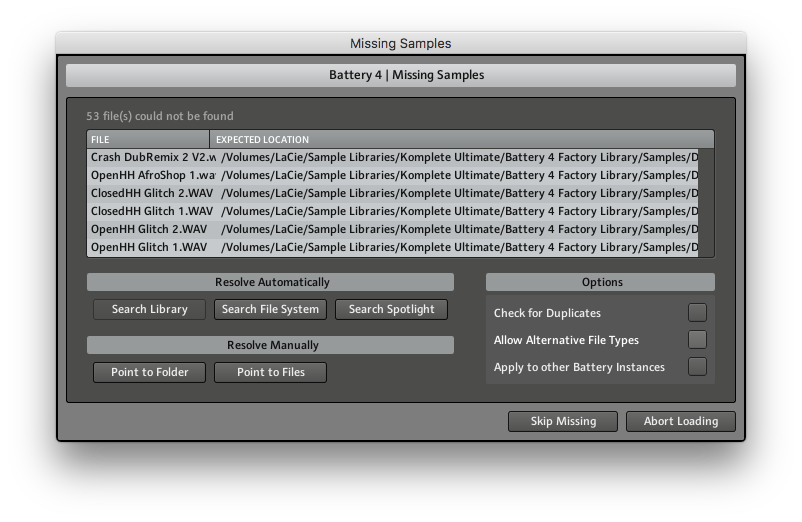
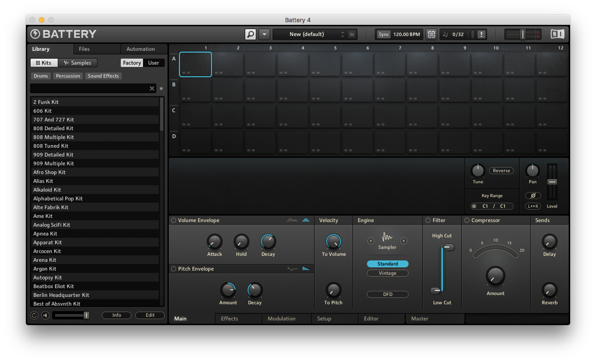
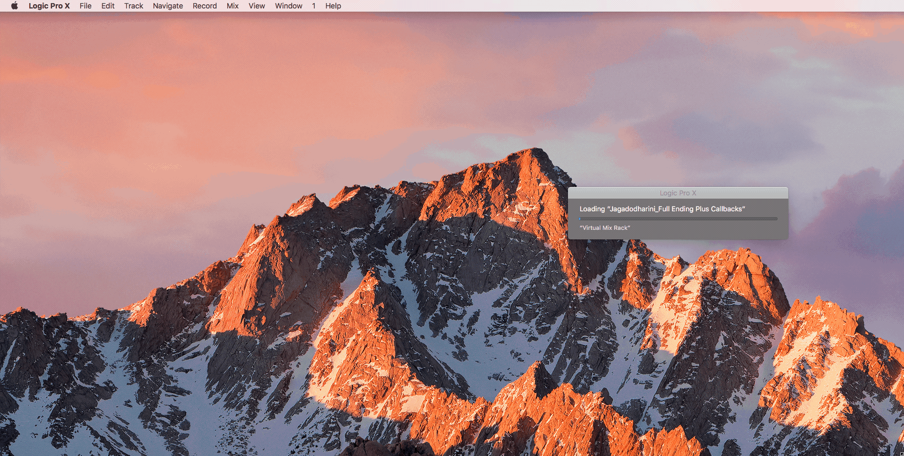

## Problem

This message keeps coming, even though the Battery 4 plugin and library is installed and I point it to the folder.

## Solution

Turns out the dialog will appear for each plugin *instance* in the project.

First make sure the libraries can be loaded.

1. Open the standalone **Battery 4** app (in `/Applications`)
2. Have it scan your library files (e.g. `/Users/Shared/Battery 4 Factory Library`)
3. There's now a bunch of kits visible. Close the application. 

Then select `Apply to other Battery Instances` **first** and use `Point to Folder`. It will automatically apply the same settings.

Once the project is saved, the settings will persist.
