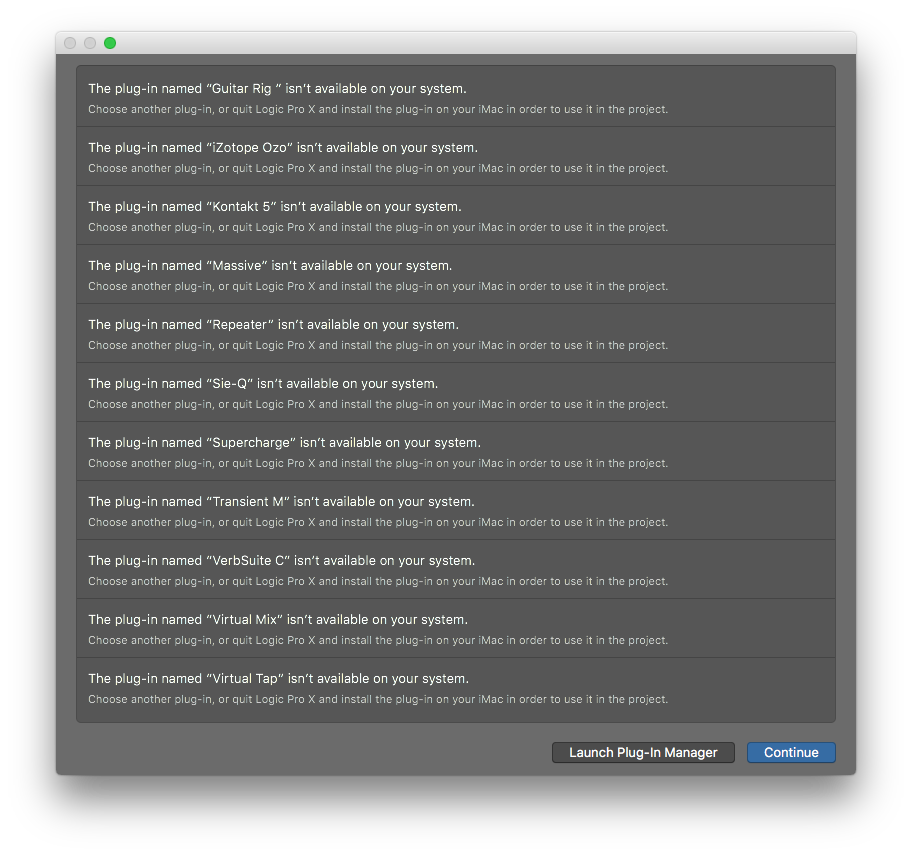
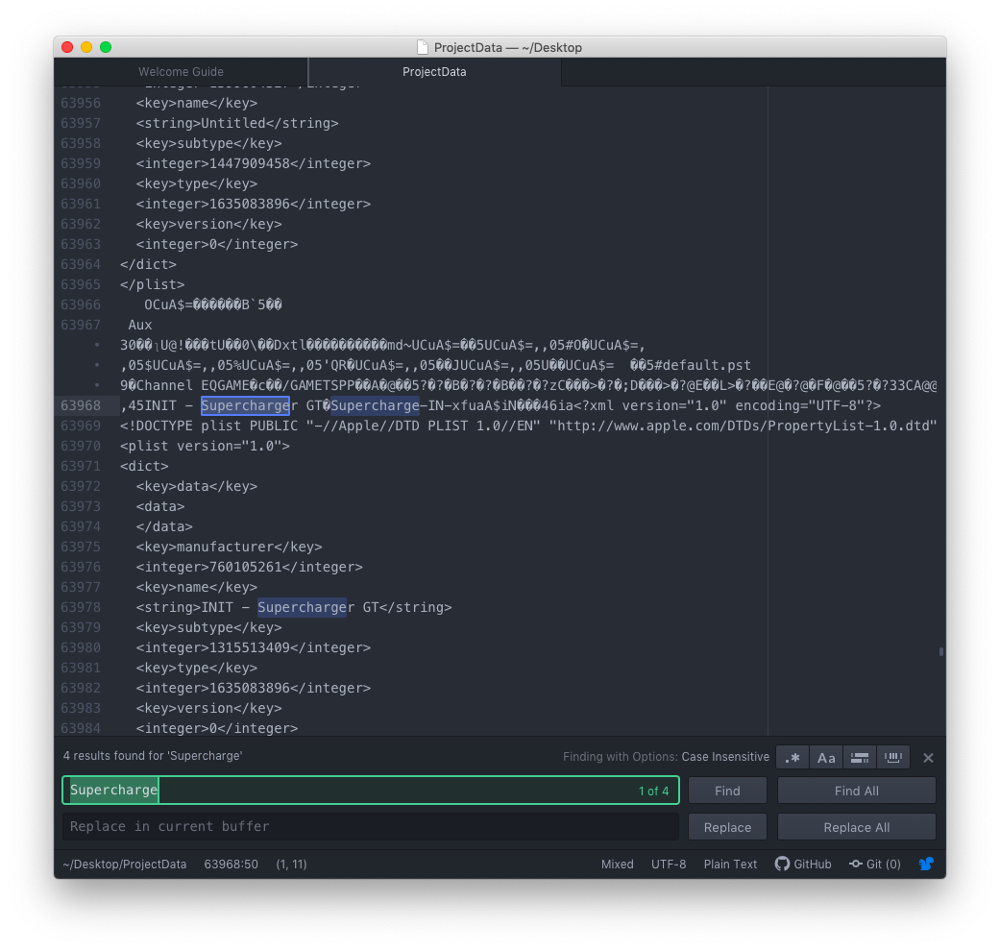
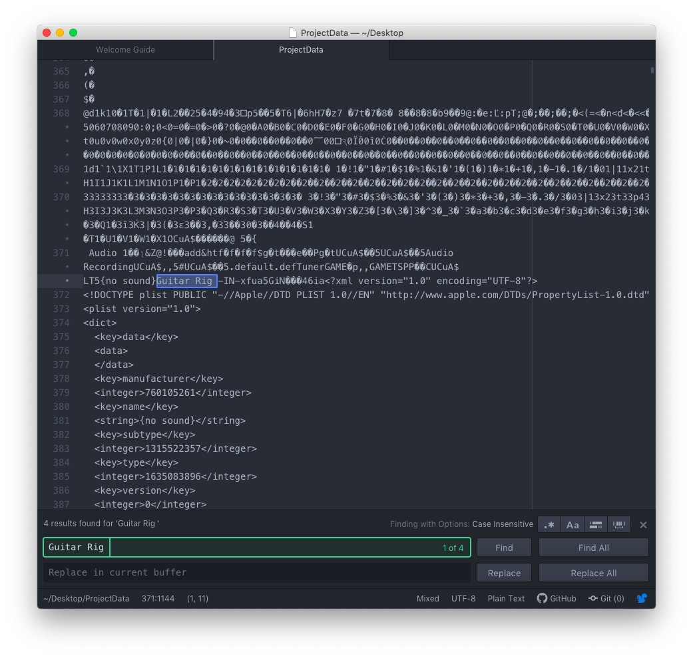
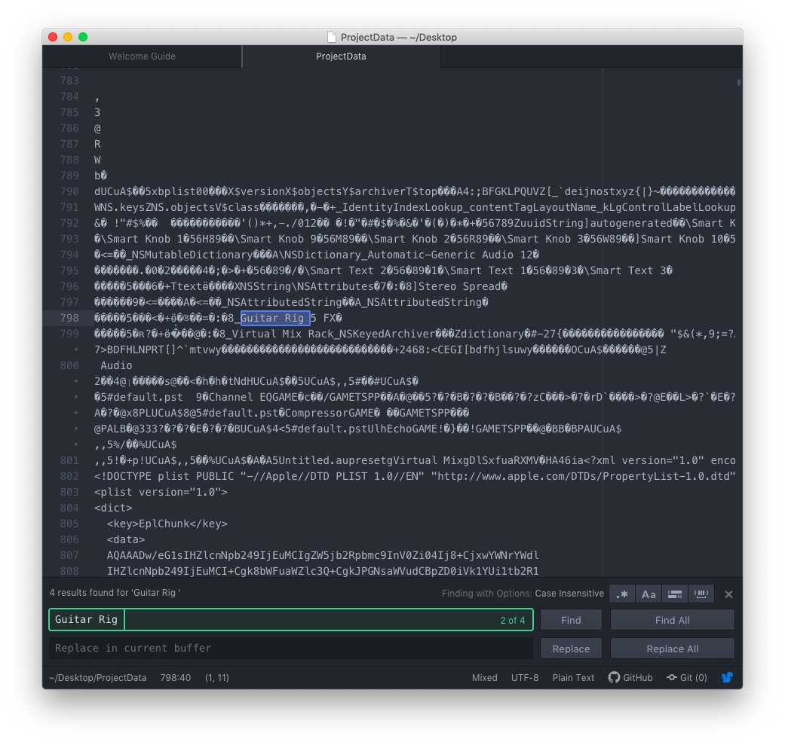
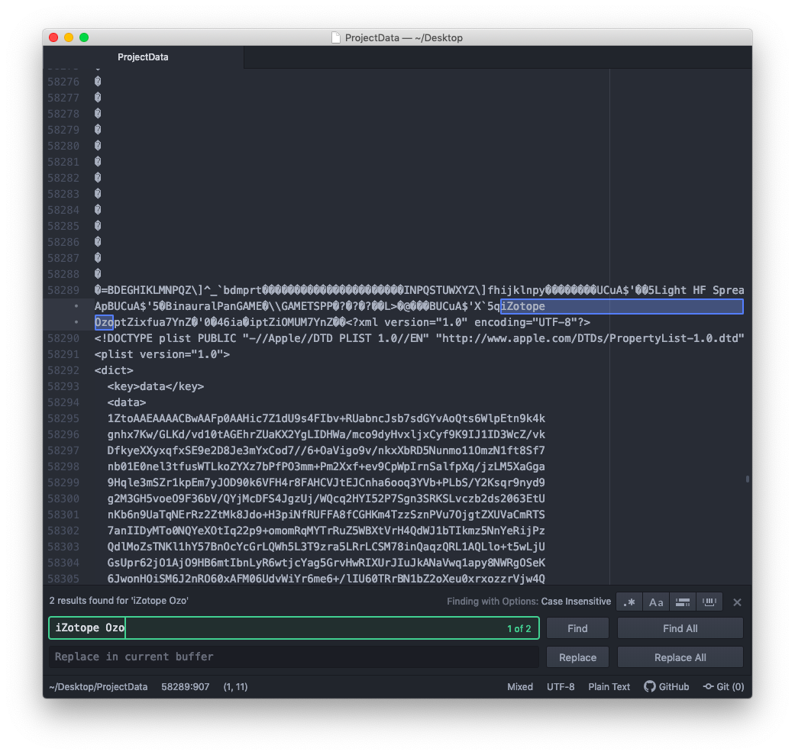

## Problem

Loading a project from a friend. Logic says it can't find a plugin, but the plugin name is abbreviated! How to find out what it is?

For example is `Supercharge` Supercharger or Supercharger GT? Which version is `Guitar Rig ` (note the space at the end)?

## Solution

Open the bundled `ProjectData` file in a text editor and perform a case sensitive search. The file is technically an encrypted SQLite database, so it needs to be interpreted as ASCII. Many of the columns appear to be unencrypted making search possible.

* Right click the Logic project
* Select `Show Package Contents`
* Go into the `Alternatives` folder and find the corresponding version folder (`000`, `001`, etc.)
* Copy the `ProjectData` file to your Desktop (to be safe)
* Open `ProjectData` from your Desktop in your favorite code editor (Atom, VSCode, etc.)
  * TextEdit will work but may be slow
  * I perfer a text editor over a hex editor because of the syntax highlighting

Note: since this a hack, YMMV. For example `iZotope Ozo` turned out to be iZotope Ozone 7 Advanced, and I only determined that through manual trial and error by installing various trial versions.

## Screenshots

## Links

* <https://www.logicprohelp.com/forum/viewtopic.php?t=126933>