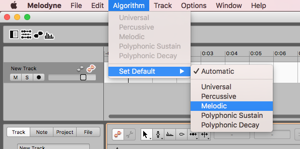

## Problem

The Melodyne 4 Trial defaults to the `Polyphonic` algorithm when loading a new file. Only noticed the artifacts after making a bunch of edits.

Notice how it almost sounds like a chord (i.e. polyphony) at the end of each phrase.

<audio src="https://raw.githubusercontent.com/NaanProphet/blog/master/static/assets/polyphonic-fail.mp3" controls preload></audio>

## Solution

Don't use the `Polyphonic` algorithm for vocal editing. Use `Melodic` instead.

<audio src="https://raw.githubusercontent.com/NaanProphet/blog/master/static/assets/polyphonic-fail-fix-melodic.mp3" controls preload></audio>

Note: there is a setting in the menu bar so set the default algorithm, but it doesn't seem to persist after quitting the application.

