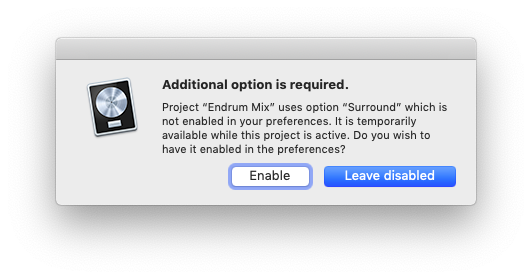

## Problem

I was surprised by this warning when I was opened a stereo project.

Turns out an effect was using binaural panning. This means when using headphones, the listener will hear a simulated surround sound (after all you only have two ears for real surround sound too).

Interestingly even with the setting disabled in Preferences, I can still hear the effect with headphones as I drag around the puck...

## Solution

I'm leaving it disabled since I don't need all the actual surround features listed in [Logic Pro X: Surround features overview](https://support.apple.com/kb/PH24627?viewlocale=en_US&locale=en_US). Hopefully that'll also make Logic run faster.

## Links

* <https://www.logicprohelp.com/forum/viewtopic.php?t=123448>
* <https://youtu.be/Xi332sZ4VCc>
