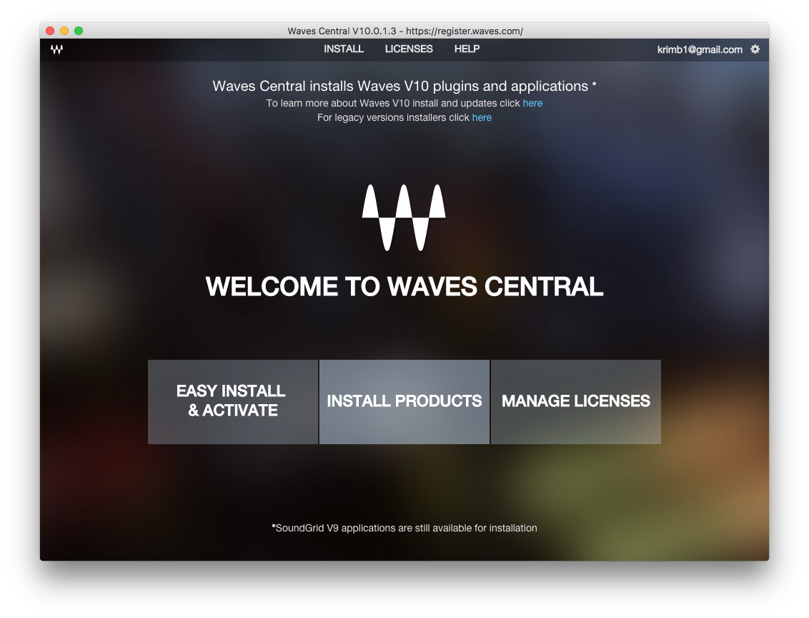
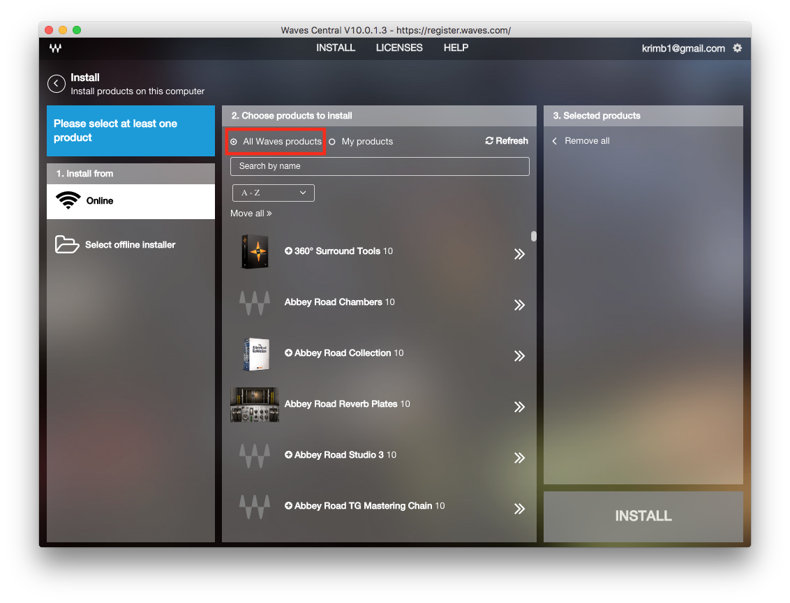
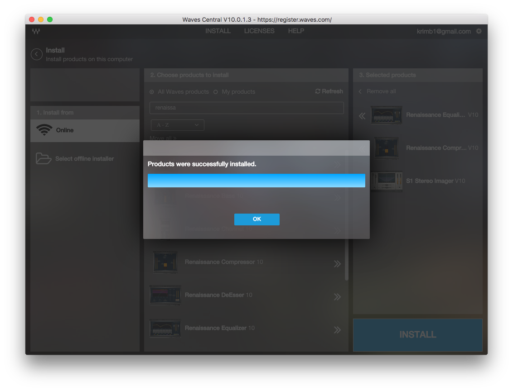
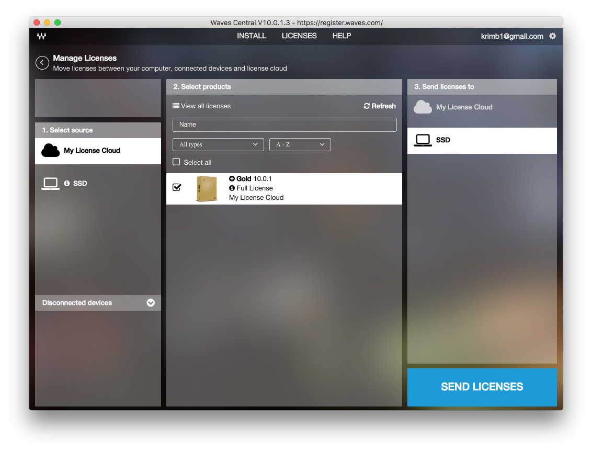

## Problem

Purchased a Waves bundle. Only want to install three plugins.

## Solution

1. Don't choose Easy Install
2. Select `Install Products`
3. Select `All Waves Products` and choose the plugins you want
4. Navigate to `Manage Licenses`
5. Activate your bundle's license

## Screenshots

