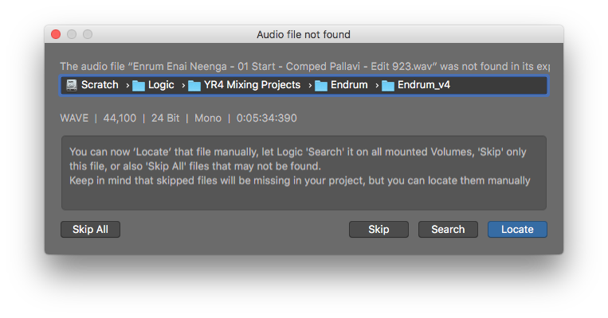
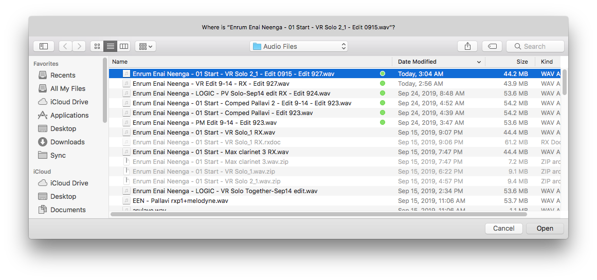
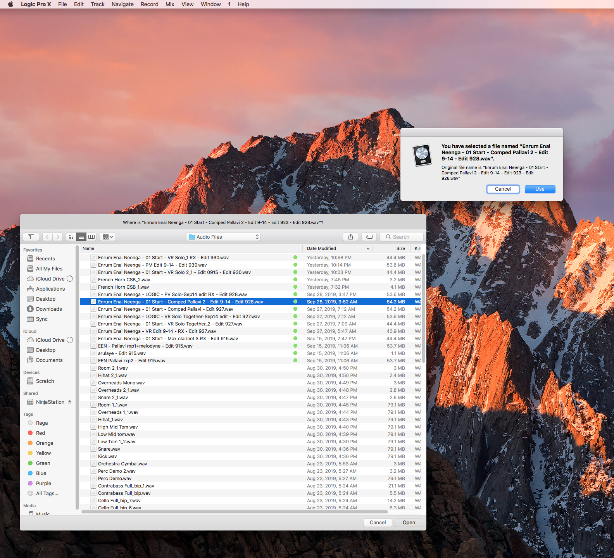
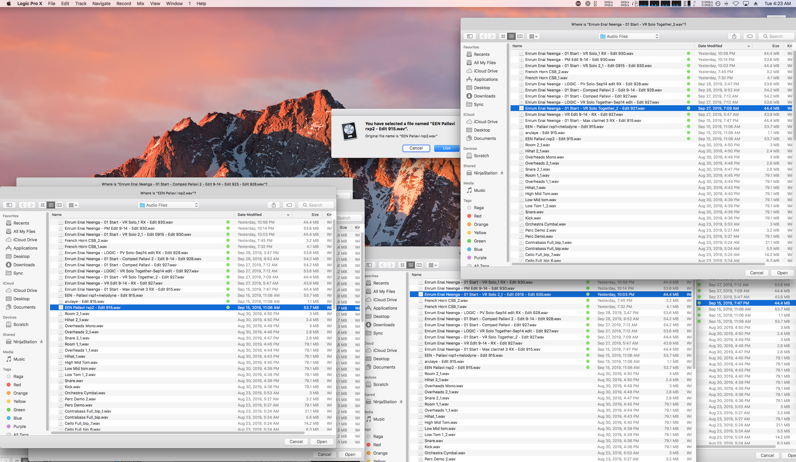

## Problem

Sometimes, if I replace/relink an audio file during launch, the project seems to hang without loading.

What is actually happening is there is another dialog prompt (for another missing file) but it is hidden behind the Finder prompt!

## Workaround (Ratchet)

Move the Finder dialog *off to the side* selecting a file with `Open`. That way, the dialog will appear in the usual place and you can still see it. Press `Use` to continue.

If you have multiple files that need relinking, be careful to move the dialogs away in a consistent manner—otherwise it may look like this!

## Notes

This post was an extension of [Replacing/Relinking Audio Files in Logic]().

