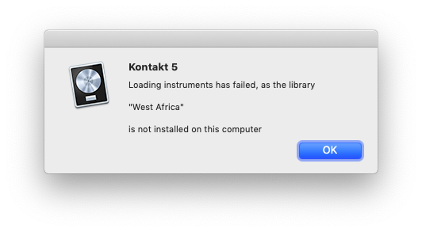
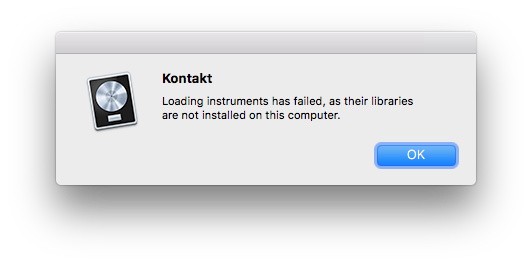

## Problem

Sometimes Logic is very helpful when a missing Kontakt instrument is missing.

Other times, it is not!

How to determine which instrument is missing?

## Solution

Unfortunately, this seems to be because of third party instruments. You might have some luck with the approach described in [How to Decode Shortened Plugin Names in Logic]() but otherwise ask the person whose project you're opening.

In this case, it turned out to be instruments from the **Cinematic Studio** series.