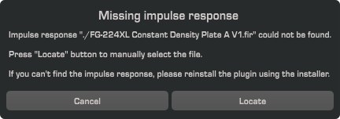
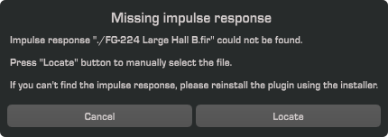

## Problem

Installed VerbSuite via a Slate Digital All-Access plan. Two errors show up when Logic scans the plugin in.

I don't have a Gobbler account, so I couldn't follow the guide on Slate's FAQ page [How To Access the VerbSuite FG-224 Expansion Installers](https://slatedigital.zendesk.com/hc/en-us/articles/115005085188-How-To-Access-the-VerbSuite-FG-224-Expansion-Installers).

## Solution

Contacted Slate support and they provided me with direct links for the VerbSuite Expansion installers in one business day.
