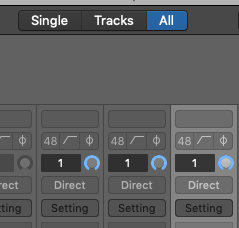
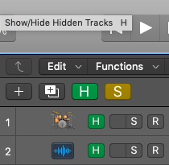

## Problem

I know this project is using a plugin, because it requires it when the project loads (`Kontakt 5`). However in the mixer I can't find any Kontakt instruments!

## Solution

The track using the plugin is probably hidden. Toggle `All` in the mixer console to see hidden tracks.

Alternatively, unhide the tracks by pressing `H` or clicking the `H` button in the Main Window.

