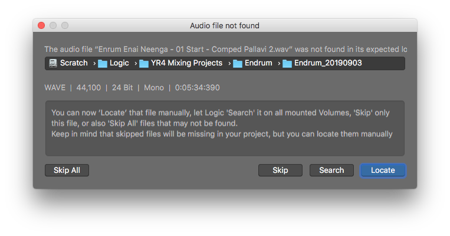
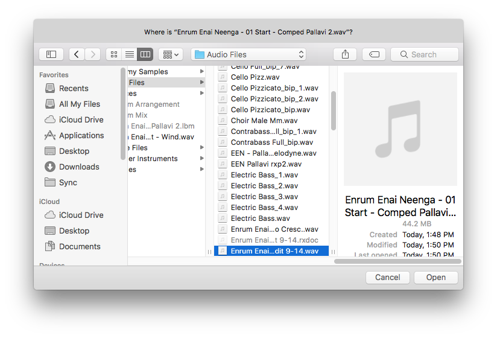
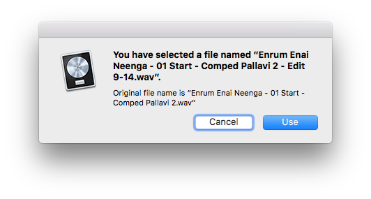

## Use Cases

Round tripping audio edits between workstations. Renaming the file helps with version control.

## Method

This is like "Relinking Files" in video editing.

5. Find the original file in the `Audio Files` folder
2. Zip it up
3. Delete it
4. Close the Project (because the file is already loaded in RAM)
5. Reopen the Project
6. A warning will appear saying the file is missing 
7. Select **Locate**
8. Choose the new file 
9. A confirmation window will appear saying the file is changed 

## Links

* <https://www.logicprohelp.com/forum/viewtopic.php?t=71041>

