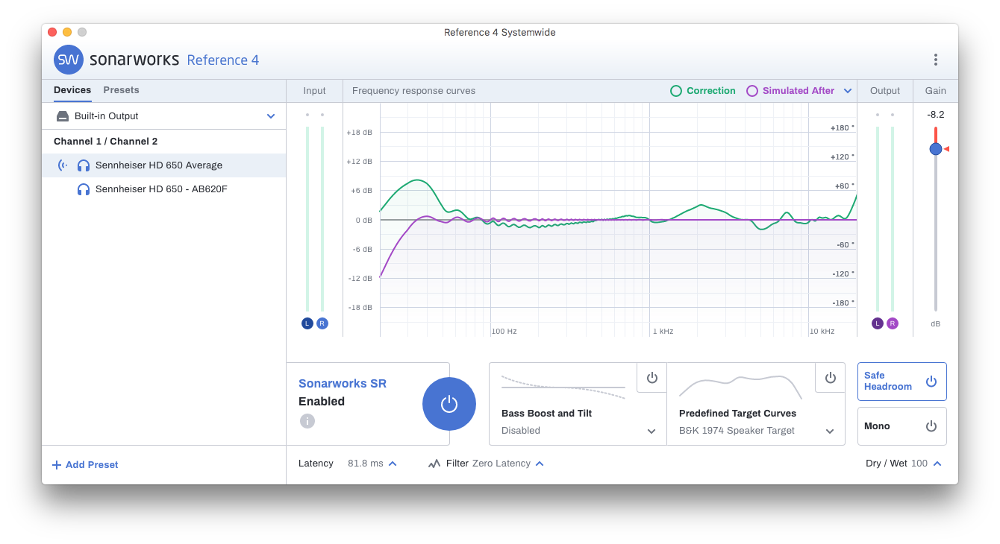
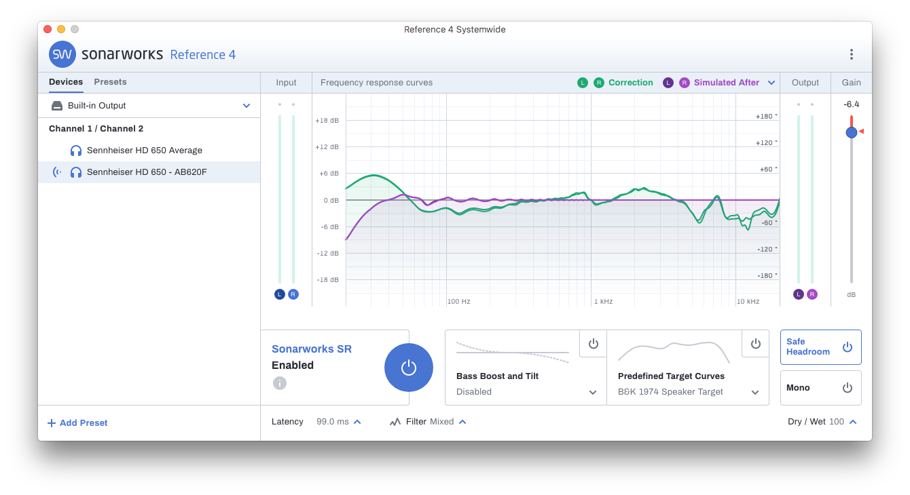
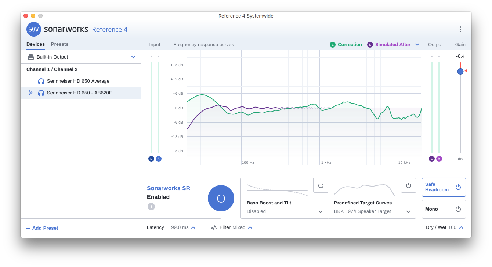

## TL;DR

Do individually calibrated headphones from Sonarworks make a difference? Yea!

- Stereo imaging is clearer
- Vocals are not over-pronounced
- Bass (especially in <= 200Hz range) is clearer/louder

Is it worth the $149? IMO yes, especially because of how it cleans up the sound. (It is worth noting that not all headphones normalize with EQ calibration well, but the HD 650s do.)

## Calibration Curves

Below is a comparison of the average calibration curve to the individually tailored one.

The corrections in the 10kHz range are particularly interesting!

**Sonarworks' Average of all HD650s Calibrated**

**Individually Calibrated L/R**

**Individually Calibrated L Only**

**Individually Calibrated R Only**

