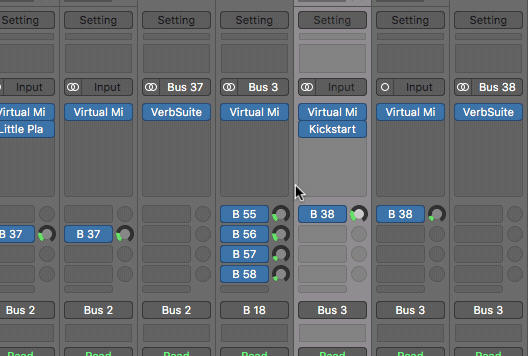
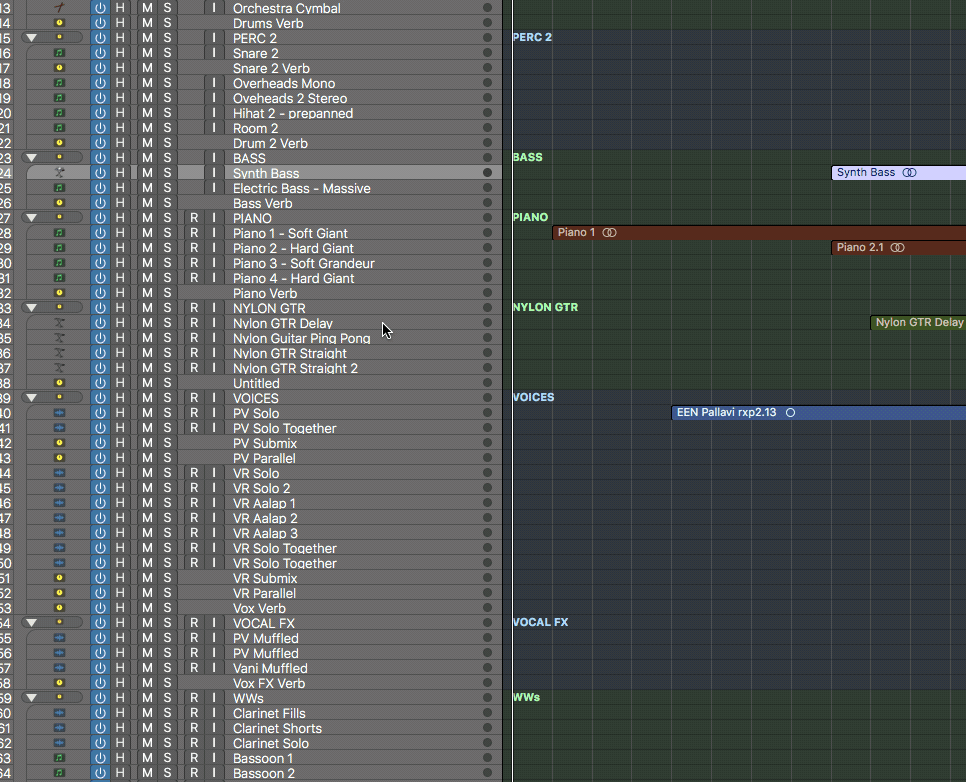

## Problem

Can't turn on/off a plugin (another person's project). The edit window also doesn't appear.

## Solution

The track is freezed. Unfreeze the track.

## Links

* <https://youtu.be/VP0A2g_hTx8?t=40>