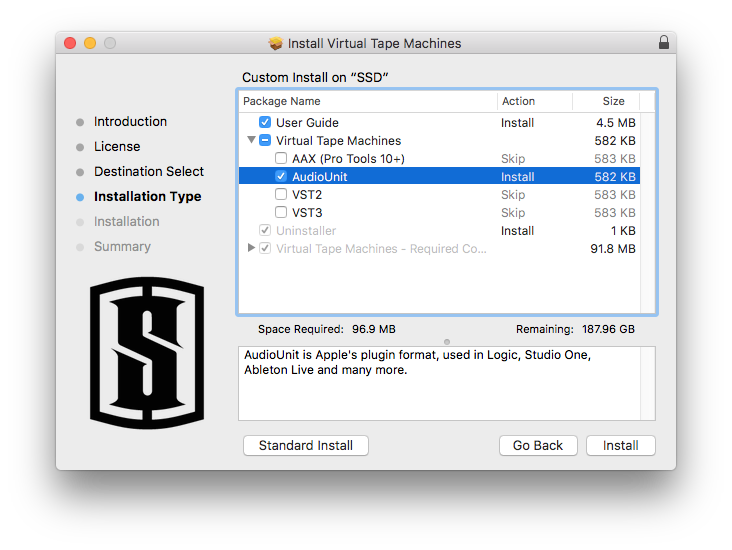

## TL;DR

When installing plugins for LogicPro X, only Audio Unit (AU) is needed.

## Breakdown

Slate's installer actually has awesome descriptions of various formats!

* AAX Pro Tools plugin format, Pro Tools 10 (32 bit) and later (64 bit)
	* RTAS is for older Pro Tools
* AudioUnit is Apple's plugin format, used in Logic, Studio One, Ableton Live and many more.
	* This is what Audio Hijack uses as well.
* VST [aka VST2] is Steinberg's plugin format, used in Cubase, Studio One, Ableton Live, Reaper and many more. 
	* The original GOAT. Can be 32 or 64 bit, depending on the plugin.
* VST3 is Steinberg's new plugin format, used in Cubase, Studio One and Wavelab.
	* Supported in Ableton Live 10 onwards.

## Links

* <https://www.musicradar.com/tuition/tech/the-quick-guide-to-plugin-formats-and-compatibility-620406>
