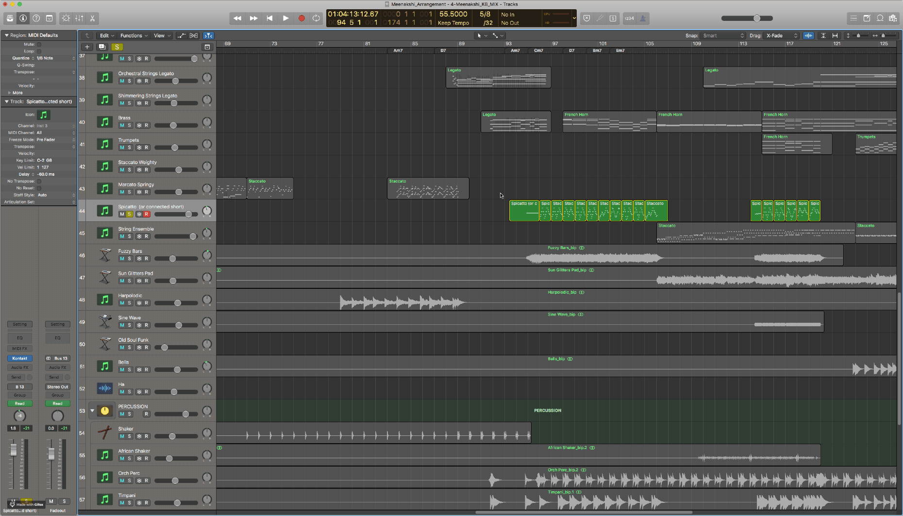

## TL;DR

Programming refers to managing dynamics and articulation on software instruments to make passages sound more authentic. Often these settings are scripted based on phrasing into JavaScript or Python scripts, hence the term.

Professional libraries like [Cinematic Studio](https://cinematicstudioseries.com) or [Spitfire](https://www.spitfireaudio.com/shop/a-z/bbc-symphony-orchestra/) have incredibly vast degrees of freedom for adjusting nuance and articulation than starter libraries do. The [Thanos Script](https://vi-control.net/community/threads/free-permanent-fix-for-css-legato.71972/) is popular for adjusting articulation and delays for Cinematic Strings Logic X.

*Shout out to [my mentors](/about#my-mentors) Sanchit Malhotra and Samarth Srinivasan for dropping knowledge. 🎤*

## Crash Course on Programming (with Cinematic Studio) 

Programming isn't just about switching sample libraries. The big thing is fine tuning expression and dynamics with MIDI Control Change (CC) messages so that the passages actually sound better. Swapping libraries is like changing orchestras; programming a library is like rehearsing.

## Tradeoffs of Sample Libraries

Entry level libraries (like [Logic X MIDI Strings](https://support.apple.com/en-us/HT208461) or [Native Instruments Session Strings Pro](https://www.native-instruments.com/en/products/komplete/cinematic/session-strings-pro/)) don't offer the same level of expressiveness. The samples recorded are not detailed enough to capture fine nuances of attack transients, color nonlinearites, etc.[^1] However, starter libraries do have an advantage when arranging/prototyping: they are smaller, take less RAM, and sometimes easier to work with punch out ideas.

Have a listen of these two embedded factory demos to hear the difference yourself.

**Native Instruments Session Strings Pro** 

https://www.native-instruments.com/fileadmin/ni_media/producer/kontaktsoundpack/SESSION_STRINGS_PRO/audio/02_City_Of_Lights.mp3

**Cinematic Studio Strings** *New Dawn*, by Alex Walbank

https://cinematicstudioseries.com/wp-content/uploads/2020/01/alex-wallbank-new-dawn.mp3

The same of course applies for other instruments as well!

## Programming as Orchestrating

Programming can also involve orchestration—splitting a general "legato strings" into a different tracks for first chair, first violins, second violins, etc. The process is similar to taking a piano score and setting it for orchestra!

## Refining Sound via MIDI

Most libraries respect certain CC values to mean certain things by convention.

* Long/legato patches
  * `CC1` = dynamics or dynamic layer. Also known as `modulation` or `mod`. The value of CC1 will choose the appropriate sample (and/or crossfade samples, depending on how many samples it has) for the dynamic level you want. Think sfzorando vs. piano vs. pizzacatto.
  * `CC11` = expression. Technically speaking, CC11 is a volume control that shapes the sample already chosen by the dynamic layer. It's like a second-order dynamics shaper within the CC1 sample chosen. Also called phrase shaping.
* Short patches/articulations 
  * Controlled by MIDI `velocity`

Typically you would broadly define the shape of a legato phrase with `CC1` and micro changes with `CC11`.

For example if you're at `CC1` = 70 which is mezzoforte, `CC11` values 0-127 will go from no volume up to mezzo forte. `CC11` can be used for breaths between notes or rounding off each note, depends how detailed you want to get.

## Logic X MIDI Programming Techniques

* `CC11` isn't super necessary for CSS
* Split legato and staccatto passages on different tracks
* Match the `velocity` of stacatto to the `CC1` modulation levels of legato if playing at the same time
* Copy `CC1` levels to other tracks by copying the region and then deleting the notes after
* Merge `modulation` across tracks by selection regions and pressing `J`. Only works if there isn't mod data in the other regions though.

## Scripting Changes with the Thanos Plugin

Adjusting notes manually in Logic X via the Piano Roll looks something like this. Convenient for a passage here or there, but imagine this x15 and say hello to mental fatigue and carpal tunnel syndrome.

On the other hand, scripting changes looks like this. Obama says it all.

https://www.youtube.com/watch?v=CBwcuBjVK4U

More on the Thanos plugin for Cinematic Studio Strings on the official forum page [here](https://vi-control.net/community/threads/free-permanent-fix-for-css-legato.71972/).

## Negative Delays for Attack Transients

As mentioned in the video, the Thanos script also adjusts the delay of the notes so that they speak on the beat they were quantized on. This was something I didn't realize at first, until certain formerly snappy Session Strings passages started dragging (hence the [discussion on tradeoffs above](#tradeoffs-of-sample-libraries) on how simpler libraries are easier to prototype with)!

Reading the CSS Manual:

> When a musician transitions from one note to another, there is a subtle timbral and dynamic shift as the players prepare for the new note. This effect can be heard while listening to a solo bassoon or a group of violins, and is a crucial factor in creating a realistic sounding performance with samples. CSS has been programmed to include these subtle swells before each new triggered legato note, and the end result is a smooth, expressive sound. In practical terms, this means there is a delay whenever you trigger a new legato note in any CSS instrument. The amount of delay is determined by the velocity at which you play each new legato note. There are three velocity zones: 0-64, 65-100, and 101-127, which correspond to three legato speeds respectively: slow, medium and fast, as pictured below.
>
> Slow has the most delay, approximately 1/3 of a second (333ms), medium is about 1/4s (250ms), and fast has a small delay - approximately 100ms.


And for fast notes:

> Please note that there is a short delay of 60ms from the beginning of the short note samples to their “rhythmic peak.” We left this in the samples intentionally as we believe this adds a significant degree of realism, and most importantly, it ensures that the timing across all short note types is consistent. So make sure you account for this when quantising short note tracks, either by applying a negative 60ms delay to the whole track, or moving the the notes back manually.


## References

[^1]: For a good read see this NY Times article [To Save the Sound of a Stradivarius, a Whole City Must Keep Quiet](https://www.nytimes.com/2019/01/17/arts/music/stradivarius-sound-bank-recording-cremona.html)