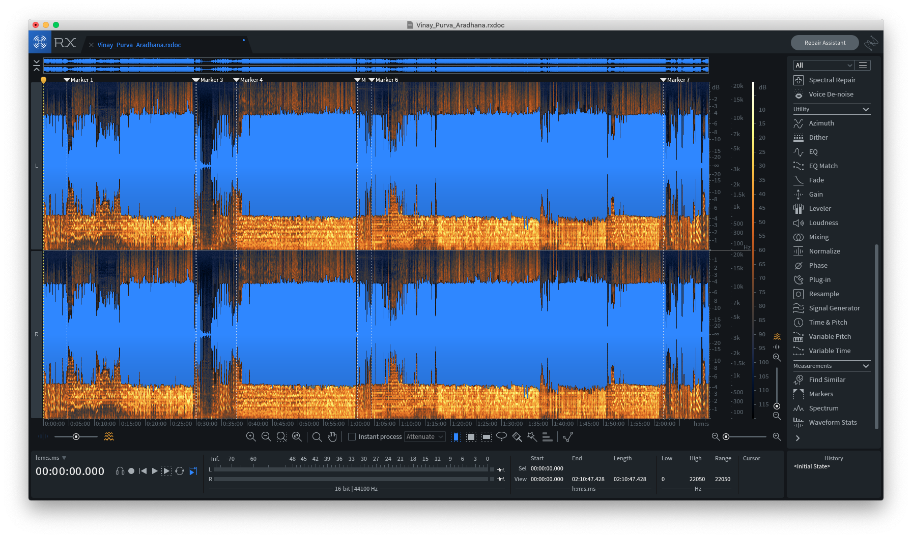
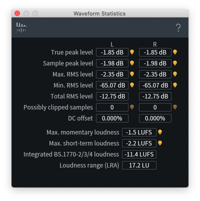
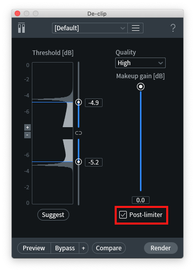
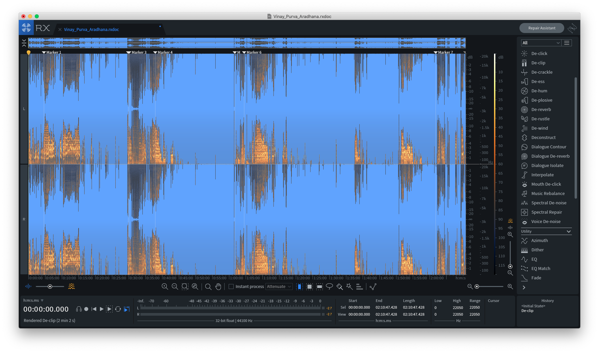
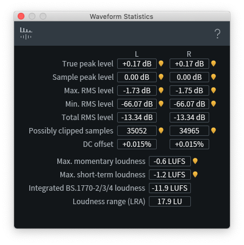
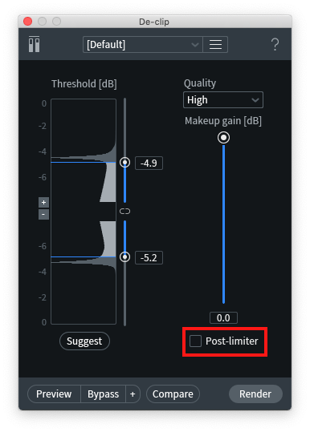
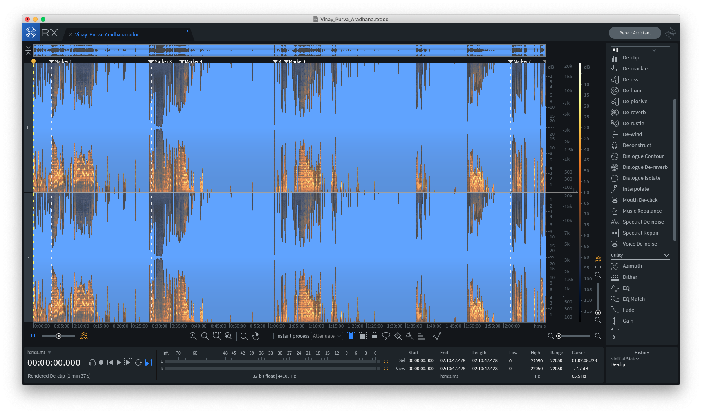

Many years ago I did live sound for a concert and recorded the stereo mix. When I came home I realized the audio sounded distorted even though I kept the levels under 0 dB!

Even though the digital waveform was under 0dB (-1.98 dB sample peak level, -2.35 dB max RMS level), something in the audio chain made the recording saturate. Can't remember now exactly but I was using an old Yamaha analog mixer and probably a portable audio recorder (Zoom H1, H2, etc.) via RCA stereo out.

Thankfully, I was able to repair it using iZotope RX Advanced's Declip tool. I had a fun conversation with Claude Opus 4.6 to understand what happened.

> It sounds distorted because harmonics from the upstream analog clipping are baked into the sample values. The flatness is the signature.

RX's Declip tool analyzes where the plateaus occur and then redraws the waveform.

Notably, the declip thresholds were asymmetric (-4.9, -5.2). This suggests analog saturation, likely from the recorder plugged into the RCA outputs.

> Digital clipping at a fixed-point ceiling is perfectly symmetric by definition — samples get clamped to ±max value, no room for asymmetry. If the Zoom's ADC had been the clipping stage, you'd see symmetric thresholds, not asymmetric ones.

> Analog saturation, on the other hand, almost always has some asymmetry. A 0.3 dB asymmetry is exactly what you'd expect from a consumer-grade unbalanced input stage hitting its limits.

After running Declip, the levels pegged at 0 dB...but didn't sound distorted!?

> Declip was working in 32-bit float (the rxdoc XML confirms this), and there's no ceiling in 32-bit float. Declip wasn't clamped at 0.

Indeed. RX first runs Declip using 32-bit floating point arithmetic, regardless of what the bit depth of the original audio file is. As an experiment, I ran it with `Post-limiter` off, and the declipped version regularly hit +4.76 dB! However with the limiter on, RX then pulls everything back down so that the max is 0dB.

-2 dB to +11.5 dB...that's almost +13.5 dB of clipping!

This made me wonder: should I have reduced gain first before running Declip?

> The post-limiter is doing the job better than any manual gain reduction could. Declip reconstructs the true shape in 32-bit float with full headroom, then the post-limiter transparently catches the overs. If you'd reduced gain by 5 dB first, Declip would reconstruct to roughly 0 dBFS, and you wouldn't need the post-limiter — but you'd also be guessing at how much to reduce by. The post-limiter lets Declip do its math unconstrained and handles the headroom automatically.

It also occurred to me that pre-reducing gain before Declip could make silent the softer parts! This was a music performance with high dynamic range, and preserving all of that musicality is important. With the post- limiter, true peak was 0.17 dB.

All this reveals something quite interesting about the nature of clipping and distortion.

> Clipping isn't about level. It's about shape. A recording can be clipped at −2 dBFS and sound terrible (wide flat-topped analog saturation). The same recording can be reconstructed to 0 dBFS with 0.17 dB of true-peak overshoot and sound perfectly clean (a sliver shaved off a natural peak). The difference isn't the level — it's how much of the peak's shape is destroyed. Declip fixes clipping not by making the file quieter, but by restoring the shape.

Reflecting on all this, it could be cool to create some kind of realtime audio monitor to detect "unclipped" plateaus to catch this kind of stuff during the show itself. Might be possible in python. Something for a future post!