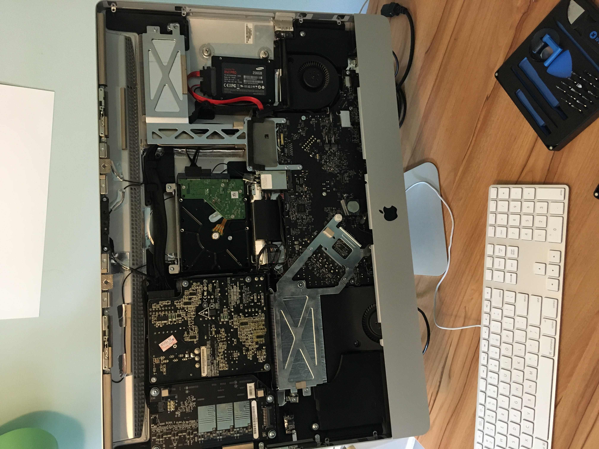
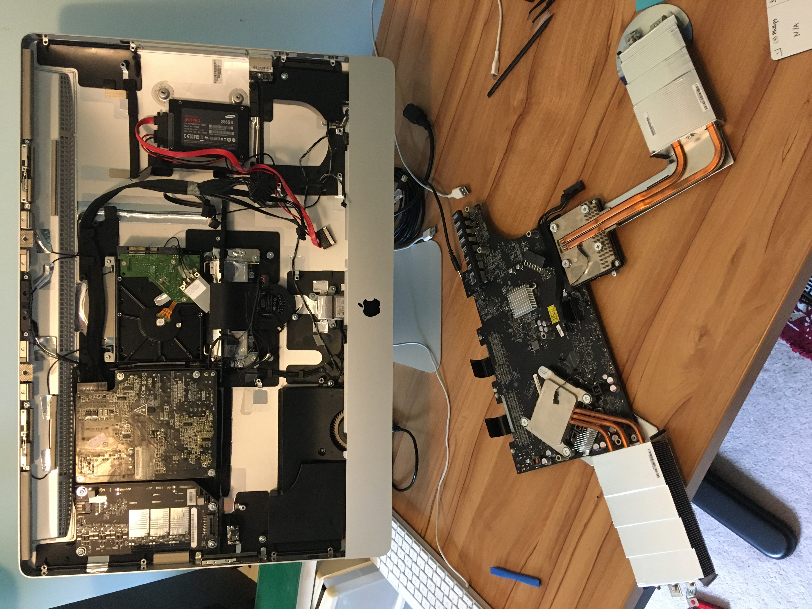
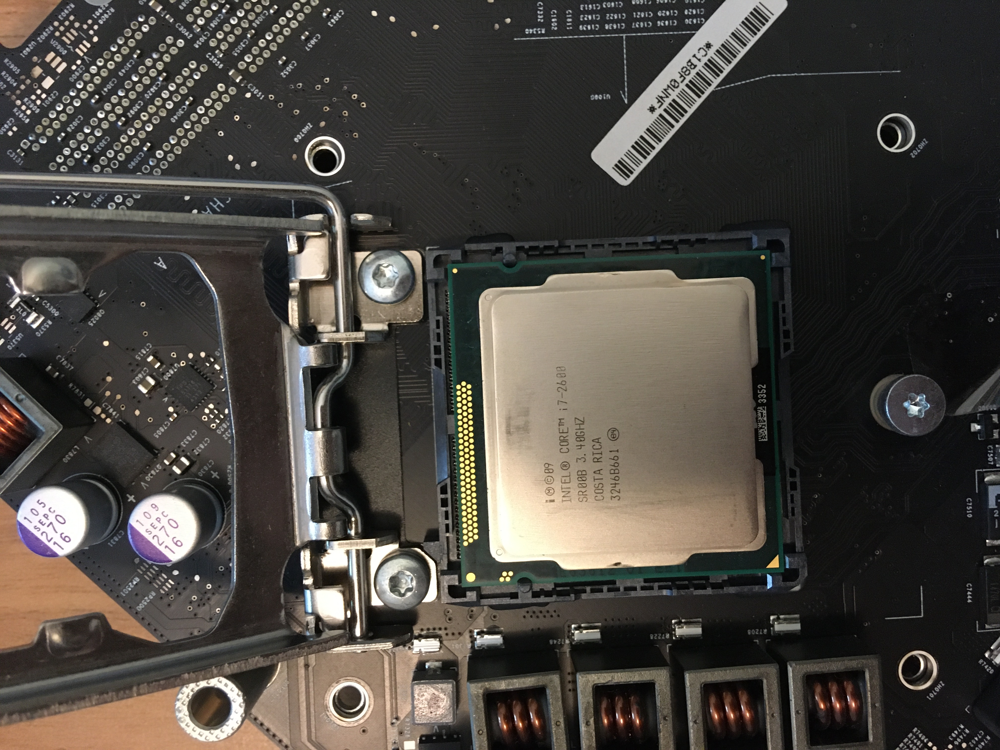
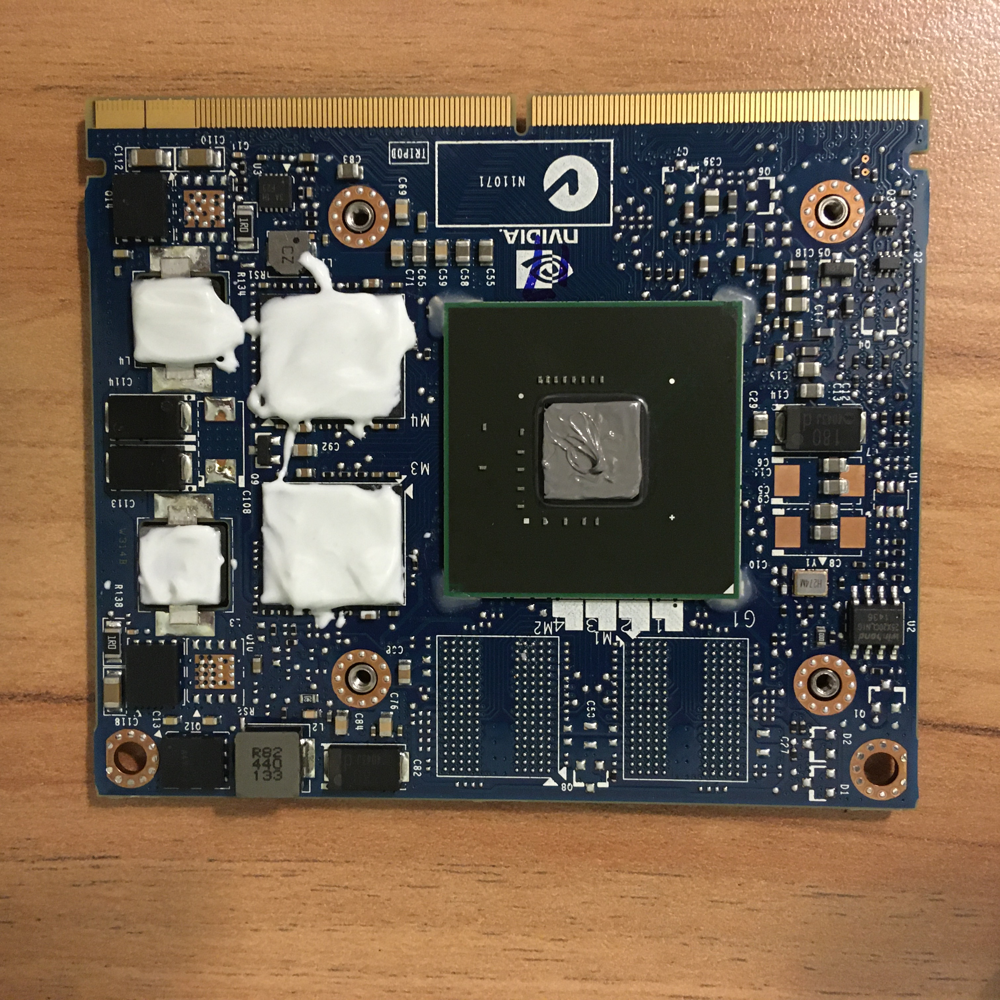
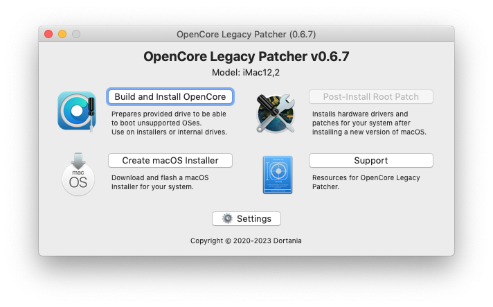
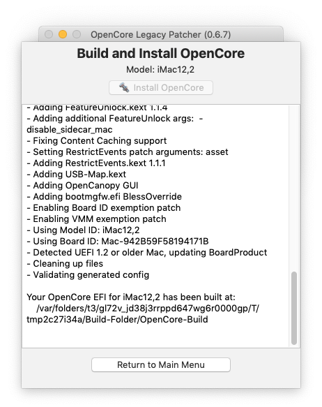
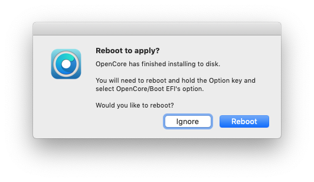

## Why Upgrade

Older iMacs can't be upgraded to MacOS 10.14 Mojave (or higher) because the stock GPU it has doesn't support Metal. The last, officially supported non-Metal MacOS for the 2011 iMac is 10.13 High Sierra.[^12] Time to go unofficial.

Apple Logic Pro X 10.5[^13] requires Mojave, and at the time I was collaborating on some projects created in Logic 10.5. To use them on the iMac, I need to swap the GPU with one that supports Metal and then install Mojave unofficially.[^19]

Since I'm already performing computer surgery, I might as well upgrade the CPU as well. Music production can be particularly CPU intensive, especially when using software instruments or synths.[^14]

## But Why DIY

The most straightforward route would have been to purchase a new machine that supported Mojave. However the DIY appealed to me for a few reasons:

* Less cost 💰
* Less e-waste ♻️
* Fun, new challenge (haven't done something like this before) 🔧
* Good trailblazing by the community 🤓
* Sentimental 🖥️
* Artistic 👨🏽‍🎨

## iMac Specs

Stock machine (full OEM specs listed on [Everymac](https://everymac.com/systems/apple/imac/specs/imac-core-i5-2.7-27-inch-aluminum-mid-2011-thunderbolt-specs.html)):

* Mid 2011 27" iMac 12,2
* A1312 EMC 2429
* 2.7 GHz Intel Quad Core i5-2500S with Turbo Boost 3.7 GHz
* AMD Radeon HD 6770M 512 MB

In addition, some previous upgrades were:

* 32 GB DDR3-1333 RAM
* Dual Drive (via extra SATA port[^7], still retains optical drive)
	* 256 GB Samsung 840 PRO Series SATA III 6 Gbps
	* 1 TB 7200 RPM WDC WD1001FALS-403AA0 SATA II 3 Gbps

## New Parts

Both the CPU and GPU will be upgraded. The [MacintoshMen upgrade guide](http://macintoshmen.is-great.net/2019/09/08/imac-2009-to-2011-upgrade-guide/) is an excellent starting point for reviewing available CPU and GPU options.

* Intel Quad Core i7-2600 CPU ($80 eBay)
* Nvidia Quadro K610M 1024 MB ($22 eBay)
* Artic Silver Combo Kit for CPU/GPU dies ($15)
* K5 PRO Thermal Paste for GPU VRAM ($11)

### CPU

Here is the original CPU the iMac came with.

* 2.7 GHz Intel Quad Core i5-2500S with Turbo Boost 3.7 GHz ([link](https://www.intel.com/content/www/us/en/products/sku/52211/intel-core-i52500s-processor-6m-cache-up-to-3-70-ghz/specifications.html))

The new CPU I chose was offered in 2011 as an Apple-supported upgrade, making it a plug-in replacement.[^3] It uses the same [Sandy Bridge architecture and the LGA 1155 socket](https://en.wikipedia.org/wiki/Sandy_Bridge#Desktop_platform) as the original.

*  3.4 GHz Intel Quad Core i7 (i7-2600) with Turbo Boost 3.8 GHz ([link](https://www.intel.com/content/www/us/en/products/sku/52213/intel-core-i72600-processor-8m-cache-up-to-3-80-ghz/specifications.html))

It's now known (since my initial research in 2019) that [Sandy Bridge Xeon chips](https://en.wikipedia.org/wiki/Intel_Sandy_Bridge-based_Xeon_microprocessors#Sandy_Bridge_Xeon) also work, so another option could have been the Xeon 1290.

* 3.6 GHz Intel Xeon Quad Core E3-1290 with Turbo Boost 4.0 GHz ([link](https://ark.intel.com/content/www/us/en/ark/products/55452/intel-xeon-processor-e31290-8m-cache-3-60-ghz.html))

### GPU

The old GPU is from AMD and does not support Metal.

* AMD Radeon HD 6770M 512 MB

The new GPU is from a used Dell/Alienware laptop.

* Nvidia Quadro K610M 1024 MB (MXM-A form factor)

Note: the K610M is the least powerful upgrade, but it is the most straightforward[^9] without requiring any heatsink[^6] or temperature sensor[^8] modifications. Since this machine will be used primarily for audio production (rather than video), a simple GPU card is OK.

### Sourcing

Finding a CPU on eBay was easy. On the other hand, the GPU was reported to be hit/miss.

Luckily my K610M from eBay worked the first time!

## Outline

Community support is chiefly found on two Mac Rumors pages: **CPU Upgrade iMac Mid 2011**[^1] and **2011 iMac Graphics Card Upgrade**[^2].

Some of these steps (like upgrading to High Sierra) could be performed earlier, but here is what I did.

1. Open the iMac and get to the motherboard
2. Physically install the new CPU
3. Reboot, confirm it still works
4. Upgrade to High Sierra and confirm latest Mac firmware is present
5. Prepare GPU vBIOS USB boot drive
6. Open the iMac again
7. Physically install the new GPU that supports Metal
8. Built-in screen no longer works 😱
9. Turn on the iMac and flash the new GPU vBIOS using another computer and SSH
10. Built-in screen works again 🥳 but brightness control and sleep won't work yet 😅
11. Use OpenCore[^15] to restore brightness control[^17] and sleep functionality
12. Install Mojave unofficially, since the iMac now supports Metal 🥳

## Steps

### I. CPU Install

1. Follow steps 1-32 of the iFixit guide [Installing iMac Intel 27" EMC 2429 Dual Drive Kit (HDD or SSD)](https://www.ifixit.com/Guide/Installing+iMac+Intel+27-Inch+EMC+2429+Dual+Drive+Kit+(HDD+or+SSD)/7575)
2. Follow steps 43-end of the iFixit guide [iMac Intel 21.5" EMC 2428 CPU Replacement](https://www.ifixit.com/Guide/iMac+Intel+21.5-Inch+EMC+2428+CPU+Replacement/5951) (it's the same for the 27")
3. Release the CPU and seat the new one.
4. Clean and apply thermal paste to the CPU, consulting the [Artic Silver guide](http://www.arcticsilver.com/intel_application_method.html) for reference. The i7-2600 is 2nd generation and therefore needs a **single vertical line**.

*Pictures*

1. Taking the display off  
2. Removing the main circuit board. CPU pictured left, GPU pictured right.  
3. So long already-expired warranty  
4. Releasing the old CPU  
5. Installing the new CPU (thermal application not shown)  
6. Reboot success! (I was running Sierra at the time)  

### II. High Sierra

1. The new GPU will need OpenCore to restore native keyboard brightness control. OpenCore in turn requires the latest MacOS firmware, so first make sure the computer has it.[^11]
2. Upgrade the iMac boot rom firmware to the latest version by installing High Sierra on an internal disk, including all recent Apple software updates.
3. Confirm the firmware version is up to date using the Eclectic Light Company's firmware lookup table.[^16]
4. Open System Preferences and enable High Sierra for remote access, screen sharing and remote login (SSH) just in case after the GPU replacement the display remains black!

### III. Preparing the vBIOS

vBIOS stands for video BIOS. Most of the aftermarket GPUs come from Dell/Alienware laptops, so they need to be re-flashed. Without this, the iMac boots to a nice, black screen.

There are a few options for flashing the new vBIOS, but the easiest, non-Windows way is via SSH and a USB flash drive.[^4]

Note: I did this back in June 2020, and since then there is an updated USB image (`Mac_GPU_Flash.zip` md5 `7d9e19926da009f2565597542089360d`) with different instructions.[^5] I followed Q3 in the old FAQ.

1. Download the file `2011_imac_usb.zip` (md5 `18e02e92844ebed8fc0fcf3ca039c754`) for the USB image from [here](https://forums.macrumors.com/threads/2011-imac-graphics-card-upgrade.1596614/page-175?post=28184981#post-28184981). There are strikethroughs to indicate deprecation, but the links still work.
2. Download the K610M vBIOS from [here](https://forums.macrumors.com/threads/2011-imac-graphics-card-upgrade.1596614/page-271?post=28497093#post-28497093) to **restore the display and show the boot picker**[^10]
3. Use Disk Utility to format the USB drive with GPT + FAT32. Copy the files to the new flash drive (no fancy flashing required). Lastly copy the vBIOS file onto there inside a folder.
4. Eject the USB drive and keep this ready for later.

### IV. GPU Install

A nice summary of the process is here <https://forums.macrumors.com/threads/2011-imac-graphics-card-upgrade.1596614/page-596?post=29967927#post-29967927>.

1. Follow the CPU removal guide to get to the GPU.
2. Apply the GPU thermal paste. The K610M has one die and four VRAM chips. Use the same thermal paste for the die as for the CPU (Artic Silver), but use the goopier thermal paste for the four VRAM chips (K5 PRO).
3. GPU is same dimensions as the original so pop it back in.
4. DO NOT fully put the computer back together yet (see next step).

*Pictures*

1. Preparing/cleaning the new GPU 
2. Applying all required thermal paste/compounds 

### V. GPU vBIOS Flash

Instructions for this section are stitched together partly from the OP[^4] but also from the new GMRL flash GitHub page.[^18]

1. The iMac should still be half open. Disconnect any SATA hard drive cables on the iMac. This makes it easier to load from the USB!
2. Connect the iMac ethernet port to your router—no wireless connections!!
3. Plug the USB flash drive from Part III into the iMac. Turn the iMac on. The screen will be black, but it would have booted into the USB drive.
4. Lookup the DHCP IP of the iMac by checking your router, etc.
5. Find another computer/Mac and SSH into iMac. `ssh root@YOURIP` and password `flash`
6. Find/change into the working directory `cd /lib/live/mount/medium/flash`
6. (Optional) Backup the old vBIOS `./nvflash --save Backups/OldNVBios.rom`
7. Remove the guard rails `./nvflash --protectoff`
8. Write the new ROM to the vBIOS `./nvflash -6 NVIDIA/NewNVBIOS.rom`
9. (Optional) Verify it worked `./nvflash -6 NVIDIA/NewNVBIOS.rom`
10. Reboot and enjoy the monitor again!

Note: after the vBIOS flash, the monitor will always be at full brightness until OpenCore kicks in. This means even after OpenCore patches are applied to the boot EFI, entering Recovery Mode or the like will have the iMac display at full brightness.

*Pictures*

1. Using another machine to initiate an SSH-based nvflash  
2. Flash success, ignore the warnings 
3. Internal screen works again! 

### VI. Installing OpenCore via OCLP

Next we install OpenCore via OpenCore Legacy Patcher (OCLP). From the WikiPost[^2]:

> After installing OpenCore your system will be qualified to run the stock installer programs provided by Apple.

> Owners of NVIDIA/AMD cards with a working EFI Boot screen can install the EFI folder directly to the EFI partition of the internal disk (process described in the OCLP docs). Having an EFI Boot screen one can always boot without OpenCore just by pressing alt/option on boot and selecting a supported macOS version like High Sierra.

> Please do not change any of default values (like SIP). You will only break the installation. The tool auto-detects hardware and will auto-configure the optimal OpenCore settings.

> History:
Catalina Loader (CL) was another solution based on OpenCore to be installed on USB or SD devices and maintained more easily on visible file systems than on hidden EFI partitions. The solution was helpful in times without an EFI boot picker. Since we now fully support EFI boot with all AMD cards there is no need for this out of date solution.

1. Download OCLP on the iMac from <https://dortania.github.io/OpenCore-Legacy-Patcher/>
2. Open `OpenCore-Patcher.app` 
3. Click `Settings` and navigate to `Advanced` > `Graphics Override`. Select `Nvidia Kepler` to indicate the custom GPU installation. (This step may not be necessary, but I did it just to be safe.) 
4. Click `Return` to return to the main menu, and then select `Build and Install OpenCore`. This will write files to a temp folder in `/var` 

5. Select `Install to disk` to persist changes. Select the appropriate disk with MacOS.  
6. Select the single EFI partition, already present  
7. Reboot to take effect! Note the instruction to hold down the option key. 

Note: to change the boot picker options, rebuild changing the `Show OpenCore Boot Picker` setting. 

**"Upgrading" from Catalina Loader to OCLP**

The original instructions from a few years ago required a USB boot drive called Catalina Loader. This drive would always be plugged into the iMac. However, it's really easy to cutover to OpenCore Legacy Patcher now: simply build, install, and remove the old USB! This is what I did in 2023.

It turned out sleep was broken afterwards, however, that was because I had to custom-install sleep extensions (`intelsandybridgegraphics.zip` md5 `c8acb3e1e462e189d5f5383308bdc772`) a few years ago. OCLP doesn't like those, so I just deleted them.

### VII. Upgrading to Mojave

Previous techniques required patching the MacOS installer using dosdude (what I did in 2020). However with OCLP, no customization is needed to the MacOS installer anymore!

1. Open `OpenCore-Patcher.app` again
2. Select `Create macOS Installer`
3. Boot from the new Flash drive and install MacOS
4. Reopen `OpenCore-Patcher.app` and check for any available `Post-Install Root Patch`es
4. Final state! 

## Tradeoffs

The iMac has been very stable on Mojave. After a few years here is my summary of the quality of life.

* Only one of the two Thunderbolt/MiniDisplay ports work to connect to another monitor. I don't use an additional monitor so this doesn't affect my workflow
* Brightness is full blast at the very beginning of the boot process (before OpenCore loads) and other places like Recovery Mode and Target Disk Mode
  * This kind of bothers me (looking at you midnight hour)
  * I would like to try this hardware mod[^17] to restore native brightness control everywhere someday
* Target Disk Mode works perfectly, though I don't use it much
* Target Display Mode works for the most part. [Luna Display](https://astropad.com/product/lunadisplay/ ) is better
  * With OCLP, unsupported combinations[^20] of MacOS are supported! For example a MBP running Catalina can use the iMac running Mojave as a monitor
  * Exiting Target Display Mode is buggy. Have to unplug the cable to exit, and then the iMac screen goes black even though it's still running.[^21] Have to use keyboard shortcuts to put the iMac to sleep and wake it back up to get the display on again.
  * Instead, I find the Luna Display hardware dongle much more effective. It can use the same Thunderbolt cable (for low lag) and even allows you to use your iMac's keyboard/trackpad to control the other computer!

## Footnotes

[^1]: <https://forums.macrumors.com/threads/cpu-upgrade-imac-mid-2011.2230813/?post=28362520#post-28362520>
[^2]: <https://forums.macrumors.com/threads/2011-imac-graphics-card-upgrade.1596614>  Note: a lot has changed in the sticky post since June 2020, but the instructions I followed are still present here in the WikiPost History <https://forums.macrumors.com/edit-history/3885949/view>
[^3]: All DIY attempts to 3.4 GHz / 3.9 GHz i7-3770 Ivy Bridge CPUs have failed. <https://forums.macrumors.com/threads/2011-imac-cpu-upgrade-possibilities.1225483/>
[^4]: Geekbench has some 2011 iMacs with i7-3930K and i7-3960X CPUs, but these are Hackintoshes that use different sockets (LGA 2011 vs LGA 1155). <https://forums.macrumors.com/threads/imac-27-early-2011-insta-6-core-cpu.1352021/>
[^4]: 2020 vBIOS flashing guide <https://forums.macrumors.com/threads/2011-imac-graphics-card-upgrade.1596614/page-175?post=28184981#post-28184981>
[^5]: 2021 vBIOS flashing guide <https://forums.macrumors.com/threads/2011-imac-graphics-card-upgrade.1596614/page-545?post=29723850#post-29723850>
[^6]: I do have a 2 pipe GPU heatsink, but we're sticking with the MXM-A form factor! *"If you have a 2 pipe heatsink that came with the lower end GPUs on these iMacs and want to use an MXM-B Card, you'll have to buy a 3 pipe heatsink to cool cards properly. Using a (battery powered) Dremel with tungsten carbide grinding cutters work fast and give you smooth result. Do not try other cutters!"* <https://forums.macrumors.com/threads/2011-imac-graphics-card-upgrade.1596614>
[^7]: Custom kit exploits an extra SATA port unused on the iMac logic board <https://www.ifixit.com/products/imac-intel-21-5-mid-2011-dual-hard-drive-kit>
[^8]: *"Step 9. Now relocate the ODD temperature sensor and glue it on the sink (not needed with K610M and M4000). Finally install the GPU and sink back in your iMac!"* <https://forums.macrumors.com/threads/2011-imac-graphics-card-upgrade.1596614/page-596?post=29967927#post-29967927>
[^9]: Apparently, I should have checked and used either a 0.5mm or 1mm copper shim between the GPU and the heat sink. I can't recall doing this, and as far as I can tell GPU temps are fine for my use. <https://forums.macrumors.com/threads/2011-imac-graphics-card-upgrade.1596614/page-320?post=28696585#post-28696585>
[^10]: The current version of the WikiPost[^2] does not list a BIOS for the K610M, but it was definitely needed!
[^11]: Another reason to upgrade the iMac firmware, is because in May 2011 Apple unlocked 6Gb/s (SATA III) with the two external Thunderbolt ports!!! <https://eshop.macsales.com/blog/10002-2011-imacs-no-sata-6gbs-yes-to-multiple-drives> <https://eshop.macsales.com/blog/10050-firmware-update-enables-6gbs-in-2011-imacs/>
[^12]: OWC always maintains the best Mac compatibility matrix <https://eshop.macsales.com/guides/Mac_OS_X_Compatibility>
[^13]: *"Logic Pro X 10.5 is supported only on macOS 10.14.6 or later."* <https://www.logicprohelp.com/forums/topic/130435-lpx-105-mac-compatibility/> And Logic Pro X 10.6 requires Mac OS 10.15. <https://www.logicprohelp.com/forums/topic/137704-os-high-sierra-10136-and-logic-pro-x-105/>
[^14]: *"Software synths and plugin effects use up CPU. These don't use much hard disk speed, but they require ridiculous amounts of calculations per second."* <https://www.logicprohelp.com/forums/topic/79918-will-an-ssd-cure-the-system-overload-issue/?do=findComment&comment=452195>
[^15]: When I originally performed this upgrade in 2020, I used a USB boot drive called "Catalina Loader" to patch the iMac before booting into the OS. Since then, OpenCore Legacy Patcher (OCLP) is the new, fully-featured and incredibly simpler way to patch the boot EFI partition requiring no additional USB drives. <https://dortania.github.io/OpenCore-Legacy-Patcher/> 
[^16]: For the `12,2` iMac, the last firmware version is `87.0.0.0.0`. <https://eclecticlight.co/2018/10/31/which-efi-firmware-should-your-mac-be-using-version-3/> There is also a tool called SilentKnight that they offer which can check the firmware and a few other things. <https://eclecticlight.co/lockrattler-systhist/>
[^17]: Mac Rumors member Lottosmp has actually found a hardware route to restore native brightness control, without requiring OpenCore. This would restore it everywhere, including Recovery Mode, etc. <https://forums.macrumors.com/threads/2011-imac-graphics-card-upgrade.1596614/page-261?post=28471675#post-28471675> <https://github.com/thingsapart/imac-esp32-pwm-brightness> <https://medium.com/@fixingthings/imac-2009-2010-2011-gpu-upgrade-fixing-led-lcd-pwm-brightness-with-an-esp32-bc32da61a0e7>
[^18]: <https://github.com/Ausdauersportler/GRML-FLASH#nvidia-graphcis-card-flashing>
[^19]: OpenCore Legacy Patcher (OCLP) has come a long way to support non-Metal cards in later version of MacOS, but as of June 2023 it is still WIP. Also it doesn't mention Mojave support necessarily. <https://github.com/dortania/OpenCore-Legacy-Patcher/issues/108>
[^20]: Apple only supports Target Display Mode for older machines <https://support.apple.com/en-us/HT204592>
[^21]: I haven't tried upgrading the K610m's vBIOS yet to see if fixes the Target Display Mode unplugging problem.
