## To Hack or not to Hack

Here is how I toed the line between performance tuning a jailbroken gaming console and using it officially with Nintendo Online.

After realizing how mucher smoother Overcooked runs on other consoles, I took it as a challenge to bring that same experience to my Switch—and not get banned.

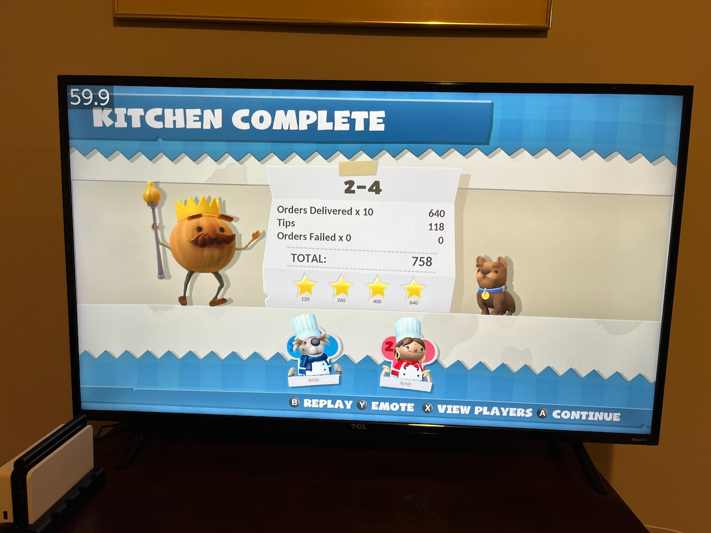
*Docked Nintendo Switch running Overcooked at 720p 60 FPS*

## Terminology

* Tegra = the NVIDIA chipset that Nintendo uses inside the Switch
* RCM = Recovery Mode
* CFW = Custom Firmware
* OFW = Original Firmware
* eMMC/sysNAND = the internal system memory (terms are loosely used interchangeably)
* emuMMC/emuNAND = emulated system memory (terms are loosley used interchangeably)
	* This is written to an SD card, since SD card contents are never readable by Nintendo for privacy
* EMC = Embedded Memory Controller i.e. the RAM on the device
* MEM = another term for the RAM
* NX = the original codename for the Switch, first publicly mentioned in March 2015[^13]
* HOS = Horizon OS, the internal name for the stock Nintendo firmware
* Erista/Mariko = codenames for the non-OLED Switch models. The original Erista can be soft-modded because of the Tegra exploit, but latter chipsets need a surrogate chip installed to re-enable the exploit.[^22]

## Objectives

1. Overclock the CPU/GPU/Memory so that performance of various games is improved
2. Continue to play online with friends/family
3. Continue to use Nintendo Save Data Cloud
4. Prevent the Switch from getting banned
5. Prevent my Nintendo Online account from getting banned

## Imperatives

These naturally follow from my objectives.

| Imperative | TL;DR |
| -- | -- |
| The Switch will not be used for game piracy. This immediately lowers ban risk. | Buy games. |
| Game cheats/mods (when applied to certain games) can leave their trace behind in save files. When these are seen by Nintendo, they can causes bans.[^6] | Do not use game cheats or mods. |
| Install CFW to the internal sysNAND to play online. This ensures the device always contacts Nintendo's servers with its original signature and serial number.[^5] | Install CFW to the internal sysNAND to play online. |
| Simply using the overclocking program `sys-clk` does not result in bans, even during online play.[^4] | Overclocking is not a bannable activity. |
| As long as your save game files are clean, Nintendo's automatic save backup on the sysNAND is perfectly safe.[^10] | Do not cheat and continue to use Nintendo Save Data Cloud. |
| There are two types of bans: device bans and account bans. Unless you cheat online, at worst, only the device will be banned, but your Nintendo Online account will still be fine. | Play fair, don't be a jerk[^8], and don't cheat online. |
| Many guides online include the cheat module [EdiZon-SE](https://github.com/tomvita/EdiZon-SE) on the SD card. This will AUTOMATICALLY load games with cheats, unless you hold the `R` trigger when selecting a game. This seems easy to forget. | Omit the cheat module from the SD card, and disable automatic loading of cheats in the `/atmosphere/system_settings.ini` file to be extra safe. [^6] |
| NAND backups (and even key backups) are not traceable by Nintendo and pose no ban risk. | Backup! |
| All guides emphasize the importance of creating an initial backup of the eMMC/sysNAND, but few discuss restoring from it. With time, the original backup will age and likely be on older firmware. If you suddenly need to restore the original backup and the firmware versions are different, it is a red flag and Nintendo will trigger a ban.[^3] [^24] | Take regular, frequent backups of the internal eMMC/sysNAND in case the need to restore it ever arises. |
| The Switch's internal device logs are not wiped even during a factory reset. Understand that your internal logs will stay with you. It is kind of like the odometer when buying a used car: it provides continuity. | Never wipe your internal logs, or you will get banned.[^9] |
| Do not customize your Nintendo Switch home screen with custom apps or themes. It's debated territory and carries undue risk. [^10] [^23] | Never add custom apps or themes to your home screen. |
| If you overclock your RAM too much, it can get corrupted aka "binning" and then it kind of dies.[^14] See more on this [later](#safe-limits). | Don't worry too much, but find the balance overclocking games that need it. |


## Design

1. [Hekate](https://github.com/CTCaer/hekate/releases) is the bootloader, and [Atmosphère](https://github.com/Atmosphere-NX/Atmosphere/releases) is the CFW. RCM is used to enter the bootloader, and the bootloder is used to launch the CFW.
2. There are two ways to load Atmosphère from Hekate: (a) the "side-chain"  approach using `payload` or (b) using Hekate's launch configs using `ff0`.[^1] [^2] The latter is better because Hekate has specific flags to force sysNAND vs emuNAND whereas the side-chain approach can accidentally boot into sysNAND.[^5]
3. Ever since Atmosphère 1.0.0, `fusee-primary` and `fusee-secondary` no longer exist. It was rewritten.[^15] When reading old guides, the files were renamed as follows: `fusee-primary.bin` -> `fusee.bin` and `fusee-secondary.bin` -> `package3`

## Customized Playbook

There are few chief resources out there, sometimes with contradictory instructions.

* <https://switch.homebrew.guide> (update 2024: now retired indefinitely)
* <https://rentry.org/SwitchHackingIsEasy>
* <https://switch.hacks.guide/>

Since my goals are slightly different than most online guides, the following is my own secret sauce.

### Mac vs PC

When writing to the SD card, the Mac can tend to leave extra files. It also can mess with the [archive bit](https://en.wikipedia.org/wiki/Archive_bit) on files and folders, which can prevent Atmosphère to boot up at launch sometimes.[^16]

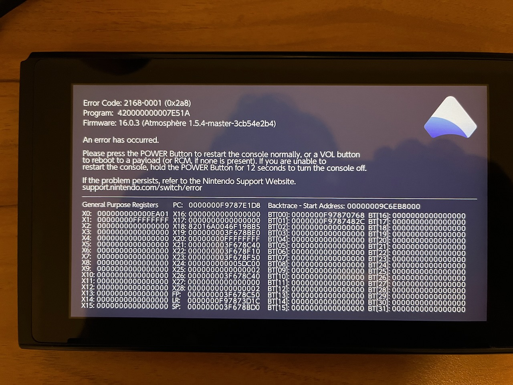

However, Hekate has an option under `Tools > Arch bit • RCM • Touch • Partition > Fix Archive Bit` to scan the whole SD card and fix the archive bit. I simply do this after copying stuff. For me this is a better compromise than using a program like Android File Transfer, which has its own quirks, or busting out a spare PC.[^25]

There are also some safe eject scripts[^26] the community has made for Mac, but I haven't needed to really use these.

### What to Download

Like all tech stacks, getting the right versions to play together is important. Here is what I have tried and tested.

*Note: for Atmosphère, be sure to download **`fusee.bin`** as well as the **`.zip`** file!*

| Tool | Purpose | HOS 17.0.0 | HOS 18.1.0 | HOS 19.0.1 | HOS 20.0.1 |
| -- | -- | -- | -- | -- | -- |
| Hekate/Nyx | Bootloader | [6.0.7](https://github.com/CTCaer/hekate/releases/tag/v6.0.7) | [6.2.1](https://github.com/CTCaer/hekate/releases/tag/v6.2.1) | [6.2.2](https://github.com/CTCaer/hekate/releases/tag/v6.2.2) | [6.3.0](https://github.com/CTCaer/hekate/releases/tag/v6.3.0) |
| Atmosphère | OS | [1.6.1-prerelease](https://github.com/Atmosphere-NX/Atmosphere/releases/tag/1.6.1-prerelease) | [1.7.1](https://github.com/Atmosphere-NX/Atmosphere/releases/tag/1.7.1) | [1.8.0-prerelease](https://github.com/Atmosphere-NX/Atmosphere/releases/tag/1.8.0-prerelease) | [1.9.0-prerelease](https://github.com/Atmosphere-NX/Atmosphere/releases/tag/1.9.0-prerelease) |
| nx-ovlloader | Tesla Framework | [1.0.7](https://github.com/WerWolv/nx-ovlloader/releases/tag/v1.0.7) | [1.0.7](https://github.com/WerWolv/nx-ovlloader/releases/tag/v1.0.7) | [1.0.7](https://github.com/WerWolv/nx-ovlloader/releases/tag/v1.0.7) | [1.0.7](https://github.com/WerWolv/nx-ovlloader/releases/tag/v1.0.7) |
| Tesla-Menu | Tesla Menu GUI | [1.2.3](https://github.com/WerWolv/Tesla-Menu/releases/tag/v1.2.3) | [1.2.3](https://github.com/WerWolv/Tesla-Menu/releases/tag/v1.2.3) | [1.2.3](https://github.com/WerWolv/Tesla-Menu/releases/tag/v1.2.3) | [1.2.3](https://github.com/WerWolv/Tesla-Menu/releases/tag/v1.2.3) |
| sys-clk | Overclocking Framework | [2.0.0-rc](https://github.com/retronx-team/sys-clk/releases/tag/2.0.0-rc) | [2.0.0-rc](https://github.com/retronx-team/sys-clk/releases/tag/2.0.0-rc) | [2.0.1](https://github.com/retronx-team/sys-clk/releases/tag/2.0.1) | [2.0.1](https://github.com/retronx-team/sys-clk/releases/tag/2.0.1) |
| Status Monitor (Overlay) | Overclocking GUI | [0.9.2](https://github.com/masagrator/Status-Monitor-Overlay/releases/tag/0.9.2) | [1.0.4](https://github.com/masagrator/Status-Monitor-Overlay/releases/tag/1.0.4) | [1.1.7a](https://github.com/masagrator/Status-Monitor-Overlay/releases/tag/1.1.7a) | [1.1.8](https://github.com/masagrator/Status-Monitor-Overlay/releases/tag/1.1.8) |
| SaltyNX | FPS Framework | [0.7.0](https://github.com/masagrator/SaltyNX/releases/tag/0.7.0) | [0.8.1](https://github.com/masagrator/SaltyNX/releases/tag/0.8.1) | [1.2.0](https://github.com/masagrator/SaltyNX/releases/tag/1.2.0) | [1.2.2](https://github.com/masagrator/SaltyNX/releases/tag/1.2.2) |
| ReverseNX-RT (Overlay) | Toggle between 720p and 1080p at will | [2.0.0](https://github.com/masagrator/ReverseNX-RT/releases/tag/2.0.0) | [2.0.0](https://github.com/masagrator/ReverseNX-RT/releases/tag/2.0.0) | [2.1.0](https://github.com/masagrator/ReverseNX-RT/releases/tag/2.1.0) | [2.1.0](https://github.com/masagrator/ReverseNX-RT/releases/tag/2.1.0) |
| FPSLocker (Overlay) | Force higher FPS | [1.2.5](https://github.com/masagrator/FPSLocker/releases/tag/1.2.5) | [2.0.0](https://github.com/masagrator/FPSLocker/releases/tag/2.0.0) | [2.1.0](https://github.com/masagrator/FPSLocker/releases/tag/2.1.0) | [2.1.1](https://github.com/masagrator/FPSLocker/releases/tag/2.1.1) |


Last but not least, we need a way to flash the Hekate payload. My favorite does neither requires installing additional dependencies nor requires Gatekeeper exemptions. Instead I use the browser-based `web-fusee-launcher`, which requires nothing other than Chrome on MacOS.

Download my fork from <https://github.com/NaanProphet/web-fusee-launcher>, open `index.html` and enjoy!

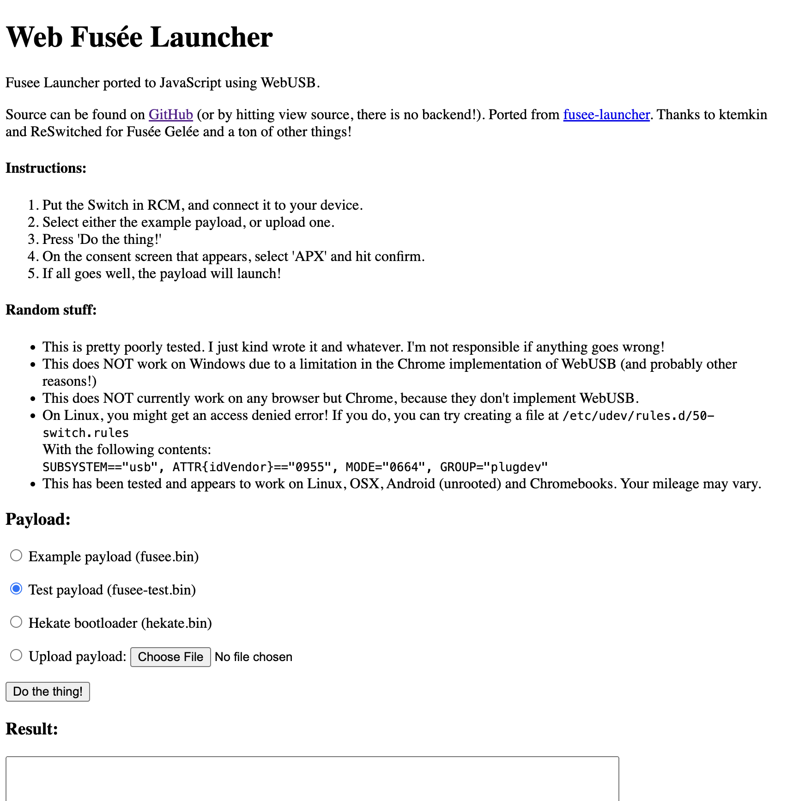

### Preparing the SD Card

Although Nintendo's instructions[^19] recommend using the official [SD Memory Card Formatter](https://www.sdcard.org/downloads/formatter/) (Apple Silicon compatible!), this will likely format larger SD cards as exFAT. We will reformat the card as FAT32 later using Hekate itself (because it is for better performance and compatibility.[^7] [^20] [^21])

For now, just insert the SD card into the computer and copy files normally. To merge folders, holding Option while dragging and dropping.

* Unzip `hekate*.zip` and copy the `bootloader` folder to the root of the SD card.
* Unzip `atmosphere-x.x.x-master.zip` and copy the `atmosphere` folder, `switch` folder, and `hbmenu.nro` to the root of the SD card.
* Place the file named `fusee.bin` in your `/bootloader/payloads/` folder.
* Merge the contents of `nx-ovlloader.zip` into the `atmosphere` folder
* Merge the contents of `ovlmenu.zip` into the `switch` folder (this will copy over the `switch/.overlays/` folder)
* Unzip `sys-clk-*.zip` and merge the `atmosphere`, `config` and `switch` folders
* Unzip `Status-Monitor-Overlay.zip` and merge the `config` and `switch` folders
* Unzip `SaltyNX-*.zip` and merge the `atmosphere` folder. Copy over the `SaltySD` folder (new).
* Copy `ReverseNX-RT-ovl.ovl` into the `switch/.overlays/` folder (you may need to show hidden files in Finder)
* Copy `FPSLocker.ovl` into the `switch/.overlays/` folder (you may need to show hidden files in Finder)
* Copy `Lockpick_RCM.bin` into your `/bootloader/payloads/` folder, if you want it. See the [Lockpick section](#lockpick) below for more info.

Note: here we skip SigPatches, because we are not interesting in pirating games.

### Booting Into Hekate

1. Factory reset the Switch by going to `System Settings` > `System` > `Formatting Options` > `Restore Factory Settings`
2. After it reboots, set up the device like normal (connect to WiFi, Nintendo Account, etc.)
3. Connect to the Nintendo eShop to make sure the console starts unbanned!
4. Now DISABLE cloud save and Wi-Fi (as a safety precaution), and turn off the Switch.
6. Enter the coveted RCM by first inserting your RCM Jig[^11]. While holding the Volume Up button, press the Power button. The screen will stay black if successful. 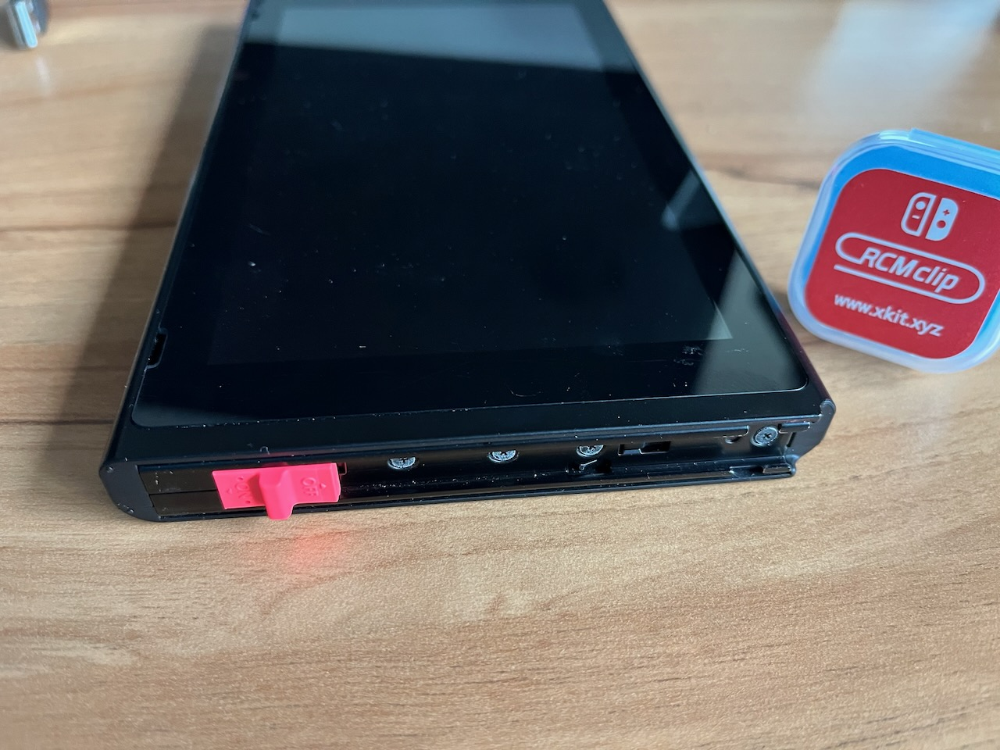
7. Use a USB-C cable to connect the device to your computer. Launch Chrome and open `index.html` from `web-fusee-launcher`. Send the initial test payload `fusee-test.bin`. 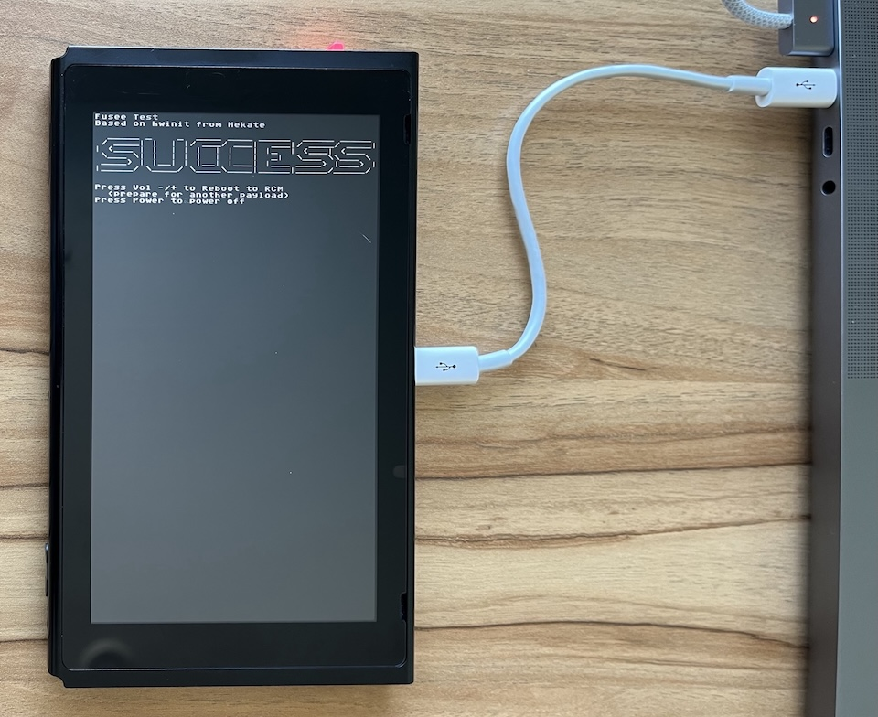
5. Now boot into Hekate by flashing the actual payload `hekate_ctcaer_6.0.3.bin` (or similar name)
7. Setup date/time using the touchscreen, woo! 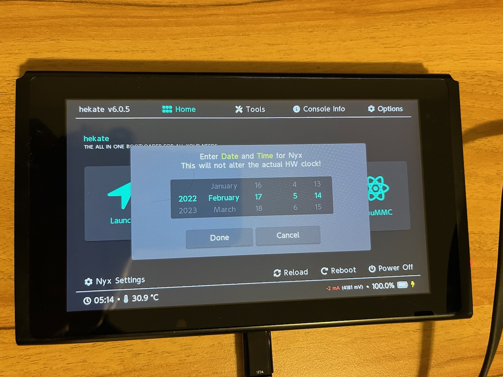

You will now have `bootloader/hekate_ipl.ini` and `bootloader/nyx.ini` files.

Step 2.

* Insert the SD card into the Nintendo Switch
* Flash the hekate payload using `web-fusee-launcher`
* Formatting the SD card using Hekate automatically backs up the `bootloader` folder only. the `switch` and `backups` folder got wiped. 


 Any other partition will be wiped!` with `Don't Backup` and `OK`. Press `OK`.
`Partition Manager: Your files will be backed up and restored! Any other partition will be wiped!`


### Finalizing the SD Card

1. First off, we need to re-format the SD card using Hekate. Navigate to `Tools > Partition SD Card`.
2. A dialog will popup either saying `The SD Card files will be backed up automatically!` or `The SD Card cannot be backed up automatically!`. It should be the former, because there is hardly anything on the SD card at this point, and the internal Switch 32 GB storage should have enough to temporarily backup/restore. Select `OK`.
3. Drag the `FAT32` slider all the way to the right. Select `Next Step` and then `Start`.
4. The re-format and restore should be successful! This will rename the SD card to `SWITCH SD` woo!
5. Next, navigate to `Tools > Backup` and backup both `eMMC BOOT0 & BOOT1` and `eMMC RAW GPP` (15 mins for the 32 GB model). 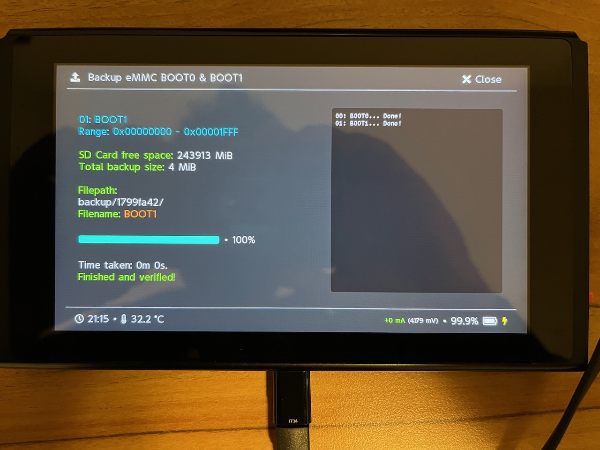 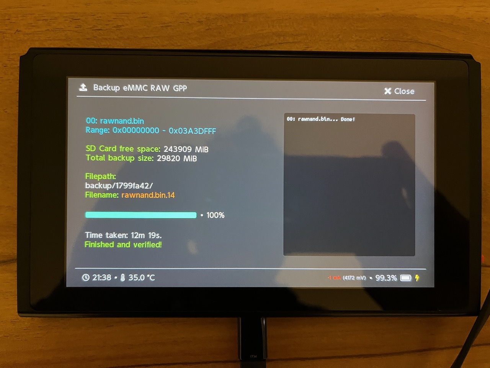
6. Eject the SD card while Hekate is running. The popup `SD card was removed! Nyx will reload after inserting it.` is normal. Alternatively, use USB storage mode (`Tools > USB Tools > SD Card`), which is slower.
7. Copy the new `backup` folder's contents from the SD card to a safe location (5 mins). Delete the `backup` folder from the SD card after, if desired.
8. The original `/bootloader/hekate_ipl.ini` should read as follows.
    
    Original
    ```
    [config]
    autoboot=0
    autoboot_list=0
    bootwait=3
    backlight=100
    noticker=0
    autohosoff=0
    autonogc=1
    updater2p=0
    bootprotect=0
    ```
    
    Now add the following secret sauce at the bottom.
    
    ```
    [CFW (sysNAND)]
    payload=bootloader/payloads/fusee.bin
    emummc_force_disable=1
    icon=bootloader/res/icon_payload.bmp
    
    [Stock]
    fss0=atmosphere/package3
    stock=1
    emummc_force_disable=1
    icon=bootloader/res/icon_switch.bmp
    ```
    
    Note: we will be leave `AutoRCM` OFF. This is the default. This means if you reboot the Switch without the RCM Jig, it will go back to vanilla HOS. I find this helpful for when you want to still play/upgrade firmware (without overclocking).

    Also: we skip exosphere and hosts blocking because our sysNAND needs to communicate with Nintendo's servers to play online.
    
9. Place the SD card back into the Switch.
10. Lastly, go to `Tools > Arch bit • RCM • Touch • Partition > Fix Archive Bit` to sanity-check the SD card before booting.
11. Return to the home menu, select `Launch` and then boot into the `CFW (sysNAND) entry`
12. Re-enable WiFi, and enjoy!
13. To enter the Tesla overlay menu, press `L+DDOWN+RSTICK`. To exit hold down `L+DDOWN+RSTICK`.

## Results

It's been really fun tweaking the clock speeds and seeing the FPS in realtime on various games! Surprisingly a lot of upper tier games are already at 60 FPS.

| Title | Default | Tweaked |
| -- | | -- | -- |
| Overcooked | 30 FPS @ 1080p | 60 FPS @ 720p (this is an acceptable tradeoff for me) |
| Prince of Persia: The Lost Crown | 60 FPS @ 1080p gameplay, 30 FPS @1080p cutscenes |  |
| Mario Kart | 60 FPS @ 1080p | |
| Super Mario 3D World | 60 FPS @ 1080p | |

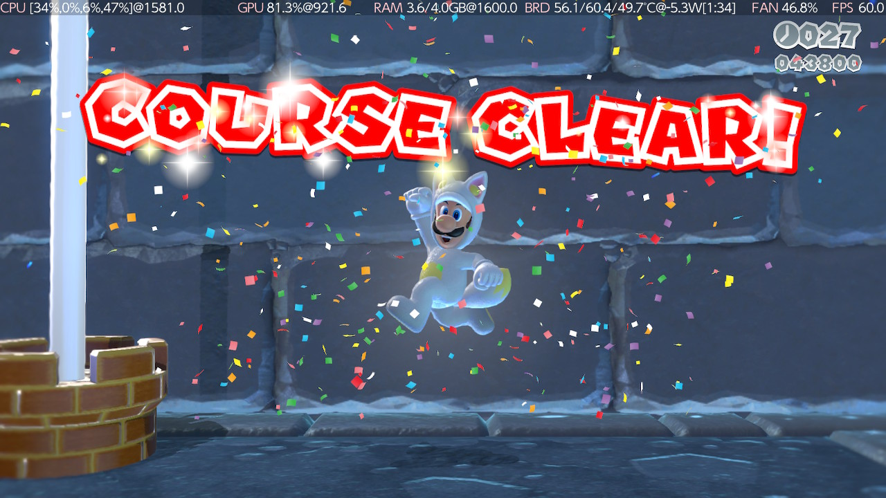

## Keeping Updated

In order to use Nintendo Cloud Save, the Switch needs to have the latest official firmware. However, sometimes there is a lag before matching Hekate/Atmosphère versions are released. So I either wait until the matching CFW comes out — or just simply update and boot into the vanilla firmware, temporarily forsaking any overclocking.

Also note that if you have two Switch consoles, one vanilla and another with CFW, in order to use Nintendo Save Data Cloud, both have to be on the latest Nintendo version.

As mentioned earlier, don't forget: When updating software on the SD card, hold the Option key while dragging files in Finder to merge them.

## Appendix

### emuNAND

Here are some additional notes on emuNAND that I learned while researching my build.

1. If an ADDITIONAL emuNAND partition is desired (for cheats/mods), it is crucial that Nintendo's servers are blocked and never contacted on the emuNAND. Otherwise, when Nintendo sees the emulated signature and compares it to the stock signature (assuming the stock Switch has already gone online at least once), it will trigger a ban. **䷏ CFW on an external emuNAND must never, ever contact the internet.**
2. Never mix same gave files from your emuNAND and sysNAND, especially if there are mods/cheats in the emuNAND. This is largely uncharted and full of unnecessary risk. **䷏ Isolate the emuNAND as a completely separate entity with its own save files. KISS.**

### Lockpick

If you wish to play your own LEGALLY owned games via an emulator, you will need Lockpick to extract the private keys from the Switch. The keys change with each Horizon OS version, so it is good to extract them regularly.

While still in USB mode, copy `Lockpick_RCM.bin` (into `bootloader/payloads`). Select `Dump from SysNAND` to extract the keys.

Note that I didn't get any `title.keys` written, similar to this post.[^27] It turns out those are only for digital games.

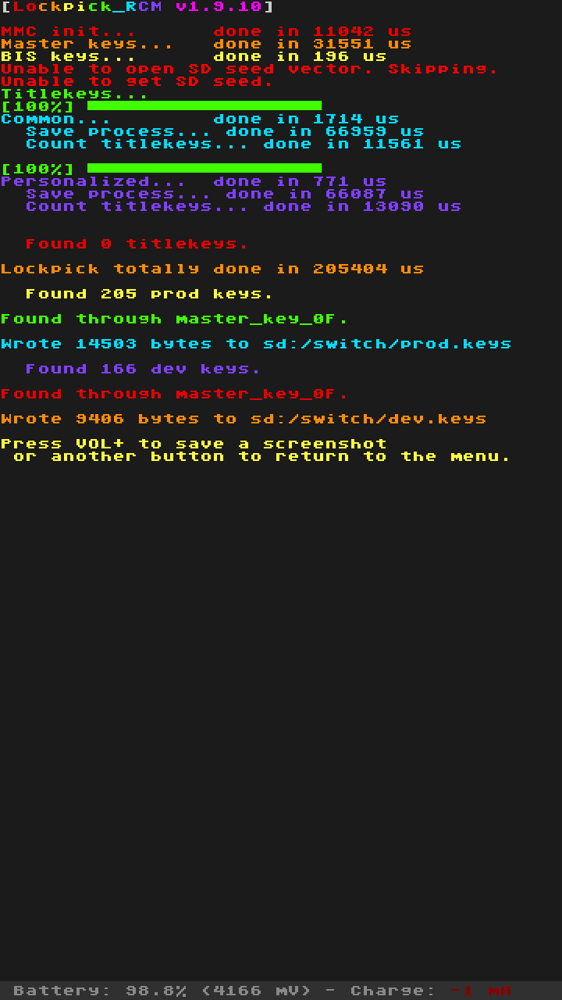

See these guides for download links and for more info: 

* <https://rentry.org/DumpingKeys>
* <https://github.com/Ryujinx/Ryujinx/wiki/Keys>

### Safe Limits

Here is the cheat sheet of official and max safe clock speeds from `sys-clk manager`. In summary, on a docked Erista, the CPU can be increased by 75%, GPU by 20%, and MEM by 20%.

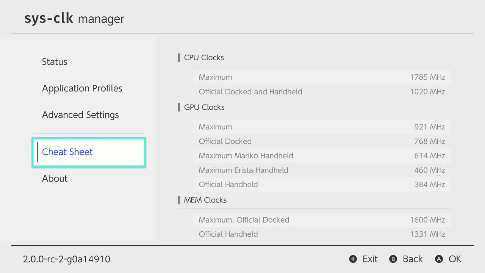

 It is possible to push the system too hard and cause the internal corruption. This is called memory binning. One Reddit post[^18] cautions against this:

> My understanding is that unstable memory clocks can cause Horizon to corrupt itself. An annoyance at best with emuNAND, and a brick if you're daft enough to do it on sysNAND. Caveat emptor.

Lucky for us, we ARE intentionally "daft enough" to install CFW on the sysNAND. 😛 However, `sys-clk`, by default, limits the available options only to the safe limits.


## References
[^1]: <https://www.reddit.com/r/SwitchPirates/comments/tb2r6c/comment/i057znj/?utm_source=share&utm_medium=web2x&context=3>
[^2]: <https://github.com/CTCaer/hekate/blob/master/README.md#boot-entry-keyvalue-combinations>
[^3]: <https://gbatemp.net/threads/restored-emummc-backup-on-sysmmc-without-realizing.609984/page-2#post-9788164>
[^4]: This is a circuitous thread, but the main mic drop regarding using `sys-clk` online is in this post <https://gbatemp.net/threads/anyone-use-sysclk-for-online-gaming.607565/page-2#post-9769783>
[^5]: Writing CFW to the internal memory by itself does not trigger a ban. <https://www.reddit.com/r/SwitchPirates/comments/rqhjek/accidental_boot_in_cfw_on_sysnand/>
[^6]: Change `dmnt_cheats_enabled_by_default = u8!0x1` to `dmnt_cheats_enabled_by_default = u8!0x0` <https://gbatemp.net/threads/edizon-cheats-are-always-active.535104/>
[^7]: From the Hektate release notes FAQ: "It is also suggested to format your sd card via hekate. That's because it prepares it for performance. something that many partitioning tools neglect." <https://github.com/CTCaer/hekate/releases> 
[^8]: These folks managed to cheating online with Pokemon, ruins it for everyone <https://projectpokemon.org/home/forums/topic/63032-is-it-possible-to-transfer-your-save-file-from-a-non-hacked-switch-to-a-hacked-one-edit-it-and-then-put-it-back-to-my-non-hacked-switch-safely/>
[^9]: <https://gbatemp.net/threads/dirty-logs-on-the-switch-can-there-be-anything-done.538929/>
[^10]: <https://www.reddit.com/r/SwitchPirates/comments/119xzbz/question_about_turning_on_automatic_save_backup/>
[^11]: I bought a cute little [RCM Jig](https://www.amazon.com/gp/product/B089YDF9N1) but there are few options listed on the NH Switch Guide here <https://nh-server.github.io/switch-guide/user_guide/emummc/entering_rcm/>
[^12]: Formatting SD cards <https://gamefaqs.gamespot.com/boards/189706-nintendo-switch/77705543> and <https://www.reddit.com/r/NintendoSwitch/comments/ekzbdo/exfat_vs_fat_32_whats_safest/>
[^13]: <https://www.reddit.com/r/NintendoNX/comments/53zhc7/the_meaning_of_nintendo_nx/>
[^14]: <https://www.reddit.com/r/SwitchPirates/comments/13j75zs/if_your_struggling_with_totk_performance_then/>
[^15]: <https://github.com/Atmosphere-NX/Atmosphere/releases/tag/1.0.0>
[^16]: <https://gbatemp.net/threads/tesla-the-nintendo-switch-overlay-menu.557362/page-85#post-10176299> I finally figured it out! After digging around, I found out that the problem was due to macOS using "." to make files invisible. So, the .overlays didn't copy over as intended. This effected Atmosphere not being able to properly recognize the .overlays folder. The solution I came up with was to use Atmosphere's USB File Transfer and create an .overlay folder using Android File Transfer. I then transferred the overlays (olvEdiZon.ovl, ovlmenu.ovl, and ovlSysmodules.ovl) into the newly created .overlays folder, rebooted Atmosphere, and everything worked as it should! Here is the link to the thread on GitHub that helped me figure out what was wrong: <https://github.com/WerWolv/Tesla-Menu/issues/62> Thanks everyone for your patience and help! I hope this is helpful to any Mac users out there who have also run into this issue.
[^17]: <https://www.reddit.com/r/GooglePixel/comments/z3d4ok/pixel_7_could_not_connect_to_device_error_usb/>
[^18]: <https://www.reddit.com/r/SwitchPirates/comments/13j75zs/if_your_struggling_with_totk_performance_then/>
[^19]: <https://en-americas-support.nintendo.com/app/answers/detail/a_id/220/kw/sd%20formatter>
[^20]: "The general idea is fat32 for 32GB or less, and exFAT for greater than 32GB. However, I'd recommend going fat32 for cards used in Switch regardless of capacity because Nintendo's implementation of exfat is pretty bad and can possibly lead to corruption." <https://gamefaqs.gamespot.com/boards/189706-nintendo-switch/77705543>
[^21]: From 2023, "I had exfat for a while. then after a while it got corrupted. Been on fat32 ever since." <https://www.reddit.com/r/SwitchPirates/comments/13724wj/are_we_all_still_sticking_with_fat32_over_exfat/>
[^22]: You can check if your Switch is hackable by visiting <https://ismyswitchpatched.com>
[^23]: <https://gbatemp.net/threads/questions-about-nand-backups-restores-cfw-and-more-on-switch.564944/#post-9052230>
[^24]: <https://gbatemp.net/threads/questions-about-nand-backups-restores-cfw-and-more-on-switch.564944/#post-9052343>
[^25]: If you use [Android File Transfer](https://www.android.com/filetransfer/), remember to quit Dropbox first (crazy right[^17]). Also keep in mind that Android File Transfer requires Intel/Rosetta, and FWIW the Apple Silicon variant [openmtp](https://github.com/ganeshrvel/openmtp) on GitHub did not work for me.
[^26]: See the commands in these safe eject scripts: <https://gist.github.com/idolpx/949f437f861b27e7d5812dc498429ad8> and <https://gist.github.com/jepebe/5cb470e2686c09b6380615a8969ad9e6>
[^27]: <https://gbatemp.net/threads/just-make-a-backup-with-lockpickrcm-for-the-first-time-am-i-missing-something.555308/.>