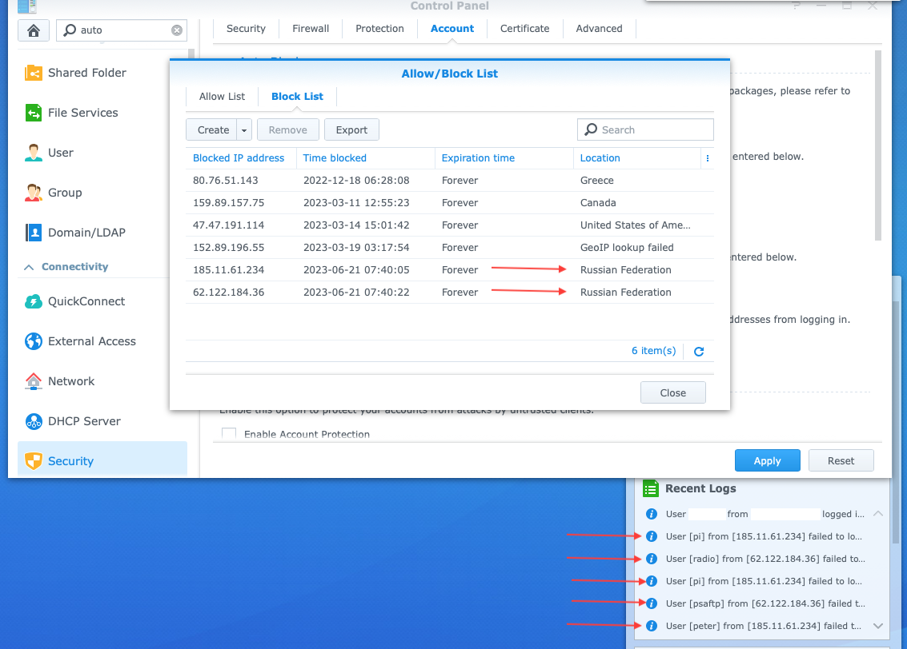

I knew that any server exposed to the internet is susceptible to brute-force attempts. It was fascinating to see it happen!

My Synology DSM home server automatically blocks suspicious traffic. One day when I logged in I saw some interesting attempts with guessed usernames.

I don't have any user named `pi`, `peter`, etc. These are dictionary-style attacks.

It's worth noting that the IP address location doesn't imply the actual location of the attacker—it is just where the IP is registered. They are likely bots just spraying the internet.

Overall, this was a great reminder for me to keep security tight on home servers exposed to the internet: strong passwords, disabling default accounts, and enabling features like auto block.