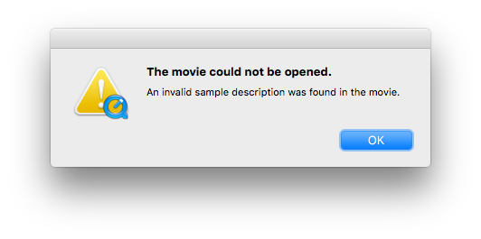
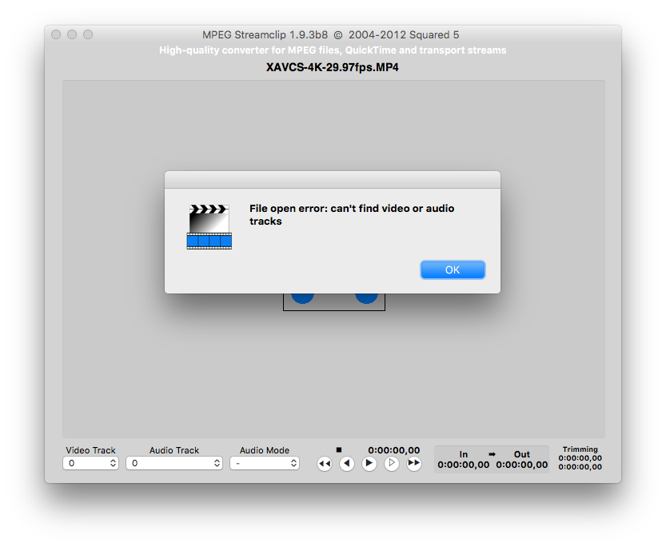
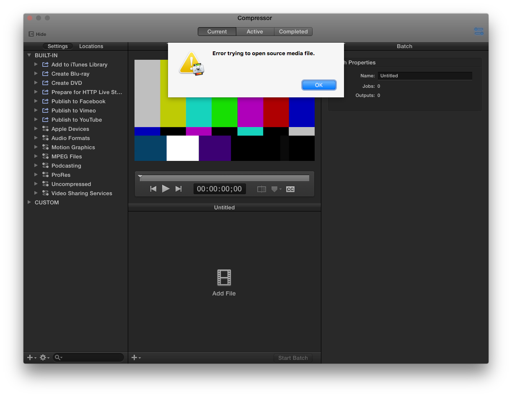
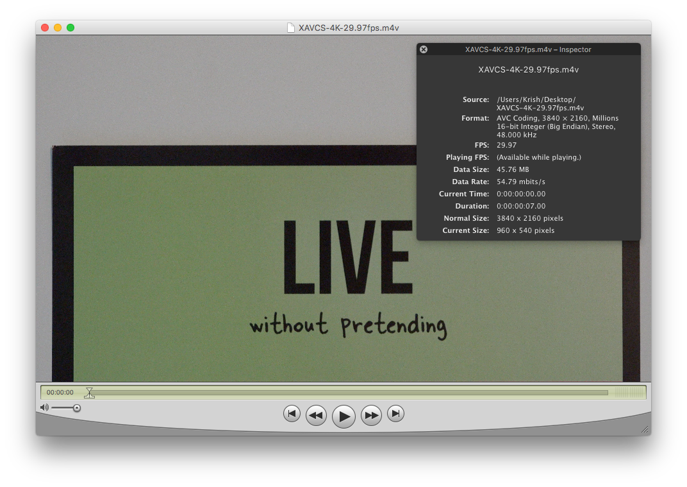

### Introduction

For a long time, Sony's XAVC-S codec was completely a mystery to me. It was the new format the Sony CX900 and AX100 use, and when those cameras originally shipped, the files could not be edited natively with FCP X. ([Version 10.2 added that functionality](https://support.apple.com/en-us/HT202252).)

What was particularly perplexing was after the software update, QuickTime Player X and FCP X would open the files, but QuickTime Player 7 and Compressor 4.2 wouldn't. QT7 was understandably written on legacy 32-bit frameworks[^1], but shouldn't Compressor 4.2 use the same new 64-bit frameworks (AVFoundation, CoreMediaIO, etc.) that QT X and FCP X used?

"Invalid sample description" ... "can't find video or audio tracks" ... very interesting. Almost suggests the programs can't read some header metadata. Thanks to the folks folks at Divergent Media, now I know XAVC-S is just H.264 video inside the container.[^2] Should be no reason QT7 can't open it.

Indeed that's the case!

### Solution

The fix? Rename the extension from `mp4` to `m4v`.

Now QT7, Compressor 4, and MPEG Streamclip all open the file once again. Hooray!

This means Final Cut Pro 7 will open such renamed files too, like QT7.

### But Why?

Um, ya.

My guess is, in the old days any file that ended in MP4 was thought to conform the MP4 standard. Makes sense, right? That implies the audio stream for MP4 files should be AAC, MP3 or a few other audio codecs.[^3] In that bucket list is _not_ PCM audio! This strict convention is what I surmise QT7 and Compressor 4.2 adhere to and therefore could not open the XAVC-S file from the video camera.

The renaming hint came from a StackExchange[^4] and FFMPEG page[^5] after searching for the QT7 error message `An invalid sample description was found in the movie`.

In the OP's case, a masquerading MP4 file contained both AAC and AC3 audio tracks—the latter which is not allowed per the MP4 spec. It's interesting to note Handbrake (version 0.10.2 x86_64 (2015061100)) now automatically renames the destination file extension from `mp4` to `m4v` upon adding an AC3 audio track! It seems programs like VLC, which have always played the file, and now QT X and FCP X, probably do not give much importance to the actual file extension but instead to the stream data inside and are thus more lenient.

### M4V is like Apple's New MOV

Like the standard quicktime `mov` container, `m4v` seems to have more for flexibility for packaging MP4 streams—in this case, for PCM audio. After all, like `mov`, the `m4v` container is developed by Apple.[^6]

For a long time, I placed the emphasis on the **v** of m4**v**—that it's MP4 **v**ideo. But in a way, perhaps the emphasis is really on the **4**: it's like m**o**v but just with the middle letter changed for mp**4** files.

### Appendix

####  XAVC-S sample file

For posterity! Original 50 MB video file from the Sony AX-100 camera available [here]() for download and experimentation.

Audio credit: _Raga Pahadi - Alaap_ by Ashwin Batish from album [_Morning Meditation Ragas on Sitar_](https://player.spotify.com/album/0hAFpAvn7T1rAXD62ge5Ut).

#### XAVC-S Stream Info

Stream information from the original 4K MP4 file from the Sony AX-100 using `ffprobe -show_streams`. Note how the H.264 profile is _High_ but the audio is PCM 48 kHz 16-bit.

~~~
Krish-MBP-2012-en1:Desktop Krish$ ffprobe -show_streams XAVCS-4K-29.97fps.MP4
ffprobe version 2.8 Copyright (c) 2007-2015 the FFmpeg developers
  built with Apple LLVM version 6.1.0 (clang-602.0.53) (based on LLVM 3.6.0svn)
  configuration: --prefix=/usr/local/Cellar/ffmpeg/2.8 --enable-shared --enable-pthreads --enable-gpl --enable-version3 --enable-hardcoded-tables --enable-avresample --cc=clang --host-cflags= --host-ldflags= --enable-opencl --enable-libx264 --enable-libmp3lame --enable-libvo-aacenc --enable-libxvid --enable-vda
  libavutil      54. 31.100 / 54. 31.100
  libavcodec     56. 60.100 / 56. 60.100
  libavformat    56. 40.101 / 56. 40.101
  libavdevice    56.  4.100 / 56.  4.100
  libavfilter     5. 40.101 /  5. 40.101
  libavresample   2.  1.  0 /  2.  1.  0
  libswscale      3.  1.101 /  3.  1.101
  libswresample   1.  2.101 /  1.  2.101
  libpostproc    53.  3.100 / 53.  3.100
Input #0, mov,mp4,m4a,3gp,3g2,mj2, from 'XAVCS-4K-29.97fps.MP4':
  Metadata:
    major_brand     : XAVC
    minor_version   : 16785407
    compatible_brands: XAVCmp42iso2
    creation_time   : 2016-01-09 00:44:11
  Duration: 00:00:07.01, start: 0.000000, bitrate: 55039 kb/s
    Stream #0:0(und): Video: h264 (High) (avc1 / 0x31637661), yuv420p(tv, bt709/bt709/iec61966-2-4), 3840x2160 [SAR 1:1 DAR 16:9], 53251 kb/s, 29.97 fps, 29.97 tbr, 30k tbn, 59.94 tbc (default)
    Metadata:
      creation_time   : 2016-01-09 00:44:11
      handler_name    : Video Media Handler
      encoder         : AVC Coding
    Stream #0:1(und): Audio: pcm_s16be (twos / 0x736F7774), 48000 Hz, 2 channels, s16, 1536 kb/s (default)
    Metadata:
      creation_time   : 2016-01-09 00:44:11
      handler_name    : Sound Media Handler
    Stream #0:2(und): Data: none (rtmd / 0x646D7472), 245 kb/s (default)
    Metadata:
      creation_time   : 2016-01-09 00:44:11
      handler_name    : Non-Real Time Metadata
Unsupported codec with id 0 for input stream 2
[STREAM]
index=0
codec_name=h264
codec_long_name=H.264 / AVC / MPEG-4 AVC / MPEG-4 part 10
profile=High
codec_type=video
codec_time_base=1001/60000
codec_tag_string=avc1
codec_tag=0x31637661
width=3840
height=2160
coded_width=3840
coded_height=2160
has_b_frames=1
sample_aspect_ratio=1:1
display_aspect_ratio=16:9
pix_fmt=yuv420p
level=51
color_range=tv
color_space=bt709
color_transfer=iec61966-2-4
color_primaries=bt709
chroma_location=left
timecode=N/A
refs=2
is_avc=1
nal_length_size=4
id=N/A
r_frame_rate=30000/1001
avg_frame_rate=30000/1001
time_base=1/30000
start_pts=2002
start_time=0.066733
duration_ts=210210
duration=7.007000
bit_rate=53251849
max_bit_rate=N/A
bits_per_raw_sample=8
nb_frames=210
nb_read_frames=N/A
nb_read_packets=N/A
DISPOSITION:default=1
DISPOSITION:dub=0
DISPOSITION:original=0
DISPOSITION:comment=0
DISPOSITION:lyrics=0
DISPOSITION:karaoke=0
DISPOSITION:forced=0
DISPOSITION:hearing_impaired=0
DISPOSITION:visual_impaired=0
DISPOSITION:clean_effects=0
DISPOSITION:attached_pic=0
TAG:creation_time=2016-01-09 00:44:11
TAG:language=und
TAG:handler_name=Video Media Handler
TAG:encoder=AVC Coding
[/STREAM]
[STREAM]
index=1
codec_name=pcm_s16be
codec_long_name=PCM signed 16-bit big-endian
profile=unknown
codec_type=audio
codec_time_base=1/48000
codec_tag_string=twos
codec_tag=0x736f7774
sample_fmt=s16
sample_rate=48000
channels=2
channel_layout=unknown
bits_per_sample=16
id=N/A
r_frame_rate=0/0
avg_frame_rate=0/0
time_base=1/48000
start_pts=0
start_time=0.000000
duration_ts=336336
duration=7.007000
bit_rate=1536000
max_bit_rate=N/A
bits_per_raw_sample=N/A
nb_frames=336336
nb_read_frames=N/A
nb_read_packets=N/A
DISPOSITION:default=1
DISPOSITION:dub=0
DISPOSITION:original=0
DISPOSITION:comment=0
DISPOSITION:lyrics=0
DISPOSITION:karaoke=0
DISPOSITION:forced=0
DISPOSITION:hearing_impaired=0
DISPOSITION:visual_impaired=0
DISPOSITION:clean_effects=0
DISPOSITION:attached_pic=0
TAG:creation_time=2016-01-09 00:44:11
TAG:language=und
TAG:handler_name=Sound Media Handler
[/STREAM]
[STREAM]
index=2
codec_name=unknown
codec_long_name=unknown
profile=unknown
codec_type=data
codec_time_base=0/1
codec_tag_string=rtmd
codec_tag=0x646d7472
id=N/A
r_frame_rate=0/0
avg_frame_rate=0/0
time_base=1/30000
start_pts=0
start_time=0.000000
duration_ts=210210
duration=7.007000
bit_rate=245514
max_bit_rate=N/A
bits_per_raw_sample=N/A
nb_frames=210
nb_read_frames=N/A
nb_read_packets=N/A
DISPOSITION:default=1
DISPOSITION:dub=0
DISPOSITION:original=0
DISPOSITION:comment=0
DISPOSITION:lyrics=0
DISPOSITION:karaoke=0
DISPOSITION:forced=0
DISPOSITION:hearing_impaired=0
DISPOSITION:visual_impaired=0
DISPOSITION:clean_effects=0
DISPOSITION:attached_pic=0
TAG:creation_time=2016-01-09 00:44:11
TAG:language=und
TAG:handler_name=Non-Real Time Metadata
[/STREAM]
~~~

### History

*[Updated September 28, 2018 wording changes for clarity.]*

### Footnotes

Shout out to Divergent Media for creating such awesome software—and informative articles!

[^1]: [Dealing with Codecs on Modern Macs](http://www.divergentmedia.com/blog/dealing-with-codecs-on-modern-macs/)
[^2]: [Understand XAVC](http://www.divergentmedia.com/blog/understand-xavc/)
[^3]: [MPEG-4 Part 14](https://en.wikipedia.org/wiki/MPEG-4_Part_14#Data_streams)
[^4]: [How do I fix Handbrake mp4s that produce Error -2041 when loaded in QuickTime?](http://superuser.com/a/130076/542965)
[^5]: [Quicktime error: invalid sample description](https://forum.handbrake.fr/viewtopic.php?p=15470#p15470)
[^6]: [M4V](https://en.wikipedia.org/wiki/M4V)