## Where Has Timecode Gone?

Newer, prosumer codecs these days like Sony XAVC-S don't seem to record video with timecode. It's one of the chief drawbacks that knocks the otherwise brilliant Sony AX100 from solid professional use. Timecode tracks can save mountains of time when editing multicamera shots, relinking media files, trimming clips precisely and so on—which, ostensibly, most home video footage won't call upon.

Prosumer camera codecs like AVCHD and XAVC-S write H.264 video in MP4 containers. H.264 is a compressed video format originally intended for delivery, not editing, but its role has slowly evolved. Prosumer cameras really benefit from the compression because then 4 hrs of 4K can still fit on a 128 GB SD card.

MP4 containers don't traditionally support timecode which may help to explain why the recent trend in dropping timecode. Although [Apple supports timecode in MP4 containers](https://developer.apple.com/library/mac/technotes/tn2174/_index.html) since 2013, [other software may exhibit side-effects reading timecode-rich MP4s](https://www.digitalrebellion.com/blog/posts/how_to_create_timecode_tracks_for_h.264_movies_in_compressor) if they do not expect it.

## MOV to the Rescue

MOV containers are like the Swiss army knife of containers. Unlike MP4, MOV supports timecode tracks full out, and rewrapping from MP4 to MOV can be done in a number of ways! But which are robust and which go bust?

Short answer: EditReady is the most robust rewrapper out there, and can even be scripted from the command line. Read on for the details and why others didn't cut it (no pun intended).

## The Setup

The following tests were performed using AVCHD files already in MOV format as imported on a MBP with Photos. They however, did not have timecode.

After timecode was added to the MOV container, the file was opened with QuickTime Player 7 and Compressor 4 to verify timecode. The file was then transcoded with Compressor to check its integrity. 

## EditReady Lives up to Its Name

[EditReady](http://www.divergentmedia.com/editready) is a champion at rewrapping footage. Divergent Media makes excellent products and their customer service is bar none. When I had written regarding the ghost render, Colin at Divergent Media explained:

> Compressor isn't good at recovering from bad frames, so that's the mostly likely problem. You hit one bad segment and it just gives up. EditReady is a little better about moving past those segments. It could have been a bad SD card or something during the original shoot.

EditReady's algorithms can correct this, so it's really the most versatile program out there. Rewrapping with EditReady makes Compressor super, super happy.

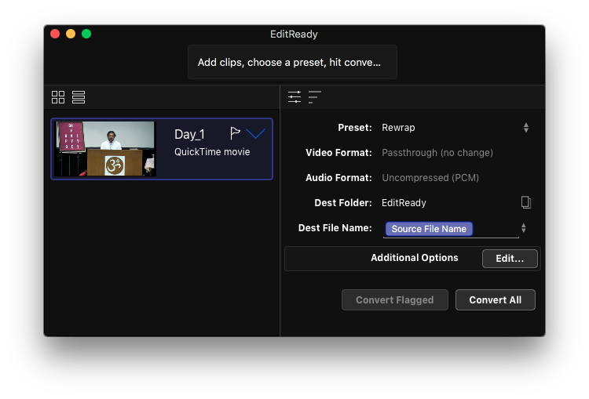

EditReady's rewrap affected the FCP X date at first, but turns out it was because there were conflicting dates inside the container's metadata!

EditReady's Metadata window calls this to your attention and allows you to select and/or set which date you would like.

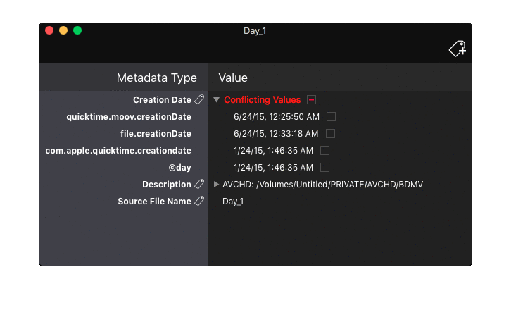

As you can see the original file does not have any timecode. By default, EditReady will preserve timecode if present, but not generate it if absent on the original. However, clicking the + icon in the upper right allows one to add a timecode tag as well! (By default, if the field is blank, timecode will start at `00:00:00:00`).

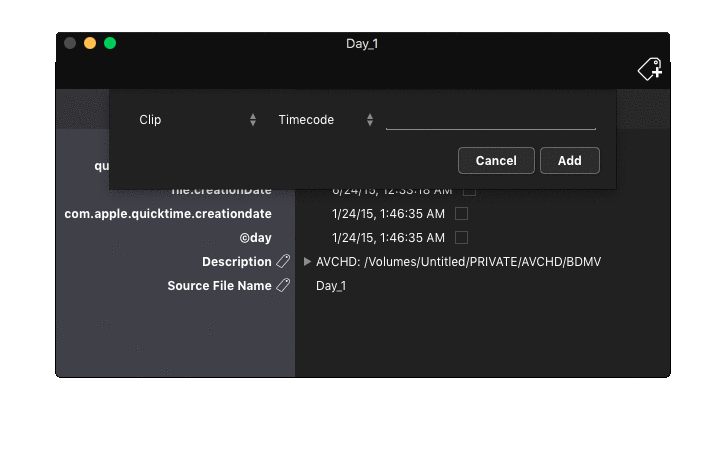

The size of the rewrapped, timecode footage is the same within a few bytes. Strangely enough, QuickTime Player 7 did crash a few times when scrubbing both.

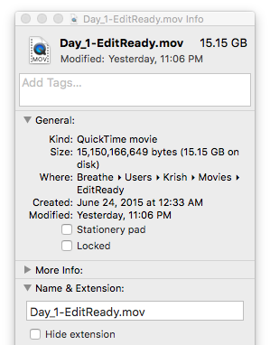

The rewrapped video however was larger in the number of frames: without timecode generation, it was `159165` frames instead of `159164` and with timecode it was `159166`. Thinking this might have been the potential missing frame correction, I checked against another clip that rendered properly in Compressor, but the EditReady rewrap (without timecode) was again greater in frames: `174150` vs `174149`.

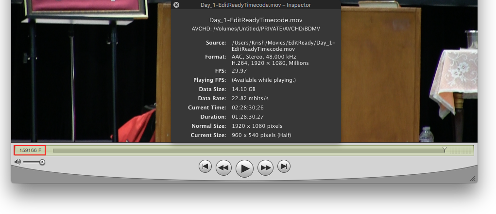

While the cause is unknown (roundoff error maybe?), the implication of the change in number of frames is clear: rewrapping footage will make relinking offline media a nightmare! Attempting to relink the timecode version with the original brings this lovely dialog:

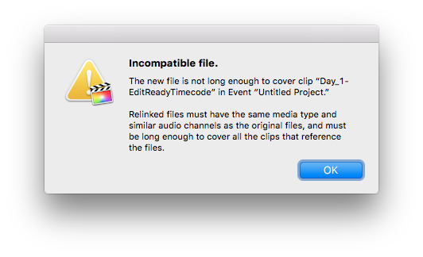

Thus, always rewrap footage first before beginning editing.

## Conclusion

At the end of the day, EditReady is the most reliable way of rewrapping and adding timecode to any footage. Repairing even small nicks from original footage, it serves a a trustworthy partner in the initial post-processing logging and transfer workflow.

## Appendix: The "B" List

Sometimes "B" is generous. Here's what doesn't work.

### ffmpeg Woes

ffmpeg is the open source king for video compression. Many programs like Handbrake are built on it, so I was excited to learn it can add timecode as well! To rewrap a container with timecode the syntax is like so:

`ffmpeg -i Day_1.mov -codec copy -timecode 04:25:50.00 Day_1.ffmpeg.mov`

Note: the timecode seems to be automatically calculated based on the framerate of the video track. Also, by default, ffmpeg only preserves 1 video and 1 audio track.

While ffmpeg successfully added timecode, the resulting file was a disaster for editing. The file systematically quits @ 20 seconds on any render in Compressor, suggesting some kind of container corruption.

Furthermore, although the file did play in QuickTime Player X and QuickTime Player 7, **scrubbing the playhead sometimes caused the application to crash**!

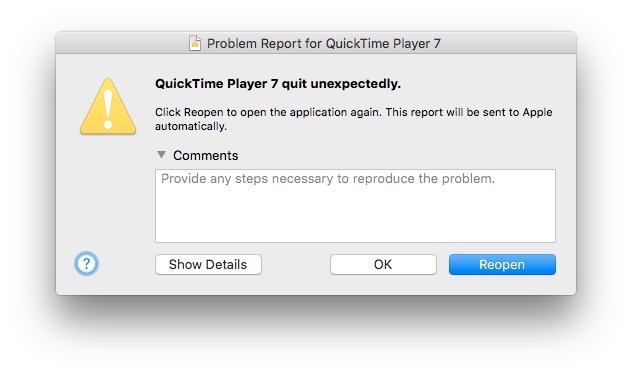

The file crashed when scrubbing in Compressor as well.

Lastly, the first frame is often black. Note in particular the strange, red vertical lines in Compressor's preview window.

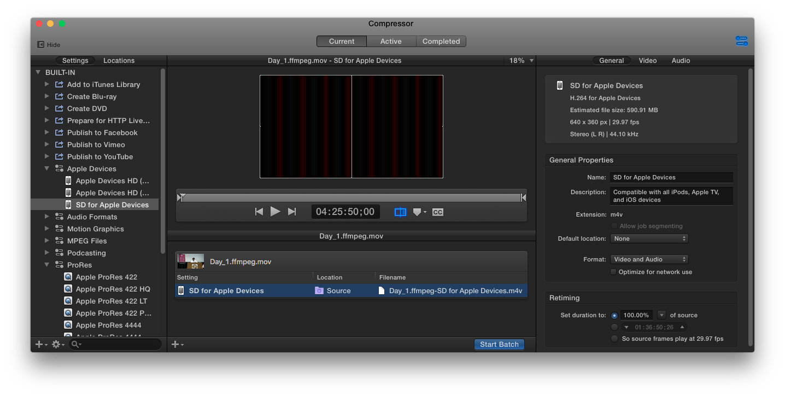

In a way, ffmpeg is a video delivery king, but perhaps not an editing king.

### VideoToolShed MP4 to QuickTime

[Videotoolshed's MP4 to QuickTime](http://www.videotoolshed.com/product/66/mp4-to-quicktime/3) was another contender, but starting from version 6 the program uses ffmpeg under the hood, to increase compatibility with other programs. So it too exhibits the same problems and failed to render with Compressor.

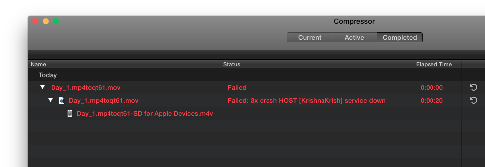

Also, the VideoToolShed GUI is very rough around the edges:

* Only detects MP4 files. So to add timecode to existing MOVs, the files first have to be renamed to trick the program to open them.
* When processing the program won't come back to the foreground. Hovering with the mouse shows the little color pinwheel...
* Files also can't be dragged and dropped, etc.

So ya, the little things—and some big things as well.

### CinePlay

[CinePlay by Digital Rebellion](https://www.digitalrebellion.com/cineplay/) is almost like QuickTime X Pro and could serve as a solid competitor to [SimpleMovieX](http://simplemoviex.com/SimpleMovieX/index.var). CinePlay offers numerous vital features for editing:

* Timecode display
* Text input of timecode location
* Add markers and annotations—including drawings! (Chapters not visible automatically in Compressor/FCP X, but can be exported to text files and imported manually)
* Set ins and outs (standard FCP7 keyboard shortcuts)
* Many others like video rotation, timecode and titlesafe overlays, etc.

Moreover, CinePlay's Export window offers a rewrapping option ([see their own blog post here](https://www.digitalrebellion.com/blog/posts/rewrapping_mp4_to_mov_with_cineplay)) which automatically adds NDF timecode starting at 00:00:00:00—perfect for changing MP4 containers to MOV. The process however cannot be scripted from the CLI, but could be, in principle, via AppleScript to queue multiple files for export at at time.

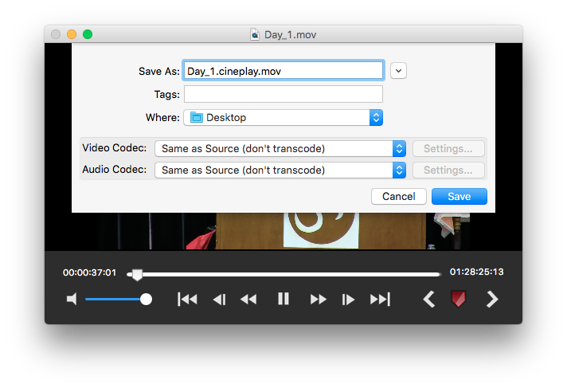

The rewrapped MOV itself appears to have full structural integrity. No funny glitches and crashes when processing the file. It does however start with a black image sometimes—but unlike the ffmpeg one, this doesn't show any funny red lines in Compressor's preview window.

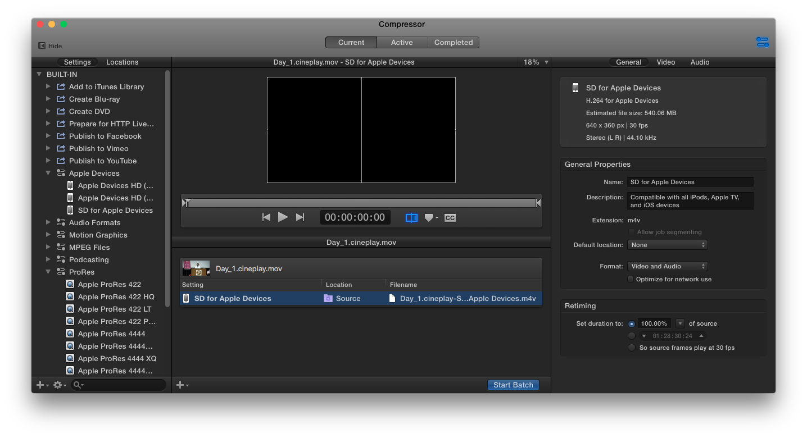

It also passes the Compressor test: no crash at the lovely 20 second mark.

The rewrapped MOV is roughly the same size, within a few bytes.

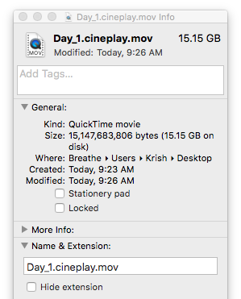

However, while the original was `159164` frames, the rewrapped one is `159111`.

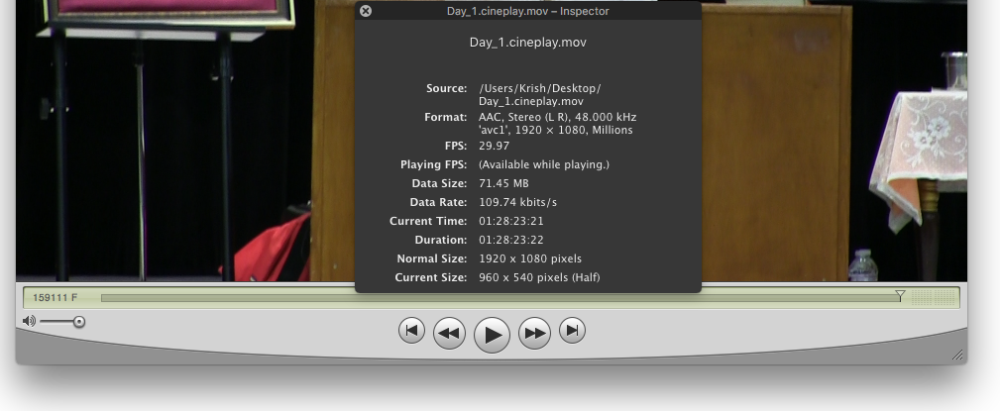

The first setback is CinePlay changes the File Creation Date of the file (i.e. the one that's read from `GetFileInfo` from the Terminal) so the date in FCP X is changed from the original to the date of the rewrapping. Also note, though how the timecode duration *appears* longer in FCP X. This I reckon is because the timecode track is NDF but the FR is 29.97, and/or some metadata is incorrect in CinePlay's rewrap. (In Compressor, the last frame's timecode is `01:28:23:21`.)

Also, the frame rate of the rewrapped footage is no longer 29.97 but instead 30, as told to Compressor.

Another rather serious hiccup was... the Compressor render never completed!

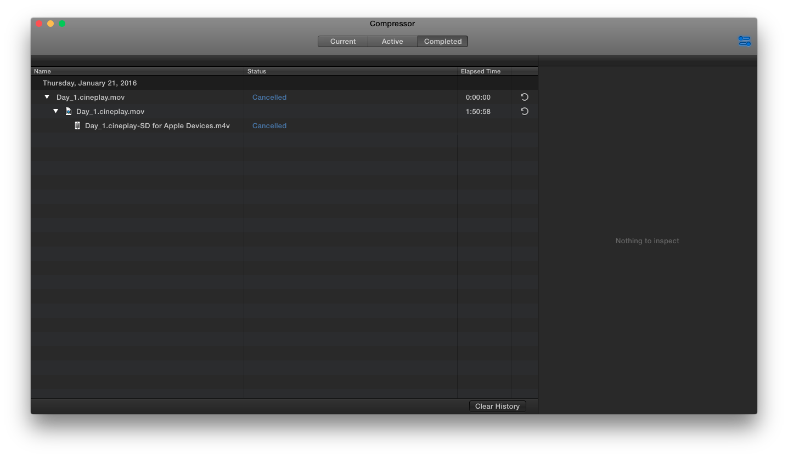

Turns out the original movie file I inherited was somehow corrupt. (Photos probably isn't the best tool to import AVCHD footage.) Not CinePlay's fault at all but it does knock it out of first place for fault tolerance!

## History

*[Updated July 5, 2019 with wording and ordering changes.]*