## The Rub

We'll start with a quote from Larry Jordan:

> X.264 and H.264 should only be used when creating files for the web. If you plan to edit the resulting file, convert it to ProRes instead. AVCHD files compressed into H.264 for editing will look just awful.

Oops.

## The Flawed Setup

I still use a Sony FX7 for some setups. It has a Firewire out which makes it perfect for livestreaming.

For this event, I wanted to (1) use the FX7 for livestreaming and (2) also record the raw HDV video itself for editing afterwards.

In order to avoid those awful MiniDV tapes—whose tape changes I feared also might cause the live feed to that meant recording to disk. It wasn't possible to share the video source with both Wirecast and ScopeBox, so I thought, "Hey, why not try recording straight to disk in Wirecast instead?"

While [this post]() details many other general livestreaming lessons learned, there are a few major downsides to relying on Wirecast for raw footage which I now realize. Wirecast doesn't know how to "automatically" record as HDV; instead it manually requires setting the codec format, frame rate, etc. which felt too easy for me to mess up. For example: since HDV is technically a 4:3 1440x1080 image that's then stretched out, I wasn't sure whether I should record to 1920x1080 or 1440x1080.

So rather than deal with all that I said instead, "Let's just save H.264 in Wirecast to disk!" (It was a pretty neat setup actually, using two Wirecast documents open simultaneously, one for the livestream and one just for the camera's archive stream.) Just in case 1080p would create an upscale, I thought going 720p would be better.

Thus the Nightmare Before Recording began.

## The Rescue Contenders

Three approaches to "uncomb"[^2] the baked in interlaced footage were tried:
* [Handbrake](https://handbrake.fr) (v 0.10.5 x86_64)
* [Compressor 4](http://www.apple.com/final-cut-pro/compressor/) via forcing the field order to interlaced
* [PHYX Cleaner plugin](http://www.phyx.biz/phyxcleaner.html) as suggested on a Wirecast forum[^3]

Of these three, **Compressor was the clear winner**.

## The Compressor Trick

Compressor, it seems, has a handy feature that allows "forcing" an input file's field order. By carefully clicking on the input file's box, the Inspector window on the right shows a little section called **File Properties**.

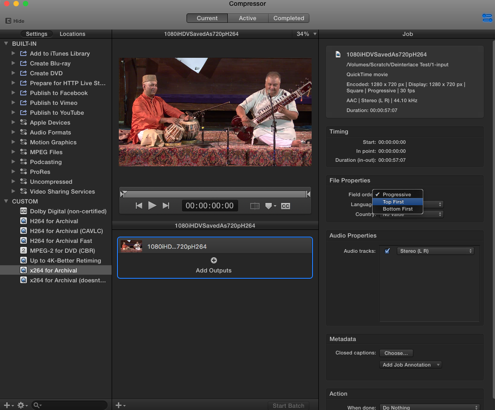

Since the file is actually H.264, Compressor reads the metadata and selects Progressive by default. Changing this to **Top First** forces it to treat it as interlaced (since HDV is top field first).

## Deinterlace Tests

All files, a total of 2.68 GB, are available [here]() for reference. Compressing them for web would precisely alter what we're trying to observe!

Note: please be considerate and only download them sparingly as needed.

**1080iHDVSavedAs720pH264Clip1.mov**

57 second clip, 30 MB.

| Output file                                 | Size | Program used      | Result |
|:--------------------------------------------|:-----|:------------------|:-------|
| Apple Devices HD (Best Quality).m4v         | 49M  | Compressor        | BEST   |
| Apple ProRes 422 Retiming Better.mov        | 498M | Compressor        | FAIL   |
| Apple ProRes 422 Stock.mov                  | 498M | Compressor        | FAIL   |
| H.264 for Archival.mov                      | 94M  | Compressor        | BEST   |
| HandbrakeHighProfileDecombBob.mp4           | 30M  | Handbrake         | FAIL   |
| HandbrakeHighProfileDecombBob60fps.mp4      | 30M  | Handbrake         | FAIL   |
| HandbrakeHighProfileDecombBobTff.mp4        | 31M  | Handbrake         | FAIL   |
| HandbrakeHighProfileDeinterflaceBobTff.mp4  | 37M  | Handbrake         | FAIL   |
| HandbrakeHighProfileDeinterlaceBob.mp4      | 36M  | Handbrake         | FAIL   |
| HandbrakeHighProfileDeinterlaceBob60fps.mp4 | 36M  | Handbrake         | FAIL   |
| PhyxCleanerMasterFileH264.mov               | 49M  | PHYX + FCPX       | OK     |
| PhyxCleanerMasterFileProRes.mov             | 499M | PHYX + FCPX       | OK     |
| Up to 4K Stock.mov                          | 69M  | Compressor        | OK     |
| x264 Jan Ozer-esque.mov                     | 48M  | Compressor + x264 | FAIL   |
| x264 Larry Jordan-esque.mov                 | 47M  | Compressor + x264 | FAIL   |

 

From these experiments, it seems **Handbrake's decombing/deinterlacing algorithms can't be forced on progressive video files**. Even forcing the footage with `tff` as top-field-first[^1] yielded zero discernible difference. Handbrake's just meant to work on actual interlaced footage.

Also interesting to note is Handbrake seems to start video earlier from the GOP, even though the file itself started many frames later. Hence the audio is blank at the beginning of the output render file!

PHYX Cleaner's output was better than the original, but it's still rather comby. Both H.264 and ProRes master files appear identical in deinterlacing quality. Perhaps the plugin can be refined further from the stock plugin settings, but even if that were the case there are so many disadvantages:

1. it's a paid plugin
2. each clip would require a separate Project in FCPX
3. exporting from FCPX can't be batched easily (like Compressor)

Compressor however is the clear champion! In particular, the only passing Compressor renders were by **forcing the field order *and* using Apple's stock H.264 codec**. Forcing the field order and using an x264 codec[^4] made no difference—and rather looked like the poor output from Handbrake (likely because Handbrake uses x264 too).

## Summary of Repair Solution

**1080iHDVSavedAs720pH264Clip2.mov**

Final confirmation with a 11 sec, 9 MB segment instead.

**Original** *especially note the combing during fast hand movements*



  

| Output file                  | Size | Program used | Result |
|:-----------------------------|:-----|:-------------|:-------|
| Up to 4K Stock.mov           | 14M  | Compressor   | BEST   |
| Up to 4K Better Retiming.mov | 14M  | Compressor   | BEST   |

 

It's hard for me to tell if there's an appreciable difference between the two retiming settings, but for sure the combing is no more!

**Repaired (Up to 4K Better Retiming)** *look Ma, no lines!*



So at the end of the day, **forcing Compressor's input field order *and* exporting using Apple's H.264 codec works like a champ**.

Phew!

## Appendix: Custom Encoding Presets Tried

Details of all the presets used. All audio settings left as default.

### x264 Larry Jordan-esque (Compressor)

Inspired by: <https://larryjordan.com/articles/compressor-x264-improve-video/>

* QuickTime settings
	* Compression Type set to x264 Encoder
	* Key Frames set to Automatic (instead of Every 24 frames)
	* Data Rate set to Automatic (instead of 6400 kbps)
	* Encoding set to Best quality (Multi-pass)
	* Quality moved to High
	* Options ...
		* Flags > crf turned on. Everything else left as is
* Retiming quality set to Better (Motion Adaptive)

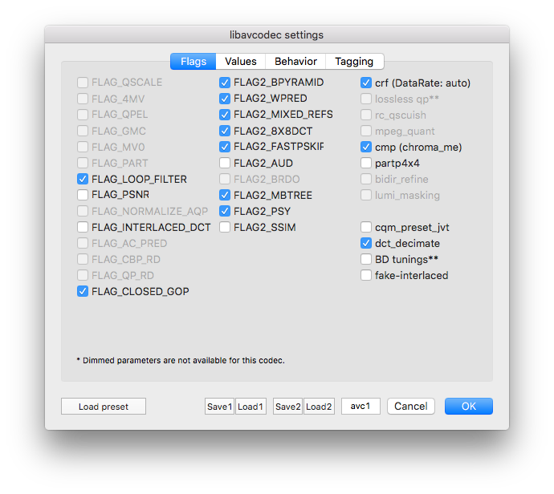

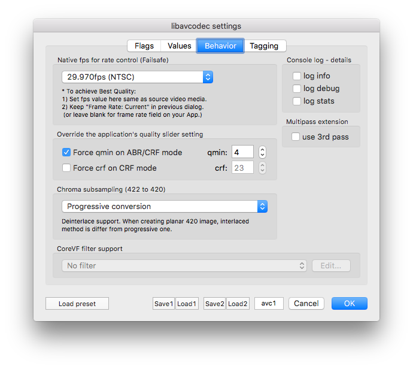

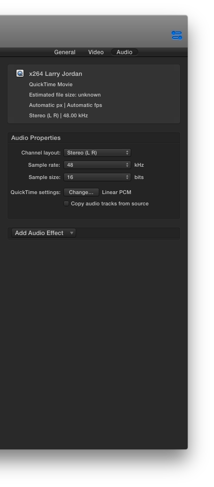

### x264 Jan Ozer-esque (Compressor)

Inspired by: <http://www.streaminglearningcenter.com/articles/first-look-apple-compressor-41.html> and <http://www.streaminglearningcenter.com/articles/encoding-with-the-x264-codec-with-compressor-4.html>

* QuickTimeSettings
	* Set Compression Type to x264 Encoder
	* Options ... > Load preset > Use Library native preset/tune
		* x264 preset left as Medium (default)
		* x264 tune left as None
		* Hit OK
	* H.264 Profile limit left as up to High Profile
		* Hit OK
	* Changed Key Frames to Automatic
	* Compressor Quality to High
	* Encoding to Best quality (Multi-pass)
	* Data Rate set to Automatic (instead of 6400 kbps)
	* Hit OK
* Retiming quality set to Better (Motion Adaptive)

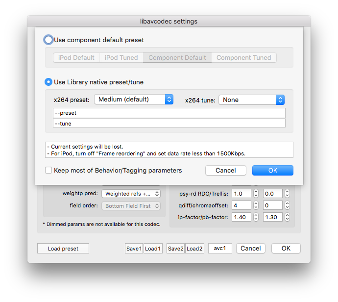
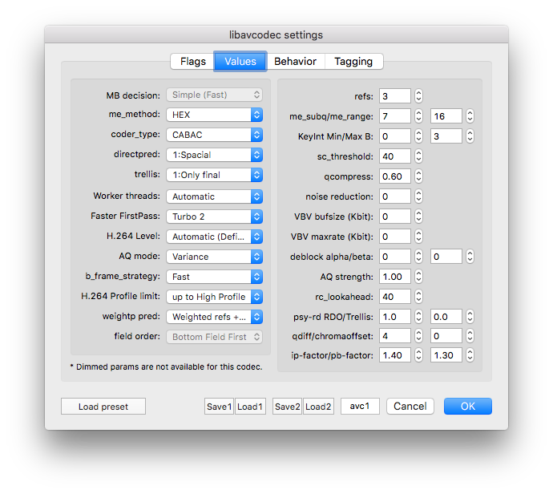
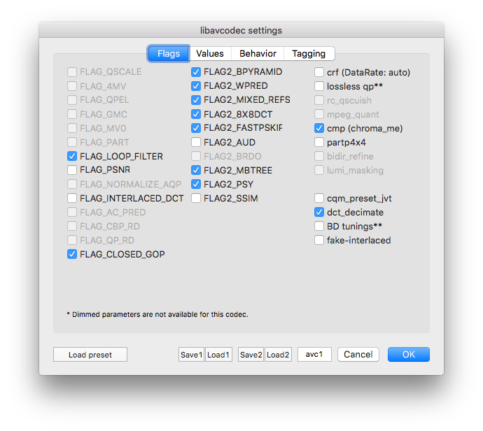

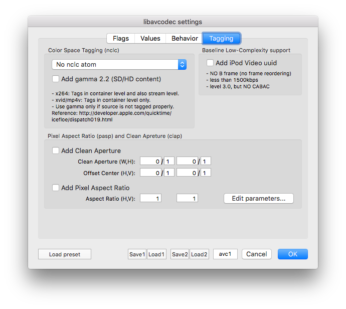
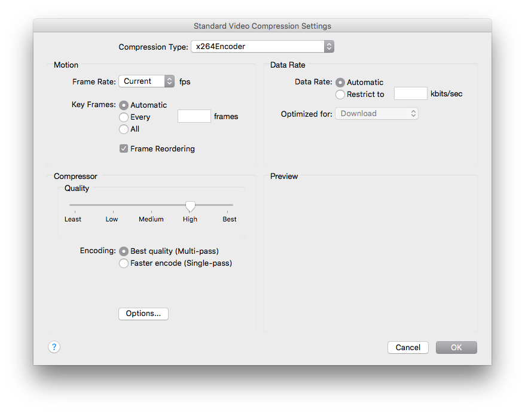

### x264 Deinterlace (HandBrake)

* Started with High Profile
* Picture Settings > Filters
	* Deinterlace: Bob

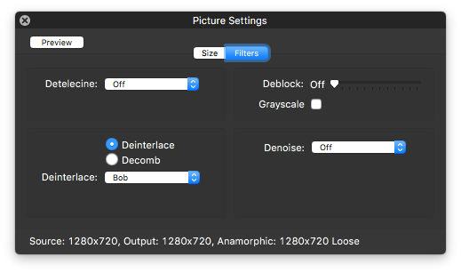
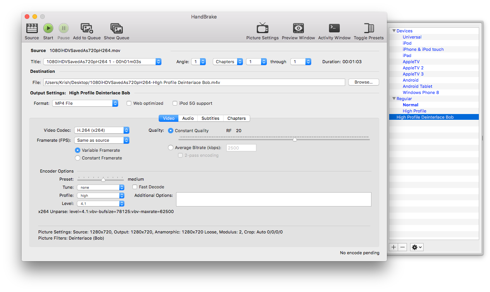

### x264 Decomb (HandBrake)

* Started with High Profile
* Picture Settings > Filters
	* Decomb: Bob

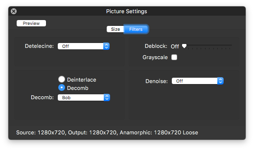
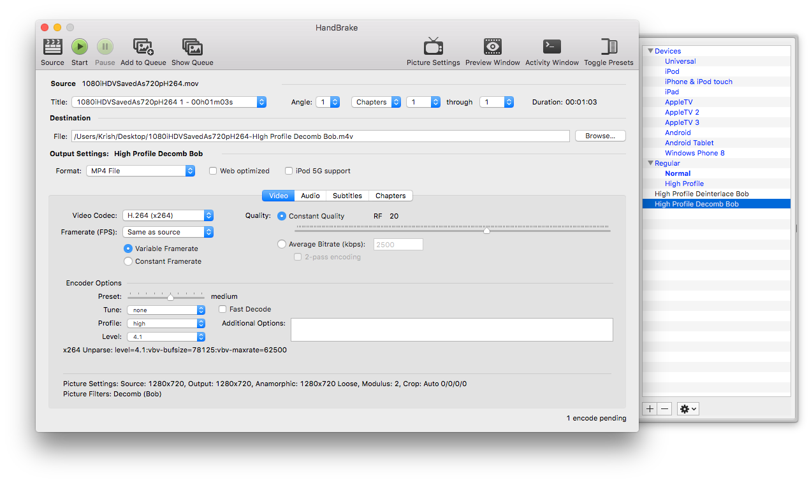
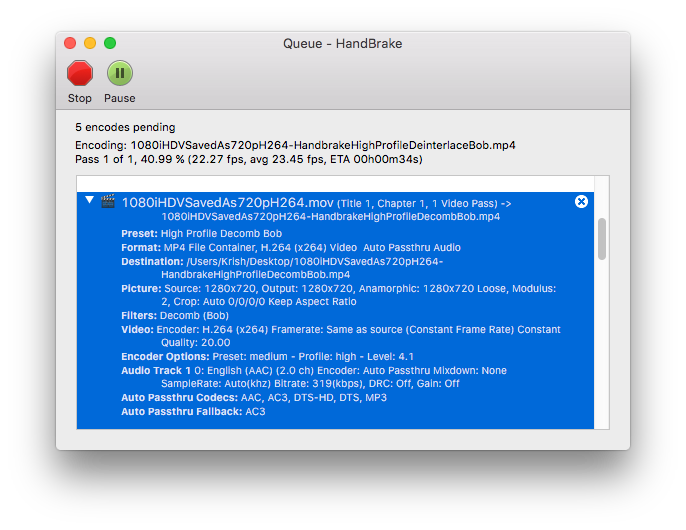

### x264 Deinterlace, Top Field First (HandBrake)

* Started with High Profile
* Picture Settings > Filters
	* Deinterlace: Bob
* Add `:tff` under Additional Options

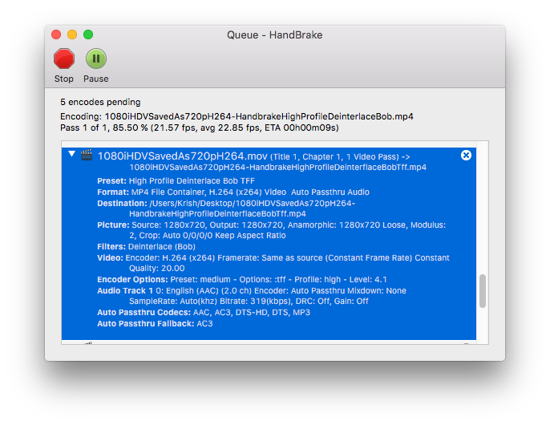

### x264 Decomb, Top Field First (HandBrake)

* Started with High Profile
* Picture Settings > Filters
	* Decomb: Bob
* Add `:tff` under Additional Options

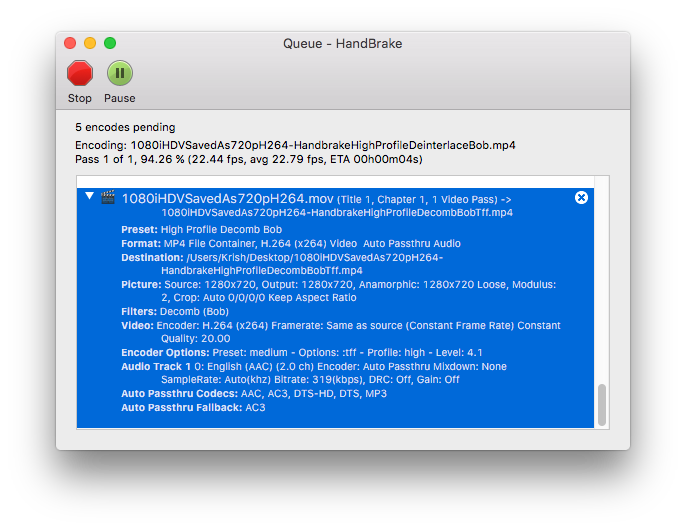

### Apple ProRes 422 (Compressor)

* Started with stock preset
* Retiming quality set to Better (Motion Adaptive)

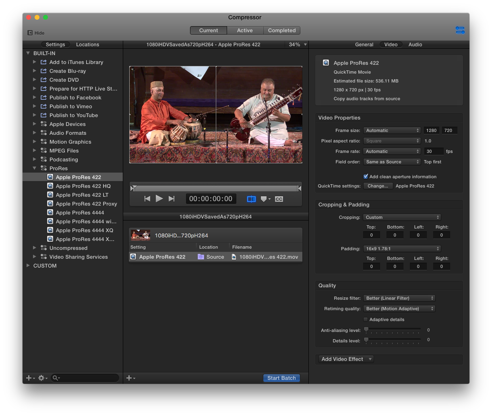

### H.264 for Archival (Compressor)
* Duplicate stock Up to 4K preset (can be found under either Publish to Vimeo or Publish to YouTube)
* Rename as H.264 for Archival
* Change Data rate from Web publishing (19531 kbps) to Computer playback (29296 kbps). Note rates listed in Compressor are for actual 4K footage and will be smaller for 720p footage.
* Change retiming quality from Fast to Better (Motion Adaptive)
* Change audio from AAC to Linear PCM 48kHz, Best Quality, 16-bit Little Endian (the Intel Default)[^5]

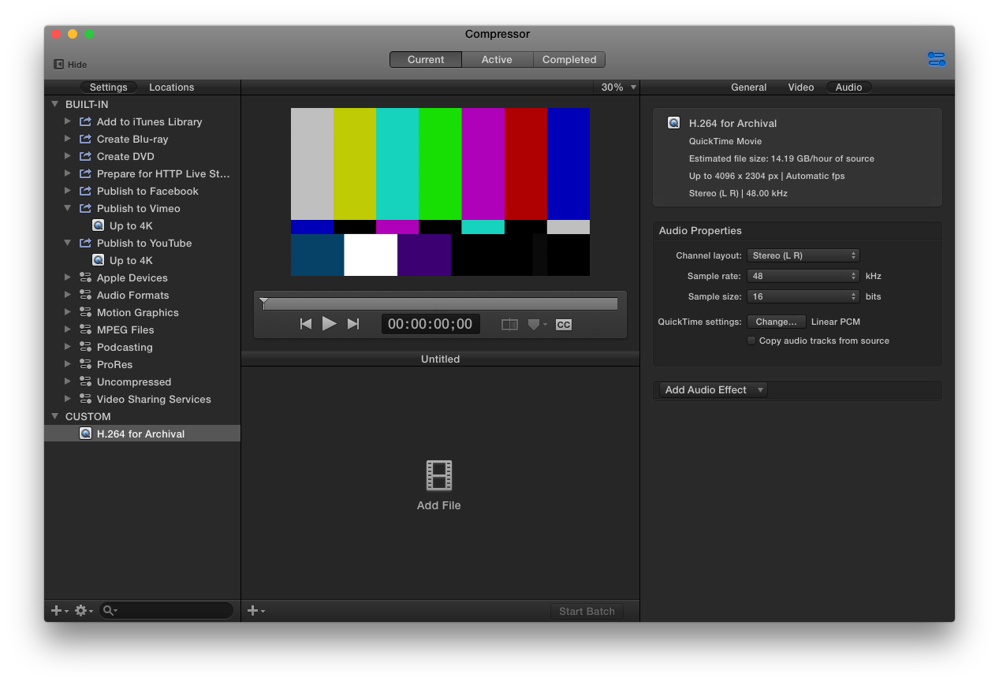

### PHYX Cleaner

## References

[^1]: Tip to use `:tff` in Handbrake <http://stackoverflow.com/questions/9287122/how-do-i-set-the-interlaced-flag-on-an-mkv-file-so-that-vlc-can-automatically-pl>
[^2]: Examples of combing <https://en.wikipedia.org/wiki/Interlaced_video#Interlacing_problems>
[^3]: Recorded Interlaced Source as Progressive file - now what? <http://forum.telestream.net/forum/messageview.aspx?catid=45&threadid=23213>
[^4]: <https://larryjordan.com/articles/compressor-x264-improve-video/>
[^5]: <https://larryjordan.com/articles/it-aint-the-endian-of-the-world/>
