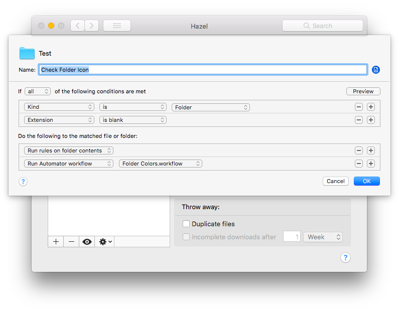

## Finder Folder Icons vs. Bucket Storage

I often use Finder labels colors to manage media, specifically colors. These can easily indicate statuses: green for complete, blue for "cold storage" projects, red for abandoned projects, etc. These labels however are not supported on many popular bucket storage, e.g. Amazon S3 and Backblaze B2.

What this means is one day, when I decide to restore a project, all the Finder folder colors will be gone. Instead, I'd drain a lot of time trying to remember where the project was. It's almost like losing a document that's never saved! Ya, that kind of feeling.

What about if we wrote our own script to do that instead?

Check it out on [GitHub](https://github.com/NaanProphet/finder-folder-icons)!

## Let's Go, Automator

Automator Services are awesome. This little guy can be triggered in any application from a single folder. Here's the overview:

- Copy the workflow into `~/Library/Services/`
- Tag folders with Finder colors (green, orange, etc.)
- Invoke the `Convert Finder Labels to Icons` service (e.g. from Finder's context menu)
- A little gear will spin the menu bar as the workflow executes
- The script writes a file `green.icon.png`, `orange.icon.png` etc. into all folders with labels, and sets the icon of the folder to that new icon (to indicate it did work)
- Folders are archived in bucket storage. The icon and label are lost, but the `png` file remains!
- After restoring from bucket storage, run the program on the parent folder again.
- The script sets the icon of the folder based on the `png` file and also sets the Finder label again!

This approach is rock solid! Automator only provides the folder list, which means the shell script can be invoked on a single folder for testing.

Furthermore, since the `png` file is named with the same color, the status of projects is easily understood browsing around the storage bucket, without needed to download and run the script.

The only tradeoffs are:

* It is not an automatic process.

* In order to completely remove a color, the icon, label, and `png` file must be manually deleted. (Changing a label to another color is supported automatically.)

  

## Appendix: But what about...

Automator wasn't the first idea! Here are some others that didn't work out.

### Folder Actions

OS X comes built-in with Folder Actions that can trigger scripts when something changes inside a folder. However, Folder Actions cannot recursively monitor a folder, so any solution would require adding an action for each subfolder. Too cumbersome.

### Hazel

Hazel is an amazing piece of software that scans folders and can perform tasks automatically. Using Hazel, it's possible to script up a trigger to convert our Finder tag/color to an icon file, and restore that icon file automatically.

The workflow would look something like this, either triggering a shell script, Automator action, etc.

However, after numerous attempts, Hazel seems a bit buggy for this particular effort. It doesn't always detect when a folder's color label has changed, and even when the log says it does the rules don't fire. The same script run manually however does work!

Several support pages on Hazel's forum also indicate bugs:

* [Rules frequency](https://www.noodlesoft.com/forums/viewtopic.php?f=4&t=5578#p17183)
* [Add file to iTunes when added to folder](https://www.noodlesoft.com/forums/viewtopic.php?f=4&t=6767)
* [Hazel Rules Not working](https://www.noodlesoft.com/forums/viewtopic.php?f=4&t=1618#p6643)

Note: by default, the output of the shell scripts is not written to the Hazel log. To do so [run Hazel in Debug Mode](https://www.noodlesoft.com/forums/viewtopic.php?f=4&t=296).

So although Hazel could do the job, it doesn't seem stable enough.
