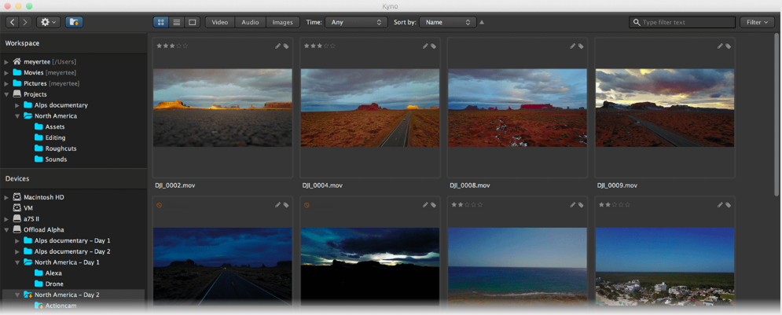
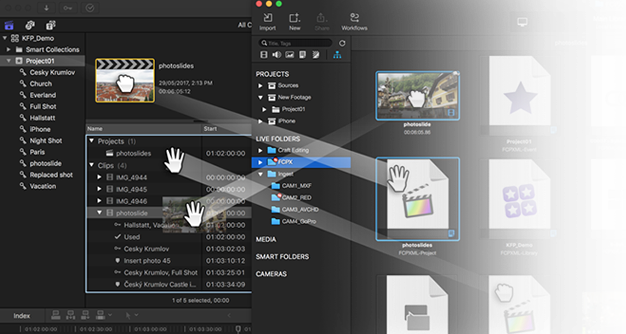
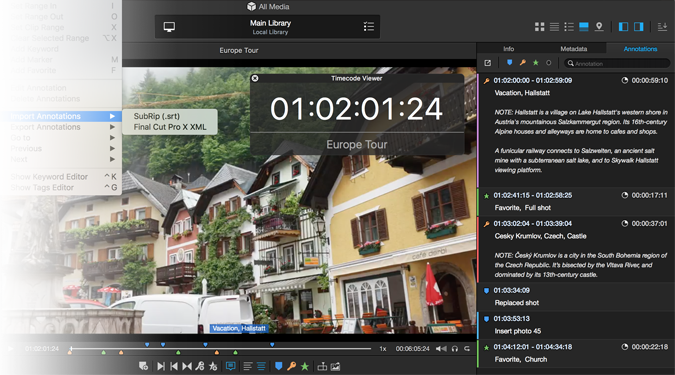
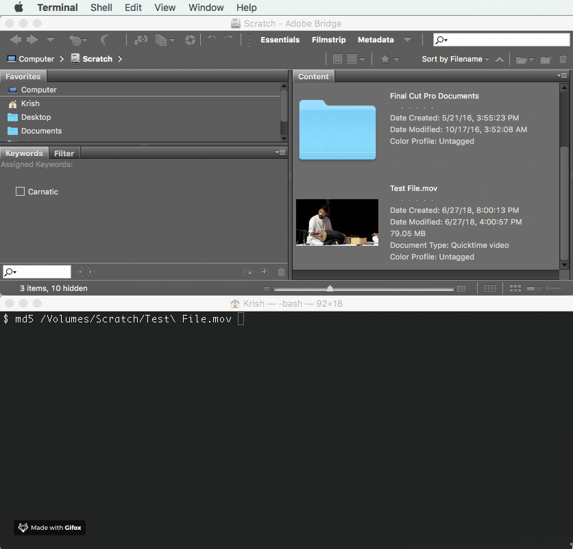
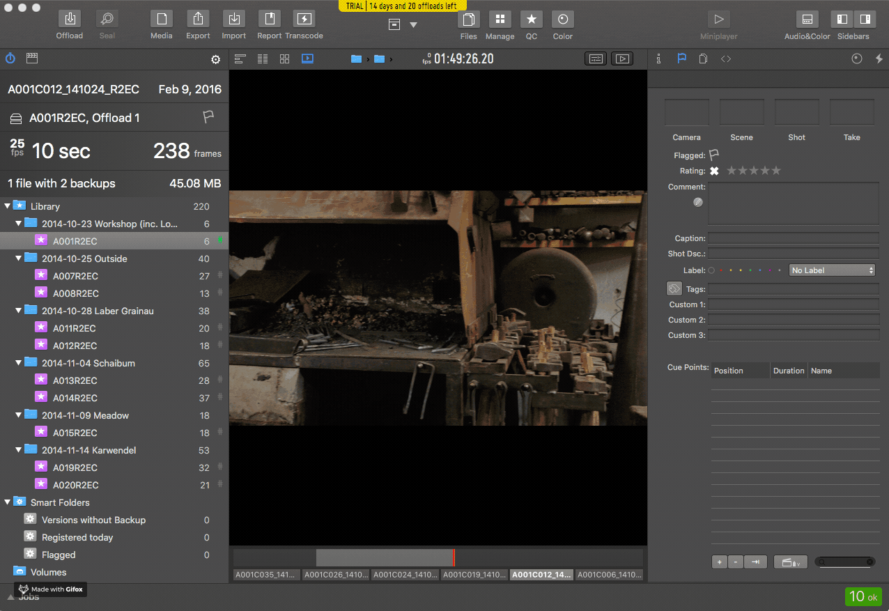

## The Dream

With over twenty years of Indian classical music concert footage, I've always dreamt of tagging each file by raga, tala, artist, audio quality, etc. to quickly pull up footage based on smart bins. Looking for Śivarañjanī? No problem. Dhrupad? Got that too. How about all files that need audio synced up? Coming right up.

Yup, the dream.

## A Guiding Principle

Great words from a [2012 discussion about media managment on Creative Cow](https://forums.creativecow.net/thread/335/26646):

> The more effort you put into a MAM (media asset manager), the more value it has to your organization—and the more dependent you become upon it. If you can't move your metadata freely in and out of a product, you are tying yourself to it. The more data you put in, the more expensive and painful it becomes to transition.
>
> We're still in the early days of metadata for media, so I think these standards are only just beginning to emerge.
>

Is there a solution worth investing in which still leaves one's workflow open and flexible?

## Two Metadata Philosophies

There are two approaches when tagging footage: library-based managers that tag reference footage in a catalog vs. file browser-based solutions that write metadata next to the originals as text files.

Kyno, a file browser-based program, articulates this difference really well in their FAQ.[^10] With sidecar programs:

> ... there is not really a concept of "inside" or "outside"... which also means there is no global search of all content...

### Pros/Cons

Here are the pros/cons of the two approaches.

**Library-based management**

- Global search of all content
- Tag/search metadata even when footage is offline
- Catalog cloud footage before upload
- Use the catalog to download just the files you want, to save on bandwidth costs

**File-based management**

- Depends on files being present locally
- Metadata is easier to share/backup (plaintext files are compatible on all systems)
- Sidecar content can also be searched via regular file searches
- No concept of "global searches" because the application does not itself store metadata

### What's right for me?

In my mind, file-based management seems best suited for preparing an edit. It is perfect for working with local drives, NAS drives, and even tagging footage while it's still on SD cards.

As a cloud storage user and road warrior, I however want to have the ability to find footage when it's not on my local machine and present it to stakeholders. The ability to browse and tag footage that is offline/in the cloud makes **library-based management** exactly what I'm looking for.

Your use case may vary, so the best programs of both types will still be considered below.

## Two Kids on the Block

### Kyno (File-based)

[Kyno](https://lesspain.software/kyno/) is a really beautiful metadata tagging program. It writes all its metadata to JSON files hidden in the same folder as the original asset. The UI is a refreshing change from Adobe Bridge, and is PC/Mac compatible.

Kyno is in active development and bundles many features that are helpful for preparing an edit like transcoding, batch timecode changes, and so on. In that sense, Kyno could be a formidable replacement replacement your current offloading workflow.

Kyno doesn't lock its metadata inside itself offers FCP X and Premiere exports. The advanced version will also export to Excel, etc.

Kyno's pricing starts at $159. There is no subscription, but after 1 year you have you pay for another year of software updates.

### KeyFlow Pro (Catalog-based)

KeyFlow Pro blew me out of the water. It definitely seems like a more-mature sibling of Kyno, and is particularly Mac-centric supporting popular NLE exports.

* Clean and modern interface, indicates active product development. It's received a lot of critical acclaim too.[^11] [^12] [^13]
* Roundtrips with FCP X like a boss. *Drag and drop from KeyFlow to FCP X and back.* 
* For the Adobe folks, it supports Premiere exports. It can open FCP X libraries directly too.
* Subtitle import with SRT 
* Generate proxy footage so you can take low res version of video files on the road!
  

KeyFlow Pro 2's pricing model is really attractive at $50 on the Mac App Store. In-App Purchases for client/server collaboration more, but since I'm a single user I would simply park the library file on Dropbox and let it sync that way across my machines.

## Conclusion

**KeyFlow Pro 2** is now part of my software team, and I can't wait to use it more and more. It has a lot of features for the price, and I feel like I'm just beginning to scratch the surface of what it can do. Their documentation isn't always super polished (grammatical mistakes/typos, for example) but that's something I will live with.

Time will tell if a file-based solution like Kyno will also find a place.

## Appendix

Here are some first attempts reviewing various other metadata management programs, aka the "No Thanks List."

### NLEs

Sometimes, I've found people advocate using editing programs[^9] for their media management as well. I find this to be too limiting for a few reasons.

  

**FCP X**, for example, has undergone many iterations since its original 64-bit debut, and the support for multiple libraries in 10.1[^1] was a real game changer for organizing footage. Yet, FCP X isn't ideal for media management.

- The layout of FCP X seems optimized for editing, rather than cataloguing media. While the Organize workspace is nice (^⇧1) I still find there is a lot of wasted screen space. Also, as soon as the clip width is increased (to see/add markers, etc.) it becomes very difficult to see other clips!
- Metadata is difficult to export outside of FCP X.
- Risk of accidentally modifying old projects! Projects cannot be locked.

- There's only one window for all libraries. Since previously-open libraries reappear on launch, closing and reopening them to keep content relevant is a little tedious.

  

**DaVinci Resolve** suffers from similar limitations.

- Metadata is locked within the program until export.[^6] [^7] [^8]
- Metadata is exported as CSV files.
- Relinking media does not recursively search in folders for matches, which makes moving footage between drives extremely difficult.
- Does not allow for manual relinking to renamed files (unlike FCP X).

In short, I find NLEs best for organizing metadata when working on a specific deliverable, but not for providing a landscape of one's total media assets.

### BulletProof (Catalog-based)

BulletProof was once a shiny new app from Red Giant. Red Giant makes awesome software and plugins, and I'm a heavy user of their [Shooter Suite](https://www.redgiant.com/products/shooter-suite/).

BulletProof however was only designed for offloading footage from cards and did not support linking to reference media. Terabytes of existing footage on network drives can't really be copied somewhere else.

It also had some video playback issues and lacked the ability of *relinking* files in the catalog. Makes it difficult to move media to different folders/drives. No support for smart bins either.

As of June 8, 2015 (v12.7.0 of the Shooter Suite), the application is retired, [due to lack of public interest](https://www.redgiant.com/products/shooter-suite/downloads/ http://www.provideocoalition.com/fare-thee-well-red-giant-bulletproof). It basically seems like it was whittled down into Offload, which is still part of the Suite. RIP.

### Adobe Bridge (File-based)

Adobe Bridge is a file browser with XMP metadata tagging capabilities. Bridge was really attractive financially, since it is completely free for life.[^3]

Bridge **fails for making destructive edits to MOV files** by embedding XMP metadata inside the container, among other formats. See below how the checksum of the file changes after a tag is applied.

 

While **[FCP X is unaffected by these embedded XMP changes]()**, modification of the original asset throws a major wrench in any kind of NAS/cloud archival strategy. Any type of resync will unneccessarily rewrite GBs of data for a few KB of metadata.

XMP sidecars are also difficult to import into FCP X, so Bridge stays within the Adobe ecosystem. Let's find another program.

### Adobe Prelude (Catalog/File hybrid)

Prelude is a particularly curious application. Like Adobe Bridge, its fatal flaw is that it **writes XMP metadata *inside* MOV containers**, and this cannot be changed.[^5] [^4] [^2] [^15] Also note the "Write XMP ID to Files On Import" option does not have any bearing on this behavior.[^14]

Prelude also has the concept of projects, so each project is like a catalog. However, the project itself doesn't store any metadata—it needs to read the XMP inside/beside each file to do so! Thus, Prelude needs all files at loading.

Prelude is essentially like a poor man's Premiere with some metadata features built-in. So long, farewell.

### Hedge (File-based)

Hedge is a modern, media offloading application. Its polished UI is really beautiful.

Hedge has the ability to write MHL metadata files on export (inspired by Silverstack). It does not have a browser for viewing footage, however, it does come with a [Spotlight plugin that will read the MHL](https://medium.hedgeformac.com/why-we-need-a-sidecar-for-offloads-4c5d2c783d5d) plaintext files for searching metadata.

Hedge's main limitation as a media manager is it only tags media it imports and **cannot tag existing footage**.

### Silverstack (Catalog-based)

[Silverstack](http://pomfort.com/silverstack/overview.html) by Pomfort is a swiss-army knife for media management and *markets* itself as that. It however fell short for a few reasons.

Silverstack provides checksum-based card offloading, ProRes transcoding, and other features like audio syncing, report genreation, and so on. Like Kyno, it's the combination of many programs put together.

The sheer number of formats Silverstack exports is mind boggling (see them in the GIF below). They definitely seem to be targeting professional broadcasting stations and major feature films. It's really nice how the trial allows you to download a sample library with media assets pre-populated.

Silverstack dropped the ball for me when it **did not export its tags as FCP X keywords**. The program exports metadata like camera and labels to FCP X, but not tags—hopefully yet.

 

That's alright for me, since their yearly subscription starts at $399. 🤤

### TagSpaces (File-based)

[TagSpaces](https://www.tagspaces.org) is an open-source, cross-platform tagging program. It's not particularly meant for video, but for tagging any kind of file in general.

The UI is implemented in JavaScript and HTML5 and has special modes for previewing video and pictures. The metadata by default is appended to the filename, but the PRO version writes to [sidecar files](https://www.tagspaces.org/products/pro/#tagSidecarSaving). 

TagSpaces could be a really interesting competitor to Kyno, granted it may take some work to get it setup. It fell off the list, however, since it **currently has no means of exporting its metadata** to FCP X or Premiere. Maybe someone will contribute that feature one day as an extension, though it seems unlikely.

## History

*[This article was originally drafted in January 2016. As you can see, it has been quite a quest...]*

## Footnotes

[^1]: How to Use Libraries in Final Cut Pro X version 10.1 <http://www.izzyvideo.com/final-cut-pro-x-libraries/> 
[^2]: "For some formats such as QuickTime (.mov) the XMP information is written into the media file. For formats that don't support writing to the media file, like MXF, the XMP is written into a sidecar file. The sidecar file is stored at the same location as the media file." <https://forums.adobe.com/thread/1074392?start=0&tstart=0>
[^3]: It’s True: Adobe Bridge CC Is 100% Free for You to Download & Use <https://prodesigntools.com/free-adobe-bridge-cc.html>
[^4]: Official XMP Specification Whitepaper from Adobe, lists each format and whether or not the codec writes to sidecar XMP files <https://wwwimages2.adobe.com/content/dam/acom/en/devnet/xmp/pdfs/XMP%20SDK%20Release%20cc-2016-08/XMPSpecificationPart3.pdf>
[^5]: Helpful summary of which containers support embedded XMP metadata <https://forums.adobe.com/message/7518406>
[^6]: Write Metadata [from DaVinci Resolve] back to files? <https://forum.blackmagicdesign.com/viewtopic.php?f=21&t=66127>
[^7]: Exporting Metadata from Resolve to Premiere <https://forum.blackmagicdesign.com/viewtopic.php?f=21&t=50031>
[^8]: Metadata Import/Export [with DaVinci Resolve] & XMP <https://forum.blackmagicdesign.com/viewtopic.php?f=21&t=59160>
[^9]: Edit Faster and More Efficiently with FCPX’s Metadata <https://blog.frame.io/2018/01/31/fcpx-metadata/>
[^10]: Explanation of Kyno's role as a media management system <https://lesspain.software/kyno/pages/faq/is-kyno-a-media-asset-management-system>
[^11]: KeyFlow Pro 2 review, April 2018 <https://visualsproducer.wordpress.com/2018/04/23/keyflow-pro-2/>
[^12]: Small Workgroup Asset Management Using KeyFlow Pro, June 2017 <https://www.provideocoalition.com/matt-geller-small-workgroup-asset-management-using-keyflow-pro/>
[^13]: First Look: KeyFlow Pro v1.8 by Larry Jordan, June 2017 <https://larryjordan.com/articles/first-look-keyflow-pro-v1-8/>

[^14]: "The Write XMP IDs To Files On Import preference only controls whether unique ID values are automatically written to files during import. This preference does not control whether XMP metadata is written to a file under other circumstances, such as when you edit metadata in the Metadata panel." <https://helpx.adobe.com/prelude/using/prelude-set-preferences.html>
[^15]: Adobe forums [Anyway to default saving prelude metadata outside the video file](https://forums.adobe.com/thread/1837913)
