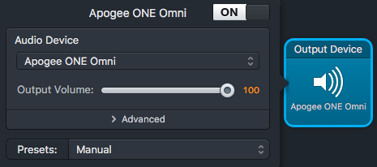

## The Scenario

Earlier this year, I was livestreaming a music concert where there was no access to the soundboard's mic output. It was a low-key, unlisted stream for family and friends, but I still wanted a find a way to improve the audio quality rather than using the camera's built-in mic.

I had my Apogee ONE with me, and it has an excellent built-in omni condenser mic. I connected it via USB and it was detected successfully in Wirecast. The latency was negligible, and so the stream was setup to use the camera's video (via the Blackmagic Mini Recorder) and the Apogee's audio.

The only trouble was, since the Apogee ONE appears as a stereo input, the omni mic is only on the L channel and the R channel is blank. Viewers of the stream would only hear audio coming out of the left channel.

## Loopback and Audio Hijack Pro

Using a combination of Rogue Amoeba's [Loopback](https://rogueamoeba.com/loopback/) and [Audio Hijack Pro](https://rogueamoeba.com/audiohijack/) the Apogee ONE's omni mic can be re-routed to a new virtual audio device for Wirecast.

1. First, create a new virtual audio interface in Loopback.
   
2. Next, create a new **Session** in Audio Hijack Pro.
3. Select the Apogee One as the **Input Device**. Under the **Advanced** settings, choose **Channel 1** for *both the left and right channels*. This will setup dual channel mono.
   
4. Add a new **Output Device** directly to the right of the input device. It will automatically connect. Select the virtual audio device under **Audio Device**.
   
5. Use Wirecast (or similar) to add the virtual audio device onto a new, active layer. It should be receiving audio on both the L and R channels.
6. Mute the original camera audio on the other layer and start streaming.

## What About Soundflower?

Loopback and Audio Hijack Pro cost $130 bundled, so the first question might be to try [Soundflower](https://github.com/mattingalls/Soundflower) instead since it's free. Soundflower is powerful and has been around for a long time [^1] and it's definitely worth a try.

Personally, I have found Soundflower's interface less-intuitive than Audio Hijack's. I was in a pinch to setup the livestream—a live show that was behind schedule—and was so grateful for the UX of Loopback and Audio Hijack to just work, and work perfectly. Worth every dollar.

## References
[^1]: History of Soundflower <https://rogueamoeba.com/freebies/soundflower/>
