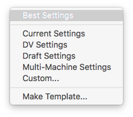
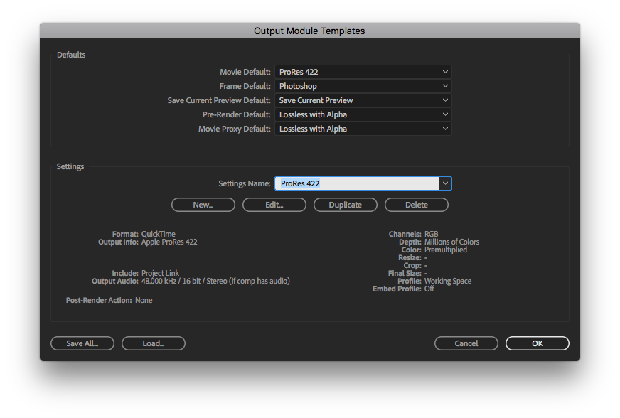

## Upconverting 480p Footage

This May, I tried something new and recorded a HD Wirecast livestream to disk as ProRes 422 @ 480p to help save on disk space/throughput.

All of the other raw, camera footage was in 1080p and I wondered if there was some way to "upconvert" the low res footage. (I especially needed to do so because some of the raw camera files got corrupted, and the livestream was the only way to salvage that angle.)

## Instant 4K Plugin and After Effects

Despite the name, the **Instant 4K** plugin is more like "Up to 4K." The plugin is part of the [Red Giant Shooter Suite](https://www.redgiant.com/products/shooter-suite) bundle and comes with support for Adobe Premiere and Adobe After Effects. From what I understand, the plugin uses some advanced interpolation algorithms to redraw each frame of the video as it expands it.

I used Adobe After Effects CC 2018 and rendered out to ProRes 422.

## A/B Video Comparison

"Seeing is believing." Here's a before/after test with the original 480 footage

### Still Frames

 Both files were opened in QuickTime Player X, and the 480p window was stretched to the same size as the 1080p window.[^2] Below is a looping slideshow of the before/after still frames (image cropped to make it easier to see).[^3]

Notice the difference in the clarity (text at top, violin bow) and richness of color (red blouse). This is *even with* the inherent compression in the screenshot.

    
    

### Running Video

If you have a 1920x1080 display, here's a video clip also. 

Both files were played in QT X at the same time via ⌘+Enter and are toggled back and forth with ⌘+` (filename changes at the top) during playback. The screen capture was exported as ProRes 4444 (from Camtasia 2) and compressed to H.264 by EditReady using default settings (visually lossless). The eight second clip is 24 MB.

There's definitely some compression in the H.264 render (for example in the color red), but even then there's a noticable difference in the clarity in the Instant 4K version. The greatest quality loss is likely in the screen capture (rather than Edit Ready), but it's still a useful test. Real-world delivery formats will be compressed, after all!

*Note: if you're hard to impress, you'll definitely be underwhelmed when viewing this video at smaller screen resolutions. Be sure your display resolution > 1080p and use the HTML viewer to maximize it fullscreen.*



There's nothing like looking at the original uncompressed footage though, so feel free to [download the raw ProRes 422 videos]() to do your own comparison (190 MB).

## Plugin Workflow and Screenshots

1. Drag and drop the footage into After Effects.
2. Right-click a video file and create a new composition from it.
3. Right-click the composition and select **Composition Settings**. Change the **Preset** to the target resolution (e.g. **HDTV 1080 29.97** with **Square Pixels**). The source video should now be smaller than the canvas size. 
4. Use the **Effects & Presets** dropdown to find the **Red Giant Shooter Suite ** section. Drag and drop the `Instant 4K` plugin into the composition's viewer to apply. It should automatically resize to the canvas size!
5. Adjust the plugin settings as desired. I personally use **Filter Type Best, Sharpness 6, Quality 10, and Anti-aliasing 3**, based on Red Giant's Getting Started with Instant 4K video[^1].
6. Select the composition and choose **Composition > Add to Render Queue** from the menubar. Use **Render Settings > Best Settings** using the small drop down. 
7. Create a new **Output Module** to export to **ProRes 422**. 

For reference, the 17 second video clip earlier took 3 minutes and 43 seconds to export on the 2011 iMac with 12 GB of RAM. That is, **13x**!

## RAM Requirements

Resizing ProRes footage apparently can't be done on all machines. Here's why.

### Are You Hongry for RAM?

Little did I know how incredibly RAM-intensive resizing footage is. This problem was particularly intensified by the sheer length of the video files: some were nearly 2 hours x 1 GB/min = 120 GB (classical music concert footage).

The 2011 MBP actually *ran out of RAM*. Like kaput. I tried a few things like increasing After Effect's memory allocation, etc. but it was all essentially the same. Anything larger than 30 minutes would crash. Queuing up multiple renders wouldn't work, because the program would need to be restarted before each one. The laptop was already maxxed out with 8 GB RAM.

 

This is when I remembered that nice desktop in the basement.

### Return of the iMac

Unlike the MBP, the iMac has four RAM slots. Both machines had 8 GB total at the start, but the iMac impressively cranked out the footage. It would seem that somehow this older iMac is just more stable, perhaps by virtue of it being a desktop.

Eventually the iMac also started freezing up for the larger files. However after upgrading the machine to 12 GB—two 2 GB chips and two 4 GB chips—it was invincible.

### Observations on RAM Pressure

One thing I noticed was even after a render is complete, After Effects typically still holds onto the RAM. Some of it can be purged by manually by selecting **Edit > Purge > All Memory & Disk Cache...** but it's my observation that the RAM is only released completely after closing the program. Exiting the program usually takes a while too, sometimes of upwards of 2 minutes as it slowly siphons the RAM back.

On the iMac with 12 GB RAM however, I had no trouble queueing up multiple renders.

## History

*[Updated Sep. 16, 2018 with detailed After Effects walkthrough.]*

*[Updated Sep. 26, 2018 with fast-loading ProRes 422 picture and video samples.]*

## Footnotes
[^1]: Red Giant's video guide for the Instant 4K plugin, from where my default settings were taken from. <https://www.redgiant.com/tutorial/getting-started-with-instant-4k/>
[^2]: The 853x480 file could only be resized to 1920x1079 in QuickTime Player X because of roundoff error. Hence the slight 1 pixel height difference when cycling between the two files.
[^3]: This slideshow is not a GIF. It's rendered with Javascript with two PNG images, in order to minimize compression losses.