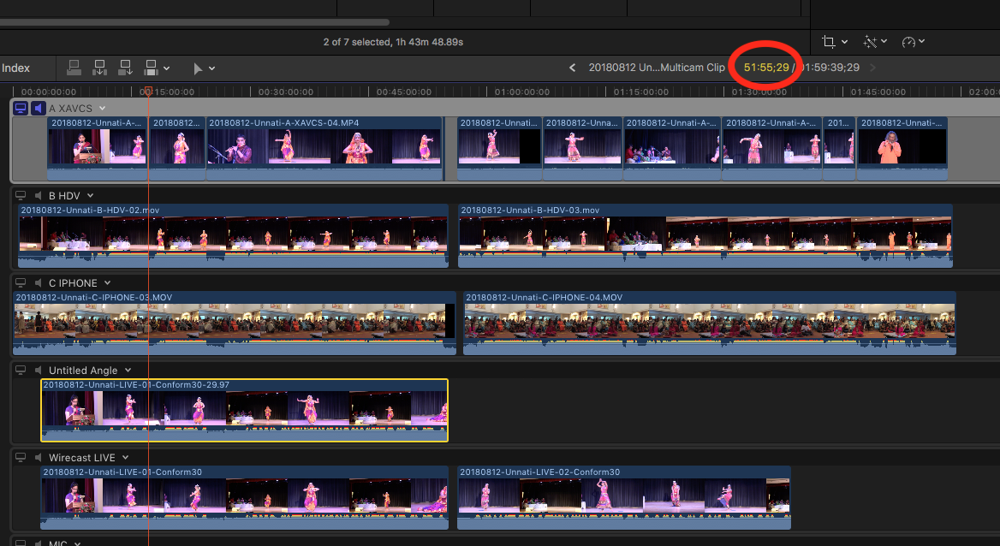
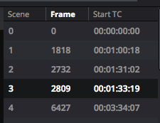

## Realtime Proxy Editing via Wirecast

I've recently been experimenting with realtime editing of live events. That way I can speed up turnaround times for multicam edits, especially for 2+ hour events like typical Indian classical dances and concerts.

The on location setup goes as follows:

* Two cameras, each recording to SD cards
* Feed the HDMI output of both cameras into Wirecast on a MacBook Pro
* Assign Wirecast keyboard shortcuts to both cameras
* Record to Disk at 480p ProRes 422 to an external USB 3.0 hard drive
* Cut between two cameras using a wireless MIDI controller and Keyboard Maestro (pretty sweet)

Then at home, the workflow goes like:

* Use DaVinci Resolve to detect the cuts and output an EDL (edit document list) with the timestamps[^5] [^6]
* Multicam sync the SD card footage along with the livestream MP4
* Use the EDL to cut between the HD/4K footage, using the livestream angle for reference

## Conforming Variable Frame Rate Footage

I was already anticipating conforming the livestream footage before pulling it into the timeline, since Wirecast uses variable frame rates.[^3]

> What Wirecast does is adjust frame duration so timing remains constant.

So the first step is to conform the variable frame rate footage into fixed frame rate footage using Compressor. The ProRes to ProRes conversion is virtually lossless.

## 30p vs 29.97p

Wirecast's default ProRes settings actually record to 30p. The Sony AX100s however record to 29.97p, our good ol' drop frame rate. This means for the same exact duration, the Wirecast file has less frames, which throws off frame precise edit lists.

The easiest way to solve this would have been to change Wirecast's ProRes preset to actually record at 29.97 fps. However, now the footage I have also needs to *change* framerates from 30p to 29.97p.

The solution? Use Compressor again for a second ProRes to ProRes render, this time from fixed 30p file to fixed 29.97p.

## Double Check Your Work

Pro tip: check the 30p to 29.97p conforming worked correctly by ensuring:

* The duration of the clips are the same (otherwise there will be audio sync issues). In my case both were 51 min and 53 sec (using regular QuickTime Player X to verify).
* The number of frames is *different* between the two files. The original 30p Wirecast file had 93387 frames and the conformed 29.97p version had less, as expected, 93294.[^1]

## Haste Makes Waste

Couldn't we just use Compressor once and conform the 30p variable fps footage to 29.97 fixed fps footage? The "two hop" process inevitably recompresses the video twice...although, again it's ProRes and virtually lossless. (Oh and it's just reference angle, too.)

Unfortunately, combining the two conforming steps doesn't seem to work. The famous `Failed: 3x crash service down` error pops up within a few seconds. In fact my previous self [tweeted about this error](https://twitter.com/tripodninja/status/1115701921111859200) back in 2018, anticipating it would take me nearly a year to typing a proper writeup.

## Don't Use EditReady for This

EditReady has a framerate adjustment feature, but is not meant for the above use case. As the [manual](https://www.divergentmedia.com/support/documentation/editready#framerate-adjustment) states, the feature intentionally only "adjusts the playback rate of your media." That is, EditReady makes all the frames spaced out evenly, even if some were held longer than others. The feature is basically meant for slow motion, etc.[^4]

In fact, if EditReady were used to adjust from 30p to 29.97p, it would stretch the video longer. The 29.97p file would have the same number of frames as the original 30p but the frames would now play back 0.1% slower.  Indeed when I tried that, the file stretched to to 51 min and 56 sec.

Interestingly, when both the 30p and 29.97p EditReady exports were pulled into FCP X they claim the original duration of 51 min and 53 sec in the browser.

However, when added to a 29.97p multicam sequence with the other actual 29.97 footage, the incorrectly stretched 29.97 file shows up as 51 min and 56 sec!

So ya, save yourself the headache and conform with Compressor the first time.

## References

[^1]: The frame count can be calculated from the command line using `ffprobe -v error -select_streams v:0 -show_entries stream=nb_frames -of default=nokey=1:noprint_wrappers=1 [VIDEO.MP4]` [CinePlay](https://www.digitalrebellion.com/cineplay/) and other GUIs can display the frame count as well. Special thanks to: <https://stackoverflow.com/questions/2017843/fetch-frame-count-with-ffmpeg>
[^3]: Forum post by Craig at Telestream. *Frame rate instability and dropped frames when recording to disk* (scroll all the way to the end) <http://forum.telestream.net/forum/messageview.aspx?catid=45&threadid=5468>
[^4]: Compressor instead should actually redraw/retime the footage. See this support thread with Colin from Divergent Media for more info <https://divergentmedia.zendesk.com/hc/en-us/community/posts/360033207774-Conforming-variable-frame-rate-footage-best-practice>
[^5]: Worthy mentioning this [tweet](https://twitter.com/tripodninja/status/1115708706300354561) about checking the **timeline frame rate** in DaVinci Project Settings first before starting scene detection. It can't be changed afterwards.
[^6]:    On a side note, DaVinci doesn't use semicolons for indicating 29.97 drop frame timecode. Fascinating and confusing both at the same time.