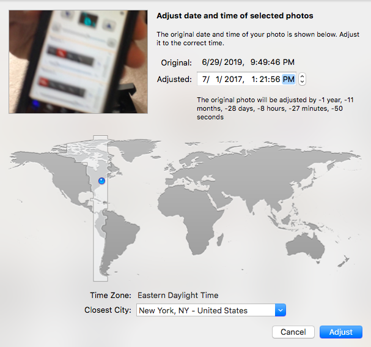
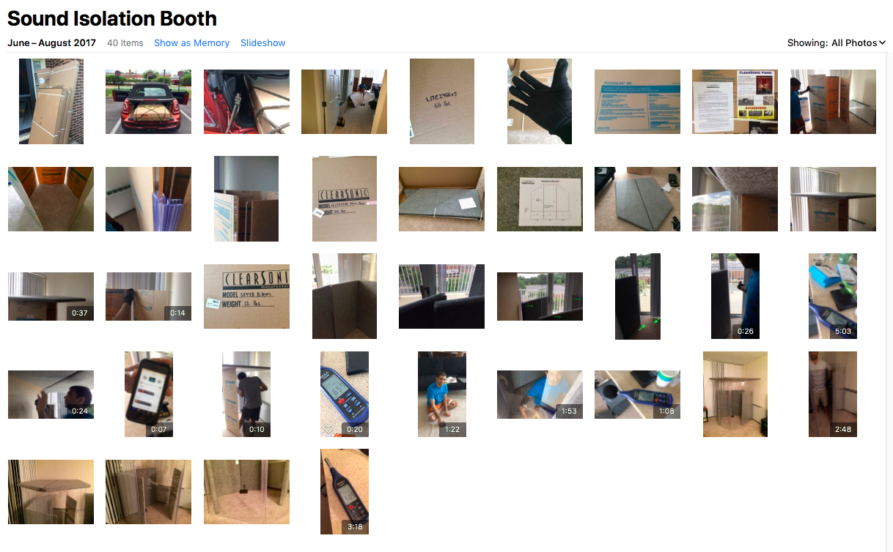
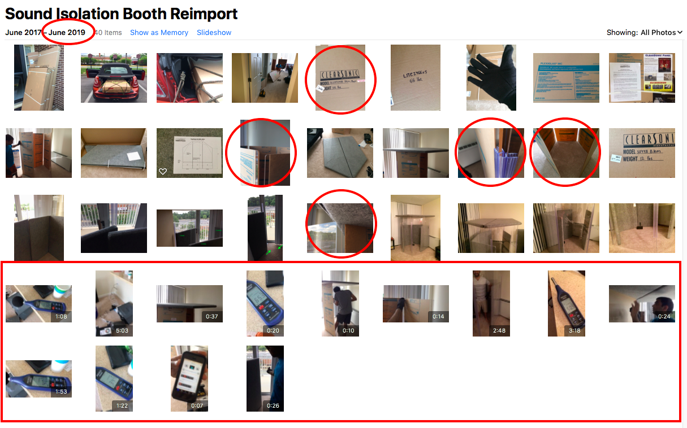
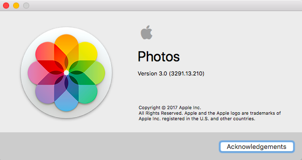
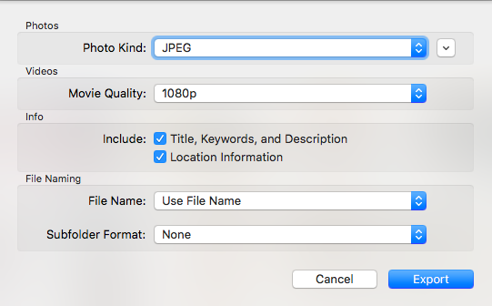

## Mac Photos Export Fail

Maybe I'm too used to [rewriting history in Git](https://www.atlassian.com/git/tutorials/rewriting-history), but sometimes I modify the create date of my pictures and videos. Metadata.

In any case, by doing this when an album is sorted chronologically, everything appears in order. I like that idea of everything organized neatly by time a lot, because that way an album's story flows well.



The trouble is, when these pictures and videos are exported from Photos, re-importing them doesn't necessarily pickup the change. This is true even when roundtripping with another Mac Photos album, let alone something like Google Photos or Flickr! How bizzare is that?

Here's a picture of the pre-export album.



Here's a snap of the re-imported album, also sorted by Oldest First. Everything in red is not in the right place. The pictures are in their original pre-modification locations, and all videos have been shifted to current timestamp—year 2019!



For the record, I'm using Mac Photos version 3.0 and here are the settings used during export.




So what's going on?

## Exiftool Detective Work

Using `exiftool` it appears the photos did have their adjusted timestamp written but not to all fields. Here's the printout from the first misordered photo.

```
$ exiftool IMG_3422.jpg | grep 201
File Modification Date/Time     : 2019:06:30 07:09:07-04:00
File Access Date/Time           : 2019:06:30 07:30:07-04:00
File Inode Change Date/Time     : 2019:06:30 07:11:15-04:00
Modify Date                     : 2017:07:01 11:35:00
Date/Time Original              : 2017:07:01 11:13:49
Create Date                     : 2017:07:01 11:13:49
Date Created                    : 2017:07:01
Digital Creation Date           : 2017:07:01
Date/Time Created               : 2017:07:01 11:13:49
Digital Creation Date/Time      : 2017:07:01 11:13:49
Create Date                     : 2017:07:01 11:13:49.785
Date/Time Original              : 2017:07:01 11:13:49.785
```

The tag `Modify Date` has our changes.

As for the videos, everything gets changed to the current timestamp except `Content Create Date`.

```
$ exiftool IMG_3453.m4v | grep 201
File Modification Date/Time     : 2019:06:30 07:10:49-04:00
File Access Date/Time           : 2019:06:30 07:35:20-04:00
File Inode Change Date/Time     : 2019:06:30 07:11:15-04:00
Create Date                     : 2019:06:30 11:10:47
Modify Date                     : 2019:06:30 11:10:48
Track Create Date               : 2019:06:30 11:10:47
Track Modify Date               : 2019:06:30 11:10:48
Media Create Date               : 2019:06:30 11:10:47
Media Modify Date               : 2019:06:30 11:10:48
Content Create Date             : 2017:07:01 13:16:35-04:00
```

Maybe `Content Create Date` is it? Nope. Even if the year is changed on the same file and re-exported, the `Content Create Date` doesn't change! (Also it looks like the tag isn't present on videos not shot from an iPhone.)

```
$ exiftool IMG_3453\ \(1\).m4v | grep 201
File Modification Date/Time     : 2019:06:30 07:37:00-04:00
File Access Date/Time           : 2019:06:30 07:37:00-04:00
File Inode Change Date/Time     : 2019:06:30 07:37:00-04:00
Create Date                     : 2019:06:30 11:36:59
Modify Date                     : 2019:06:30 11:37:00
Track Create Date               : 2019:06:30 11:36:59
Track Modify Date               : 2019:06:30 11:37:00
Media Create Date               : 2019:06:30 11:36:59
Media Modify Date               : 2019:06:30 11:37:00
Content Create Date             : 2017:07:01 13:16:35-04:00
```

## Repair Commands

The remedy? Use `Modify Date` tag to rewrite the `Date/Time Original` for photos, first. [^1]

```
$ exiftool "-exif:DateTimeOriginal<Modifydate" <pictures>
```

For videos, unfortunately the script must be manual since the timestamp was lost during export. Note that video timestamps must be GMT[^2], so I'm adjusting four hours for EDT.

```
# for videos all times must be GMT zero
$ exiftool -AllDates='2017:07:01 15:37:30' <video1> \
	& exiftool -AllDates='2017:07:01 16:08:28' <video2> \
	& exiftool -AllDates='2017:07:01 16:43:29' <video3> \
	...
```

There was one picture that was strangely troublesome even after this, probably an internal Photos library problem. For that guy I adjusted the time again in the new Photos album, exported it, ran the `exiftool` command again, and pulled it into the new album to fix it.

## Conclusion

In general when rewriting timestamps of an album, I try my best to not modify video timestamps. Instead, move the pictures around and then run the bulk command for photos since videos are a manual process.

P.S. Oh by the way, if you're curious what that Sound Isolation Booth was... check out the published album here on [Flickr](https://www.flickr.com/photos/143865512@N03/albums/72157709327467226).


## Footnotes

[^1]: Exiftool syntax modified from <http://u88.n24.queensu.ca/exiftool/forum/index.php/topic,8349.msg42878.html#msg42878>
[^2]: Forum post on *Changing Time Zone for Video* <http://u88.n24.queensu.ca/exiftool/forum/index.php?topic=8081.0>