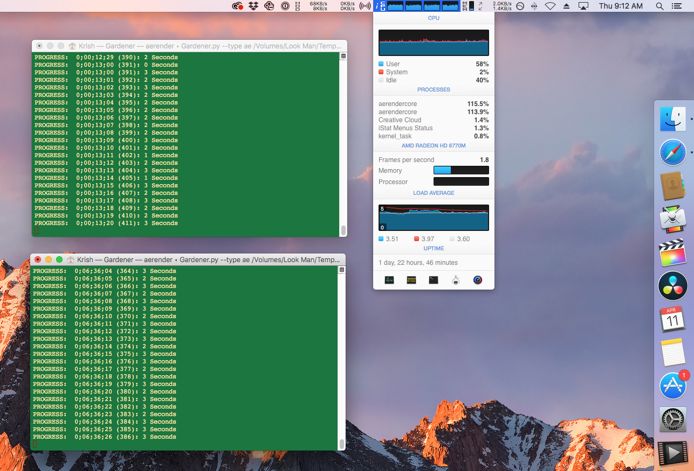
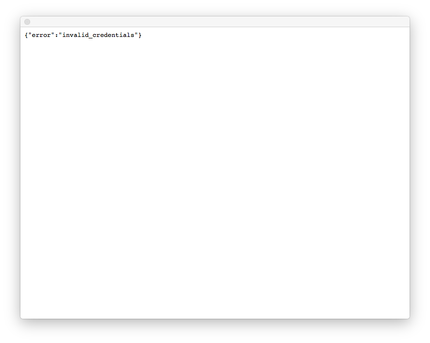

## Intro

Recently, I found myself deinterlacing footage from two Blu-ray discs using some Red Giant After Effects plugins[^3]. The two compositions were HD 1080 59.94i files[^4], 51 minutes and 94 minutes each. My jaw dropped when I saw the estimated time for just the first file start at 50 hours, and keep increase. Plenty of CPU was still available on the machine...

That got me searching for a way to multithread After Effects renders.

## Hello RenderGarden

RenderGarden by Mekajiki is a neat way to chunk and multithread renders from After Effects. It invokes `aerender` which is a headless way of running After Effects. It costs $99 and comes with a 7 day trial.

In my case I had two computers (the MacBook Pro and the iMac) with the project files accessible via a Synology NAS. I installed After Effects on both machines and procured a render-only license from Red Giant via email (less than one business day) to use the iMac as a headless render node.

## Things to Keep in Mind 🌼

RenderGarden's getting started videos are quite helpful[^2] and got me up and running in less than an hour. Here is a summary of some things I additionally learned from experience. 

* A **seed is an atomic unit** of work. The number of seeds a composition is broken up into is set when generating the script files from After Effects. It cannot be changed afterwards.
* **Cancelled renders** that are later re-seeded/restarted **do not pickup from where they left off**. The file segment is overwritten and starts over from the beginning (the log file is appended to though).
* Having the **Recycle Bin feature on the Synology** is helpful in the event of recovering accidentally deleted segments.
* If the **Launch Gardener window** doesn't appear after launching the app, it is **probably hidden behind other windows**. Use Expose to reveal it, or click on the Python launcher in the dock. <br />
* The Launch Gardener window has **four types of Gardener nodes**.  <br />
  * The `ae` node type is for actually running After Effects `aerender` in the background.
  * The `ffmpeg` node type is only used for post-processing conversion to H.264, etc. and the `combine` node is to combine segments together. This was slightly confusing at first because RenderGarden technically also uses FFmpeg to stitch movie segments together, as noted in the documentation.
  * The `notify` node type is for some type of notification system, which I didn't use.
* The folder that you select for the `ae` node is essentially **the Gardener watch folder**. It will continually scan it for work, and it can either be the parent RenderGarden folder or that of an individual composition.
* I find it good practice to only launch `ae` type nodes and wait for them all to complete before running `combine` nodes. That way I can **inspect logs and file sizes and preview the segments for issues before combining** them.
* **For network machines** only running Gardener nodes, **licensing After Effects is usually not necessary**. As long as the composition and render are not using proprietary codecs first like MPEG-2 or AC3 audio `aerender` will run on the network node and the Adobe login is only needed on the primary machine. Double check the full list of formats first on this [Adobe blog post](https://blogs.adobe.com/creativecloud/codecs-and-the-render-engine-in-after-effects-cs6/?segment=dva).

## Performance Benchmarks

Since I was running renders on both the MacBook Pro (MBP) as well as the iMac, I was curious how the two would compare in terms of speed and CPU usuage. Both compositions (A and B) where seeded to eight segments.

The following table is sorted by End Time ascending. As you can see both the Quad Core iMac i5 and Quad Core MBP i7 have an ideal throughput of roughly 20 frames/minute.

| Comp | Seed | Machine | Frames   Start | Frames   End | Num   Frames | Elapsed   Mins | Frames/Min  | End   Time   | Graceful   End |
| ---- | ---- | ------- | -------------- | ------------ | ------------ | -------------- | ----------- | ------------ | -------------- |
| A    | 1    | MBP     | 0              | 11508        | 11509        | 570            | 20.19122807 | 4/5/19 1:14  | TRUE           |
| A    | 4    | MBP     | 34528          | 46037        | 11510        | 831            | 13.85078219 | 4/5/19 5:35  | TRUE           |
| A    | 5    | MBP     | 46038          | 57546        | 11509        | 824            | 13.96723301 | 4/5/19 5:38  | TRUE           |
| A    | 3    | MBP     | 23019          | 34527        | 11509        | 833            | 13.81632653 | 4/5/19 5:39  | TRUE           |
| A    | 2    | MBP     | 11509          | 23018        | 11510        | 847            | 13.58913813 | 4/5/19 5:52  | TRUE           |
| A    | 6    | MBP     | 57547          | 69055        | 11509        | 798            | 14.42230576 | 4/5/19 14:37 | TRUE           |
| A    | 8    | MBP     | 80566          | 92074        | 11509        | 794            | 14.49496222 | 4/5/19 18:55 | TRUE           |
| A    | 7    | MBP     | 69056          | 80565        | 11510        | 817            | 14.08812729 | 4/5/19 19:17 | TRUE           |
| B    | 3    | iMac    | 42560          | 63839        | 21280        | 1024           | 20.78125    | 4/6/19 5:34  | TRUE           |
| B    | 4    | MBP     | 63840          | 85119        | 21280        | 1498           | 14.20560748 | 4/7/19 1:43  | TRUE           |
| B    | 8    | MBP     | 148960         | 170239       | 21280        | 1575           | 13.51111111 | 4/7/19 3:01  | TRUE           |
| A    | 2    | MBP     | 11509          | 23018        | 11510        | 610            | 18.86885246 | 4/8/19 22:13 | TRUE           |
| B    | 2    | MBP     | 21280          | 42559        | 21280        | 1087           | 19.57681693 | 4/9/19 4:43  | FALSE          |
| B    | 1    | MBP     | 0              | 21279        | 21280        | 1104           | 19.27536232 | 4/9/19 4:59  | FALSE          |
| A    | 3    | MBP     | 23019          | 34527        | 11509        | 565            | 20.3699115  | 4/9/19 7:39  | FALSE          |
| A    | 1    | MBP     | 0              | 11508        | 11509        | 644            | 17.87111801 | 4/9/19 21:09 | TRUE           |
| B    | 7    | iMac    | 127680         | 148959       | 21280        | 998            | 21.32264529 | 4/10/19 3:11 | TRUE           |
| B    | 5    | MBP     | 85120          | 106399       | 21280        | 1021           | 20.84231146 | 4/10/19 3:25 | FALSE          |
| B    | 6    | MBP     | 106400         | 127679       | 21280        | 1082           | 19.66728281 | 4/10/19 4:27 | FALSE          |

What are "Graceful" renders? Read on...

### Some Idle CPU is Good

I initially started with the RenderGarden recommendation of no more Gardeners than the number of physical cores[^1], which is a maximum of four on each machines. 


However I saw via iStat Menus that the MacBook Pro had still roughly 20% idle CPU, so I added an additional fifth node...


Sure enough, the idle CPU was now less than 10%. However, as the table showed above, doing so dropped the throughput drops to 13 frames/minute, which even with five processes is `100 - (13*5)/(20*4) =` 20 percent slower. I later went back to three-four nodes max, and the throughput stabilized to 20 frames/minute.

### iMac i5 vs MacBook Pro i7

To my delight, the iMac's older i5 processor was more than enough to keep pace with the MacBook Pro's i7. With two render nodes, it happily hummed along with comparable CPU usage. The time per frame as you can see is also about the same (two to three seconds each).



Complete specs of each machine are listed on the [Gear](/gear/) page.

## Adobe Licensing User Error

*Shout out to the folks at Mekajiki who even reached out to Adobe to help root cause this issue. Now that's customer support!*

The log file for a successful `ae` segment render looks like the following.

```
PROGRESS:  1;34;40;09 (21280): 0 Seconds
PROGRESS:  1;34;40;09 (21280): 1 Seconds
PROGRESS:  4/7/19 3:01:44 AM EDT: Finished composition 00003 (30p).


PROGRESS:  Total Time Elapsed: 26 Hr, 15 Min
aerender version 16.1x204
PROGRESS: Launching After Effects...
PROGRESS: ...After Effects successfully launched

RENDER COMPLETE
2019-04-07 09:03:01.130557

RenderGarden end 2019-04-07 09:03:01

```

The un-graceful renders however would also complete with `Finished composition`, but nothing else would be written. The Terminal window would just stay there without writing `Total Time Elapsed ... RENDER COMPLETE ...` etc. On some rare occassions, the filename also didn't rename from `rendering_` to `complete_`.

I started to see these strange popup windows on the MBP but didn't know what they meant at first.



It took me a while to realize this was because I never verified my email with by Adobe! If you notice from the table before, the ungraceful completions were (1) only on the main MacBook Pro which needed to be licensed and (2) only occured towards the end, probably when the check was failing. Opening up the actual After Effects program displayed the following prompt.


In either case, the actual segement completed. If you encounter this situation, **before issuing CTRL+C** to "gracefully" exit RenderGarden Terminal window, **check if the file needs to be renamed** to `complete_` first. Otherwise another free node may overwrite the actually completed segment.

Basically, make sure you verify your email with Adobe first or you'll be a newb like me.

## Final Thoughts

RenderGarden is amazing. If you're planning to use After Effects for a long render, definitely check it out and procure render-only licenses for any plugins you'll be using on the network.

If it's your first time, I suggest manually verify/scrub segments for proper length and sync issues before running `combine` nodes.

Happy gardening! 🌱

## Footnotes

[^1]: Is there a formula to decide the best ratio of CPU cores to Seeds and Gardeners? <https://www.mekajiki.com/rendergarden/faq/>
[^2]: Quick Start and Submitting a Render were the two main important videos I watched. <https://www.mekajiki.com/rendergarden/tutorials/>
[^3]: In particular, I used Red Giant's Deinterlace plugin and the Deartificater plugin, the latter of which really increases render time.
[^4]: Yes, interlaced H.264 is a thing. See <https://en.wikipedia.org/wiki/Blu-ray#Video> for the full list of supported rates. The footage was from a dance recital, and 1080p is only possible at 24 fps. The original authors probably captured it at the higher frame rate for smoother motion.
