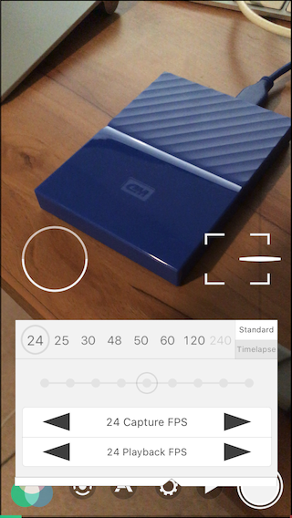
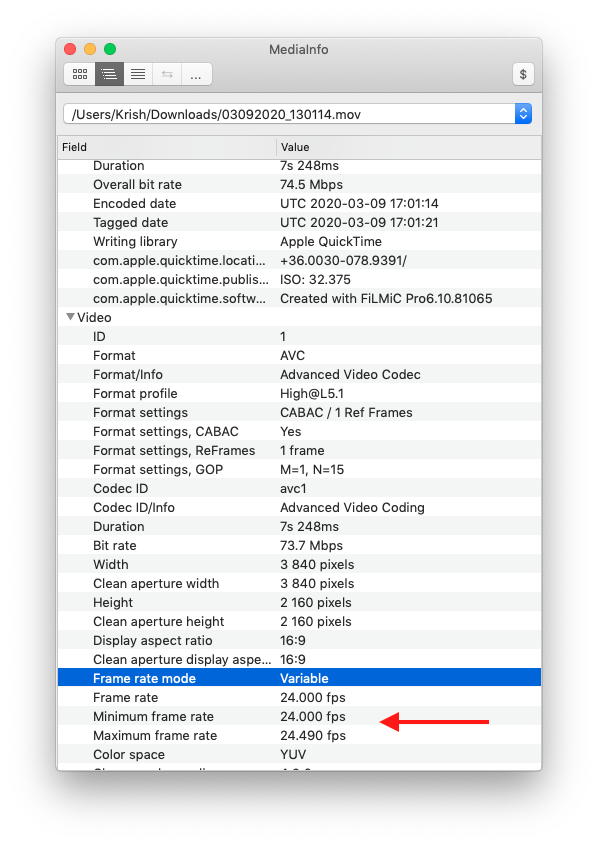
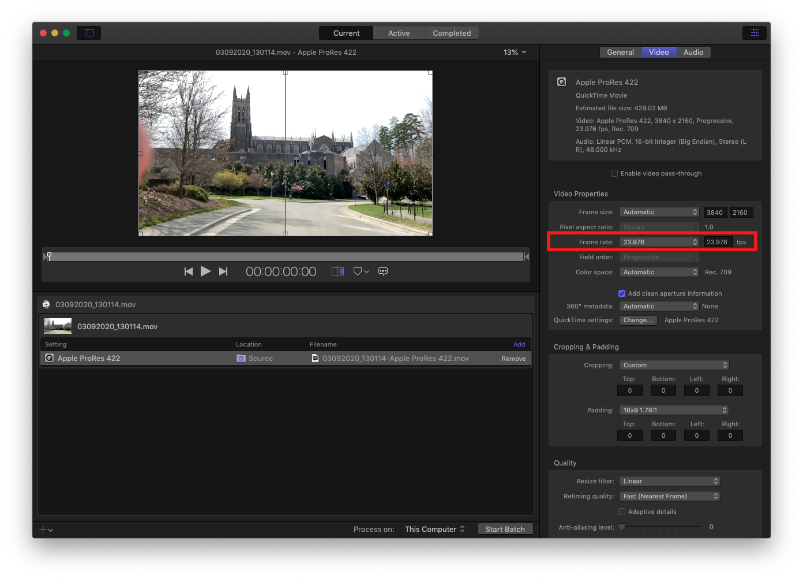

## Always Conform iPhone Footage for NLEs—even from FiLMiC

I knew that normal iPhone videos are variable frame rate. Learned that the hard way, once when I was given a concert recorded on an iPhone to sync up to mastered audio. #superfail #ididntrecordthis

But I wondered if  [FiLMiC Pro](https://www.filmicpro.com/filmicpro/)  footage was different? Nope, FiLMiC is also VBR.[^1]

## No Drop Frame

Another thing I learned is FilMiC frame rates are non-drop frame. That is `24` really means "shoot approximately 24 frames per second."

It's interesting to note how minimum and maximum frame rates of the footage, as revealed by MediaInfo.

## "One Hop" in Compressor

Interestingly, [unlike Wirecast footage](), I can successfully conform and modify the framerate for FiLMiC files in one pass with Compressor. The conversion is from H.264 (FiLMiC Extreme bitrate) to ProRes 422.

To do so:
1. Drop the default ProRes preset of your choice
2. Set the frame rate from `Automatic` (in this case 24) to the required drop frame `23.976`.
3. Import the transcoded file into NLE (Final Cut, etc.)

## Remember, Only Compressor

Recall [don't use EditReady for this](). EditReady isn't designed for conforming since it intentionally just "adjusts the playback rate of your media."

Cheers!

## References

[^1]: When you shoot video on iOS (including iPhone, iPad and iPod Touch), framerates don’t work the way they do on conventional camcorders, which use CFR (constant frame rate). That’s because iOS video recording uses VFR (variable frame rate) with only approximate targets, not exact framerates. This is true, whether you shoot on iOS with FiLMiC Pro or MoviePro. <https://www.provideocoalition.com/filmic-pro-framerates-vfr-status-workflow-reaffirmed-at-nab-2019/>
