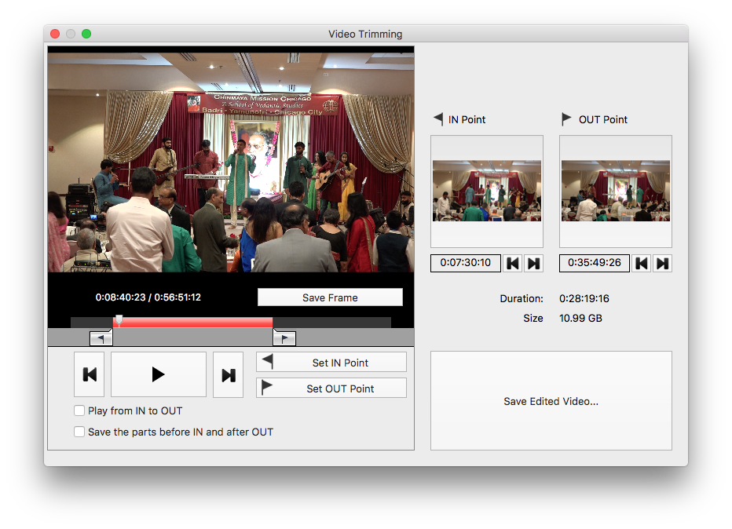

## Why Trim

Sometimes it's a live gig and I'm doing multiple things, like camera and sound. Throw in some stage delays and out of a 56 minute clip, half is not needed. On a Sony AX100 shooting at 1080p XAVCS 30fps, that's 11 out of 22 GB extra.

Now if space isn't a concern then no need to read the rest of this.[^1] But in practice there are cases when this is a real use case for me.

The challenge of course is how to trim the file losslessly. Yes there's [Lossless Cut](https://github.com/mifi/lossless-cut), [FameRing SmartCutter](https://www.fame-ring.com/smart_cutter.html), [SimpleMovieX](http://simplemoviex.com) and other similar apps, but the reality is after trying these programs the MP4 container seems so vast and varied that prosumer formats aren't properly supported by these third party tools. 

## Hello PlayMemories

Sony actually makes a free app called [PlayMemories Home](https://support.d-imaging.sony.co.jp/www/disoft/int/download/playmemories-home/mac/en/). The UI is a little clunky, exports are single threaded, and I can't choose the output directory of the destination file. However, at the end of the day, this is an application I can trust to trim files from the SD card—and do it well. No keyframe issues, no risk.

## Slow But Useful

At the end of the day, using PlayMemories to trim footage is slow and thus challenging to fold into a normal ingest workflow. However, when occassion warrants its use, it will get the job done without error.

## Footnotes

[^1]: Of course, if you're making a highlight reel then losing part of the performance doesn't matter either.