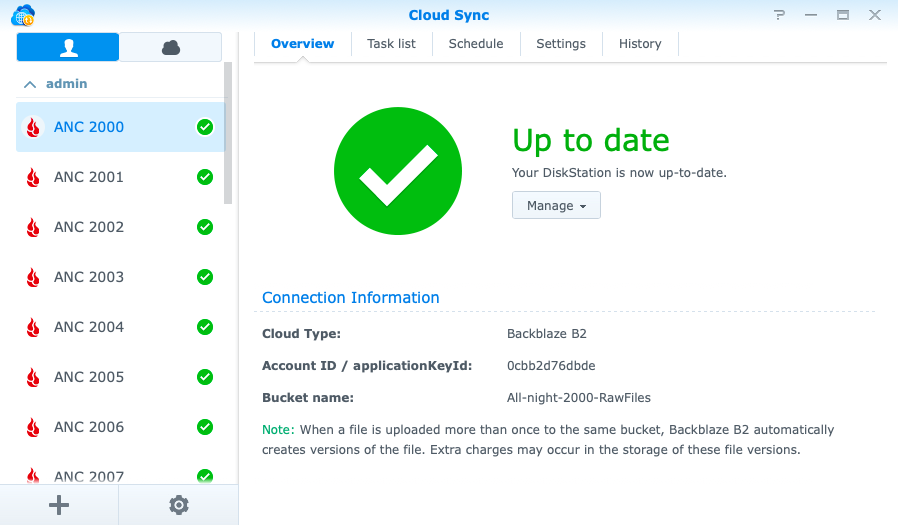
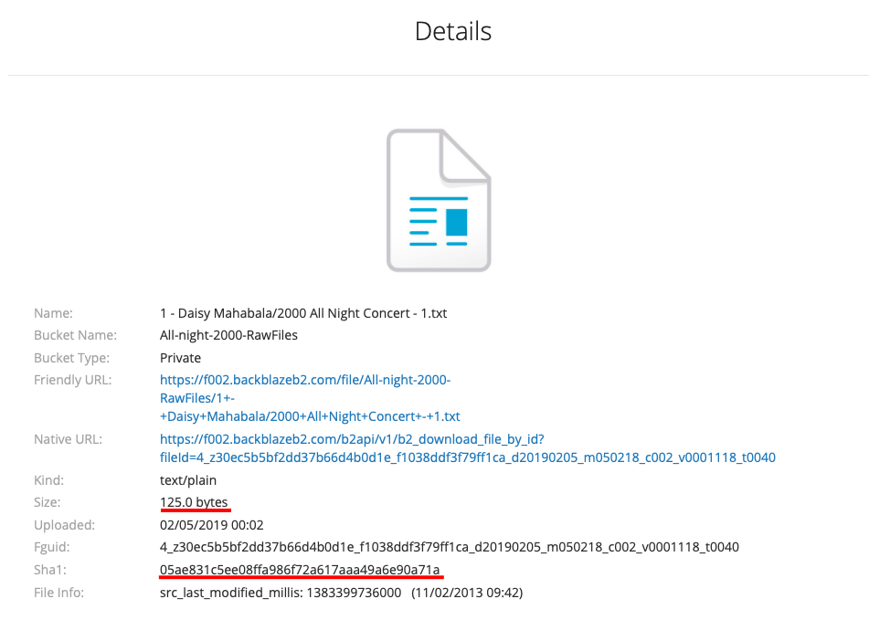
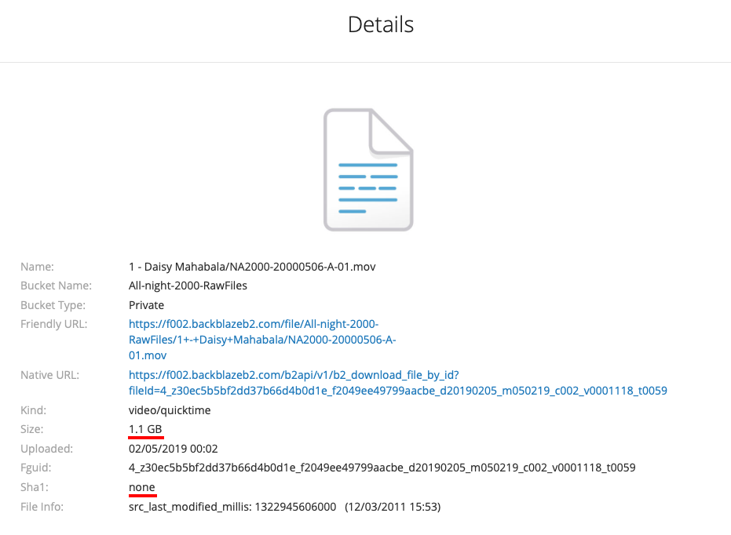
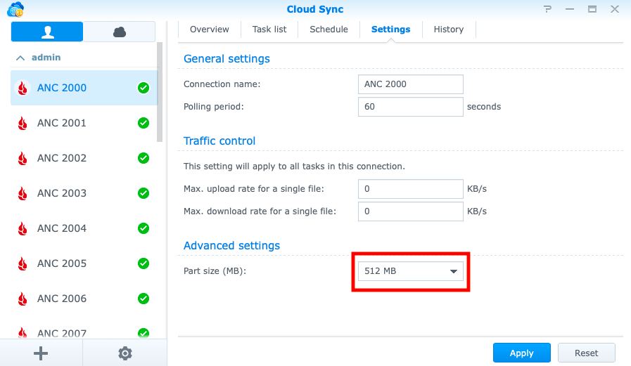

## The Task

Backblaze B2 is an incredibly cost-effective cloud-based archival platform. I had a few TBs of large file video footage stored on a Synology NAS that I wanted to archive to B2, in case anything happened to my local array.[^1]

## Synology Cloud Sync

Synology offers a built-in tool that syncs to many cloud providers, called Cloud Sync. In fact, it worked great and I created a bunch of jobs to archive nearly 8 TBs.

Cloud Sync even offers an `Advanced consistency check` option to compare checksums! All good right?

## Hash me Not

Although I had selected the checksum option I was surprised to realize not all files uploaded had their checksums written in B2. Only the small ones did.

That meant all the actual video files didn't have checksums sent to B2. Yikes.

## Design "Feature"

Not knowing this limitation was my mistake, as I did not understand the Cloud Sync documentation[^3] thoroughly beforehand.

> With **Enable advanced consistency check** ticked, Cloud Sync compares the hash (in addition to file size and last modified time) of each file between the public cloud and the NAS to enhance the integrity check of the sync results. This will require more time and system resources, and depends on the public clouds' support for advanced attributes. Please refer to the bottom of the page for more information.

And what the bottom of the page say?

> Hash values are not available for files uploaded to Backblaze B2 via b2_upload_part upload.

`b2_upload_part` upload... After consulting the B2 API documentation[^6], that command is used for uploading large files in segments. As you can see I had it set to 512 MB; the maximum is 4 GB.

## Whose Limitation is it Anyway?

To be clear, the checksum limitation is on the Synology end. Cloud Sync is simply not sending SHA-1 checksums to Backblaze. B2 in fact supports and encourages[^4] sending checksums for large files— and they can even be sent at the end!

So what can upload to B2 with checksums for large files?

## Rclone FTW

[Rclone](https://rclone.org) is a command line workhorse for syncing files with cloud storage. It's actively maintained, and writes and verifies checksums with B2 perfectly[^5]. However, it's only for folks not afraid of the terminal.

Installing `rclone` is super simple on the Synology.[^2]

1. Login via SSH as an admin
2. Run `curl https://rclone.org/install.sh | sudo bash`
3. Verify it is installed with `rclone -V` and `rclone -h`
4. Run `rclone config` , enter cloud credentials, etc.

How to use the `rclone sync` and `rclone verify` commands are deatiled in [Rclone B2 docs](https://rclone.org/b2/). Best practices of using `rclone` with using B2 coming soon.

## Conclusion

If you care about checksums for files over 4 GB, don't use Synology Cloud Sync. Instead roll up your sleeves are get cracking with `rclone` on the Synology.

## History

*[This article was originally drafted in September 2018. At long last...]*

## Footnotes

[^1]: <https://www.backblaze.com/blog/the-3-2-1-backup-strategy/>
[^2]: <https://bitbucket.org/fusebit/plex-and-google-drive/wiki/Install%20rclone%20on%20Synology%20NAS>
[^3]: <https://www.synology.com/en-us/knowledgebase/DSM/help/CloudSync/cloudsync>
[^4]: <https://help.backblaze.com/hc/en-us/articles/218020298-Does-B2-require-a-SHA-1-hash-to-be-provided-with-an-upload->
[^5]: <https://rclone.org/overview/#features>
[^6]: <https://www.backblaze.com/b2/docs/b2_upload_part.html>