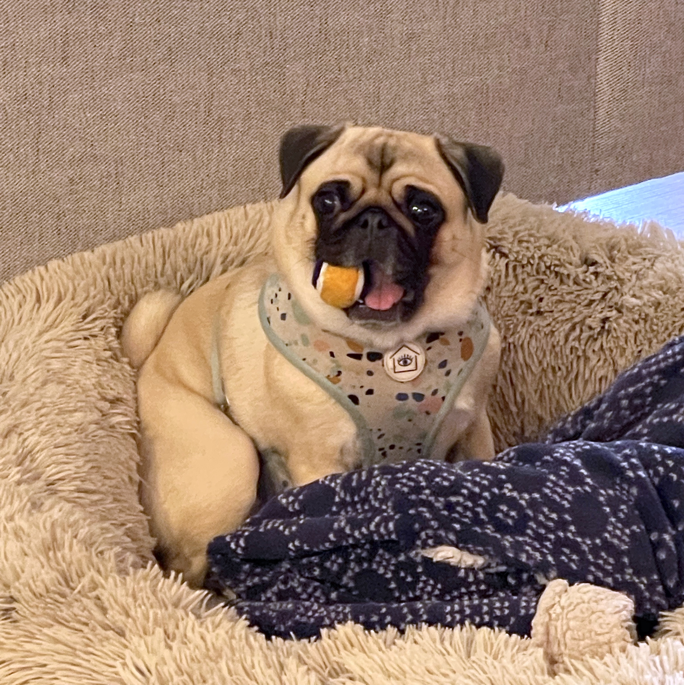

In 2021, I learned some hard lessons about hiring a videographer for our wedding. A friend who's getting married this year asked for advice. Here's what I shared.

### Communication is Key

Our photographer pulled in his favorite videographer. The photographer was excellent so we extended a lot of trust.

I initially called the videographer and inquired about his workflow before signing the contract. I inquired about his recording techniques, the gear he uses, and so on.

I asked if he would record and sync audio from the mixer during the wedding. He downplayed the importance of it ("shotgun mic would be good enough") and I deferred...what a mistake that was! More on that [later](##raw-footage-is-great-if-its-recorded).

After about ten minutes, he said he had to go and that I should route future details through the photographer. It seemed like he did not wish to be directly contacted. Overall we did not hit it off like two videographers connecting with each other.

In retrospect, I should have seen that the videographer didn't understand what was important to me. Maybe he didn't take me seriously. I knew I had qualms about moving forward, but I didn't know how to go about it.

**Could I do it again, I would not have let what I wanted be downplayed so easily. Particularly for something so personal as one's wedding!** I also would have asked better questions such as:

- How do you record in multicam and how do they sync the angles?
- Who are the people that will be filming? (Are they a tight knit team or more like a body shop?)
- Do they keep some cameras rolling the whole time? 
- Will you be onsite? Who is your lead videographer? If not, what is your role?
- Who does the editing? Is it onshore or offshore?
- What other types of events have you filmed?

Had I asked these, and the answers were not satisfactory, I should have politely shared that I was looking for something else and had the confidence to walk away.

In the end, they were largely going to do what they always do: a lather-rinse-repeat wedding job. It didn't matter that we politely informed them (from the beginning) I too was a freelance videographer. I doubt they even bothered to look at my own website. They were the "experts."

Mistake #1.

### Highlight Videos are not Everything

I really wanted to delegate and find a professional. Trust others. Find good talent and pay for it. It was my own wedding after all.

The editing sucked. How can I sugarcoat say it?

- Fast, jarring pans
- Cuts between cameras that jump forward/backward in time
- Out of focus subjects
- Boomy native camera audio, not synced with the mixer
- A curiously pervasive fuzzy quality in the edited videos (more on that [below](#timespan-of-project-files))

I sincerely do not believe the folks who edited the videos would have watched them if it were their own event. The job was perfunctory. They obviously claimed otherwise. 

> "Can all these be better? Yes, absolutely. But is it horrible and not even worth watching? I disagree with that."

From this, I realized editing is inherently subjective and thus difficult to shape. This is especially true when the other person sees their many years of experience as a reason to remain rigid.

> "We've done hundreds of weddings, and we have not once received remarks like this. We understand everyone has different expectations," BUT [insert statement that negates everything that came before the word BUT].

It was a way of invalidating my concern in a pseudo-democratic fashion, a tactful way to make you feel like **you're** the one with the problem.

As a reader you may say, "Krishna, surely you reviewed their work before hiring them. Didn't you know what you were getting into?"

That is the realization: I didn't review *all* their work. I only reviewed what they shared...their Vimeo page only containing highlight videos. These looked really good actually, and we also saw one of our previous friends hire them. However the highlight reels offered very little insight into how they record/sync footage for the ceremonies.

When making highlight videos, you don’t sweat what you don’t record, only choose the best parts, and create something nice for 15 minutes. That's an entirely different work product than recording a two-hour ceremony in multicam.

**If there are multiple work products you are paying for, ask to review examples of all of them. If privacy is a concern (reasonable), ask if you can request permission from one or more of their recent clients.**

Mistake #2.

### Raw Footage is Great, if it's Recorded

To some extent, I reluctantly anticipated the quality of the edited videos would be a gamble. Turned out it was.

However, as part of the contract, I had the foresight of requesting raw multicam footage of all events. This was conveyed with the lead photographer, who was the proxy for the videographer ([as mentioned earlier](#communication-is-key)). I asked how large the hard drive should be and they said 2 TB would be more than enough. I provided the hard drive.

**Can you believe it? The cameras weren't even recording the whole time during events.** Like even when people are talking! I synced all the raw footage provided ([PluralEyes](https://pluralsynchronizer.com) ftw) and there are parts where only one camera is rolling. We paid for it, and they didn't do it. 🤬

What's worse, sometimes the single camera went out of focus. I specifically cited an example where a camera goes in and out of focus eight times within 45 seconds, so I can't edit around it. Was the cameraman learning on the job or something? An out of focus camera, with no secondary angle, is not acceptable.

Again ([see previous section](#highlight-videos-are-not-everything)), would this have been a problem if it were footage for a highlight video? Not at all. Just snip-snip, edit around it, and no one is the wiser. Sadly for me, there is no way to salvage these moments now.

> "I have gone through all videos and I believe all events were captured properly from documentation point of view and I don't think we missed anything from coverage point of view."

This is false. If cameras are not rolling during events, you are neither documenting everything nor can you guarantee nothing was missed. You are just capturing enough for highlights.[^2]

**It's clear to me now that filming concerts gave me a completely different mindset for shooting in multicam. Every moment is precious. Nothing should be lost. These people didn't know or care how to shoot documentary style in multicam.**

They apparently also lost most of their hearing.

> "Regarding audio files I have gone through them and they sound very clear so I don't see any issues there."

Then it hit me. Maybe the videographer downplayed recording audio from the mixer [see previous section](#communication-is-key) because he lacked expertise in syncing multiple angles of video together! People tend to downplay what they don't know/find important.

When I pressed them on not rolling the cameras, they argued that it takes up a lot of space to keep the cameras rolling the whole time. Isn't that what they're paid for? Isn't that what they charged us for? The space argument doesn't hold either: audio from the mixer was not recorded for the main wedding ceremony either, and that is peanutes in storage compared to video (probably 5-10% the size). The most rational explanation is that someone forgot—or thought it didn't matter—or thought they knew better.

**If you request multicam, ask if they will keep the cameras rolling the whole time. Find out how much DELTA there is between what they always do vs. what you're asking them to do, because otherwise the person you hire may just wing it. If they downplay or minimize the ask, it might be because it cuts into their margin and they need to hire more people, or they simply don't know how.**

Mistake #3.

### Timespan of Project Files

I also asked for the project files as part of the contract. We signed on it. Then afterwards...

> "Sorry, the software we use creates really big project files. So we delete the project after every export to make edits faster and save space."

What? 😲

You mean to say you delete the project even before the client has received and approved the work? As a professional? That's dumbfounding. I was further patronized with the most brilliant editing advice I have received.

> "I am sure you can easily load edited videos in Premiere Pro and replace any shots you want with raw files he provided."

What?? 😱

THAT gave me real insight into their editing process: if you ask for a change, they re-import the compressed file they sent you, chop it up, do whatever, and then EXPORT it, compressing it again. Every cycle degrades the quality further and further. No timecode, no syncing, no project files. This is why even our family could tell that the edited videos were mysteriously not as crisp as the raw footage.

**Directly ask vendors when they delete project files. Put it in the contract. If the vendor feels like you are micromanaging, try to explain to them it's not personal and about your poor friend Krishna's experience—you just trying to prevent something like that from happening again.**

Mistake #4.

### Contracts Can Break

What can you do if you've trusted someone with your contract and they don't fulfill it? 

For us, nothing. It's extremely disappointing to have asked for something, paid for it, and have it ignored.

> "You definitely held us at the highest standards, and I am extremely sorry that I couldn't meet the expectations."

Yet another clever way of shifting responsibility and making it about "me" and "my standards." I think the *lowest* standard was they film and capture all the raw footage. They signed on it, and they didn't do it.

I always considered myself a passionate amateur until this point, but now I realize how wide the spread in "professional" really is.

> "I wish I would have stayed out of suggesting video coverage because clearly you had something different in mind which we couldn't fulfill."

In mind or in writing? If you really feel bad, then it would have been polite to offer some kind of refund as a token of good will. Not doing so suggests that there was no break in contract, which clearly there was.

Another friend told me the other day that she never even got her edited wedding videos, just the raw footage. **It seems the norm for a lot of wedding professionals is to be paid in full on the day of the event, leaving no accountability. It might have been tricky, but respectfully negotiating different payment terms is something we should have done.**

Mistake #5.

### Moving Forward

I hope these reflections are useful to anyone who may be looking to hire a videographer on their own. I wish my future self advice my former self on what to look out for and what questions to ask.

It really hurts to be minimized and taken advantage of. It leaves impressions that remain etched for a long time.[^1] I know it take time to overcome this. But I know it will make me a better person.

For now, I have what footage I have. I need to be creative, work out of happiness, and make the best of it. Our wedding was magical, and I will make something magical to share to with those I love.

### Update: One Year Later

I have not yet re-edited the videos. Each time I think about it, the negative feelings come back too strong. That may be slowly changing though.

What I have observed about myself is that I have become more confident about my own abilities. Not in a way that puts others down, but in a way in which others cannot put me down so easily. I trust and value myself in a way now that I may not have been able to otherwise, and I want to share that value with others.

That's a pretty nice wedding gift from the universe.

### Update: Two Years Later

I keep revising this post but have not yet re-edited any videos.

### Footnotes
 
[^1]: One of the most insightful commentaries of this is [Dave Chappelle: Unforgiven &#124; Exposing Comedy Central](https://youtu.be/EJJ-Pu8WsZU?t=140) at 2:20 where he describes how a grown adult stole a joke from 15 year-old Dave Chappelle (warning language).
[^2]: Don't just take my word for it. Here is another wedding videographer's definition of documentary style videos. <https://www.nuviewweddingvideography.com/documentary-wedding-film>